# Data table cell

The **data table cell** cell mode provides you with an easy way to put your data in table form. You can quickly scan multiple columns of information and mouse over the top-of-column summaries to explore the range of values.

<figure>
  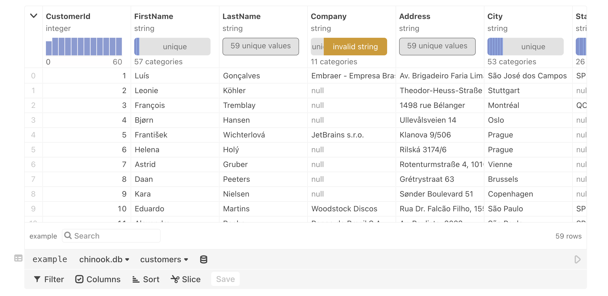
  <figcaption>Observable's data table cell.</figcaption>
</figure>

There are multiple data wrangling options available with the data table cell:
- [Filter](#filter) - Limit displayed results to matched criteria.
- [Columns (Show/Hide)](#show-and-hide-columns) - Show or hide only certain columns.
- [Derive columns](#create-new-columns-for-column-derivations) - create new columns derived from the original columns using JavaScript.
- [Sort](#sort) - Sort columns into ascending or descending order.
- [Slice](#slice) - Define a slice of data so that only limited rows are shown.

## Add a data table cell

To create a data table cell, click **Data** on the **Add cell bar**:

<figure>
  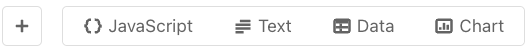
  <figcaption>The Add cell bar.</figcaption>
</figure>

 Alternatively, click the plus sign (+) to create a new cell, then select the **Data table** option from the cell menu:

<figure>
  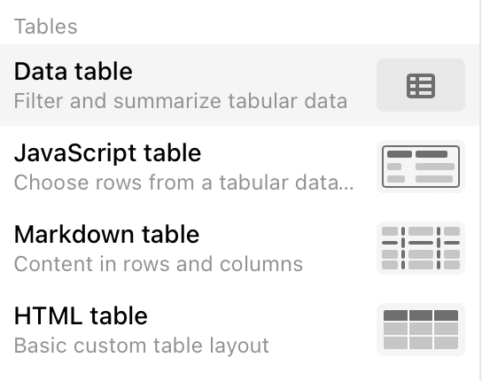
  <figcaption>The Data table option in the Add cell menu.</figcaption>
</figure>

## Select a data source

Data table cell supports Apache Parquet, Apache Arrow, CSV, TSV, and JSON file types that have tabular data, as well as database connections. In addition, any named cell in your notebook that already contains tabular data (i.e. an array of objects), you can select that as a data source. 

<figure>
  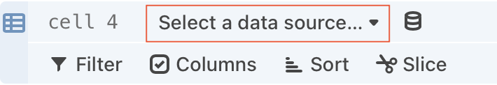
  <figcaption>Click to select a data source.</figcaption>
</figure>

### Database connections

When working with relational databases, you must select a specific table to view:

<figure>
  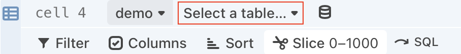
  <figcaption>Select the dropdown to select a table after you have chosen a database.</figcaption>
</figure>

<figure>
  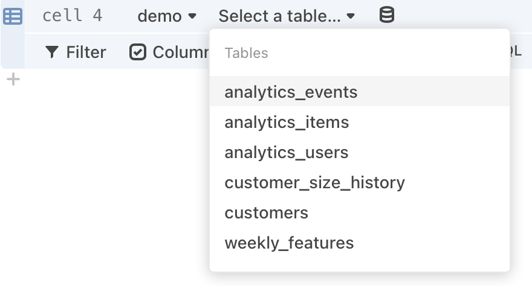
  <figcaption>Select a table from the menu.</figcaption>
</figure>

:::tip Note  
If you selected a BigQuery database, you need to enter the <em>projectname.schemaname.tablename</em>, rather than selecting a table name.
:::

## Modifying data 

There are many different ways you can wrangle data with the data table cell, such as filtering, sorting, showing/hiding columns, deriving new coulmns and slicing.

### Filter

Data table offers robust filtering options. 

<figure>
  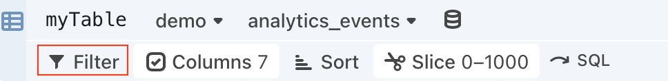
  <figcaption>Select Filter to define filtering conditions to apply.</figcaption>
</figure>

When you click on **Filter**, you will see a menu that asks you to specify a colum and an operator.
<figure>
  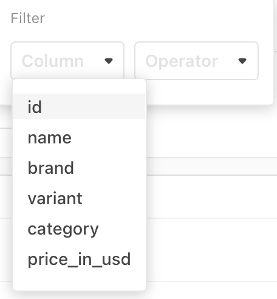
  <figcaption>Select the black triangle to display the available choices for the Column field.</figcaption>
</figure>

Once you have selected an item from the Column menu, appropriate choices appear in the Operator menu, and an additional field appears so that you can enter detailed criteria:

<figure>
  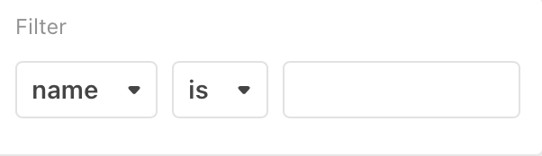
  <figcaption>After you select a Column item, appropriate fields appear so that you can specify additional criteria.</figcaption>
</figure>

The types of comparison operators available depend on the type of value in the Column field. For example, string values allow for `is`, `is not`, `contains`, while numeric values allow for `<`, `>`, or `is not null`.

::: details Additional Notes
- Object values do not support operators.
- You can define multiple filter criteria. Once you complete the first row of filter criteria, a second row appears. You can then define filter criteria based on a second column of data.
- It is possible to define filter criteria that are contradictory.
- The order in which you define the filtering criteria does not matter.
- To delete a row of filter criteria, click the "x" that appears to the right of each row.

:::

### Show and hide columns

Click **Columns** to display the list of table columns. 

<figure>
  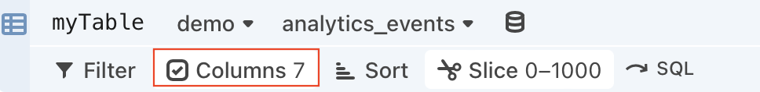
  <figcaption>Select <b>Columns</b> to display the list of table columns.</figcaption>
</figure>

The resulting list displays checkboxes indicating which columns are to be shown.

<figure>
  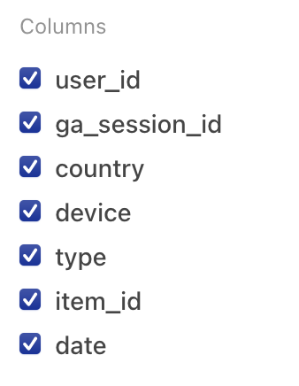
  <figcaption>Checkboxes indicate the columns to show.</figcaption>
</figure>

By default, all columns are shown. You can hide specific columns by unchecking the checkbox for a given column.

If you hover the pointer over an individual item in the list, the word **only** appears. If you click **only**, all other columns are de-selected.

<figure>
  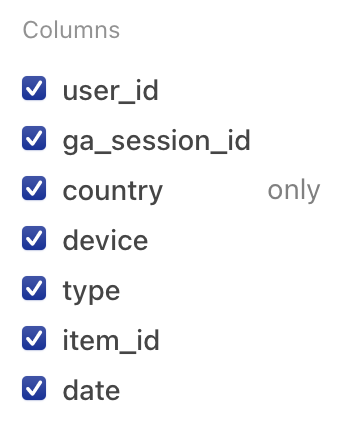
  <figcaption>Select <b>only</b> to show only that column.</figcaption>
</figure>

To restore all columns to visibility, select <b>Show all</b>.

<figure>
  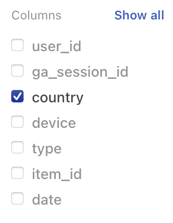
  <figcaption>Select <b>Show all</b> to restore all columns.</figcaption>
</figure>

Note that if you de-select all columns one-by-one and then add them back individually, the columns appear in the order in which they are added. Selecting **Show all** (or selecting all columns) restores the original display order.

### Create new columns for column derivations

New columns, derived from the original columns, can also be added to the data table cell. To do so, click the `+` button in the upper right-hand corner of the table view, as seen here:

<figure>
  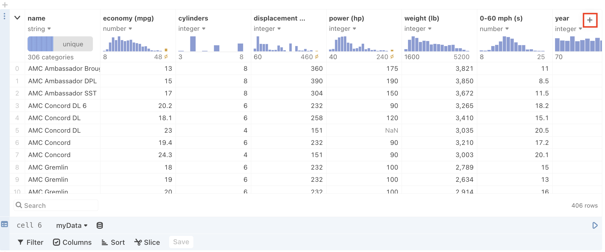+</b> button highlighted with a red rectangle outline."
  />
  <figcaption>Select the <b>+</b> button in the upper-right side of the table to create a new column.</figcaption>
</figure>

and the new column will appear highlighted in blue to the right of the original columns:

<figure>
  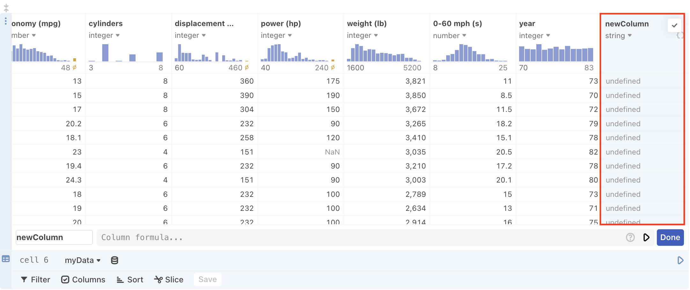
  <figcaption>The new column will appear to the right of the columns already shown.</figcaption>
</figure>

The editor also appears when you first create a column:

<figure>
  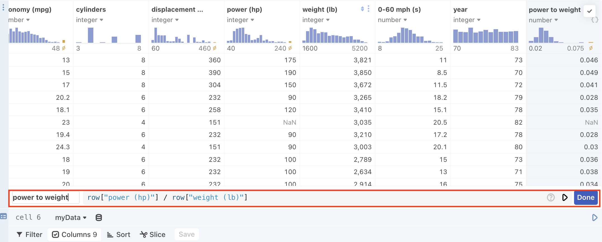
  <figcaption>The editor appears at the bottom of the <b>Data table cell</b>.</figcaption>
</figure>

which allows you to name your new column and define the derivation with an expression.

:::info NOTE
Data types for derived columns are inferred and overridable just like the other columns in the table.
:::

After you click the **Done** button, the view of the **Data cell table** will revert back to normal. However, you can edit an existing expression as needed by clicking the **{}** icon in the column heading:

<figure>
  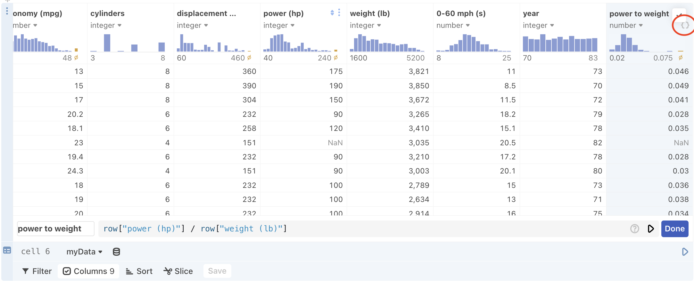
  <figcaption>To reopen the editor for editing the column name and expression, select the <b>{}</b> in the column heading.</figcaption>
</figure>

#### Writing expressions to define a newly created column

A built-in object called **row** allows you to access other column data that can then be applied to each row one at a time in the derived column. For instance, the above screenshot derives a new "power to weight" column by dividing the value from each row in the "power (hp)" column by value from each row in the "weight (lb)" column.

You can perform most of the computation available in normal JavaScript cells. This includes the ability to write arbitrary JavaScript expressions, reference the output of other cells, and call functions defined in other cells. There are some notable limitations to what you can do with this cell:
 - You cannot render HTML or a Plot in the cell.
 - You cannot render an [input](/inputs/overview) in the cell.
 - You cannot reference another derived cell.
 - You cannot access an entire column of data from within the expression cell (i.e. all of the rows at once), only each row one at a time (i.e. using the **row** object).

 #### Error Handling for deriving new columns

There are a couple of scenarios that cause errors with column derivation:
- Referencing a bad or non-existent column name, or make a syntax error in the expression cell, the table produces invalid results like `undefined` or `NaN`.

<figure>
  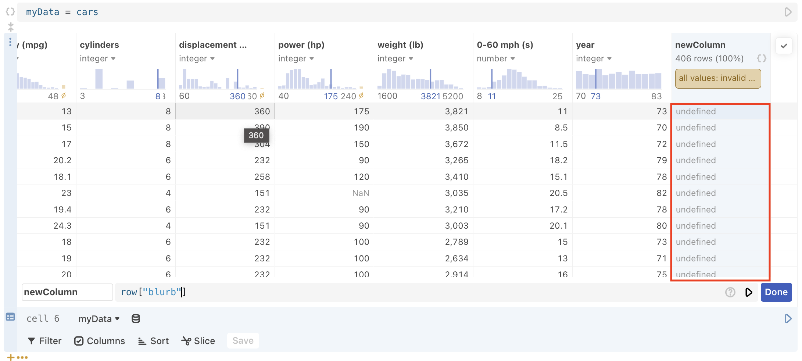
  <figcaption>Referencing a bad or non-existent name in the expression editor.</figcaption>
</figure>

- When you run the cell using either `Shift+Enter` or the play button, but include a mistake that causes a runtime error (for instance, by using an undefined variable) the data table cell collapses other than the column headings, a search field, and the expression editor. You can then use the expression editor to fix the code.

<figure>
  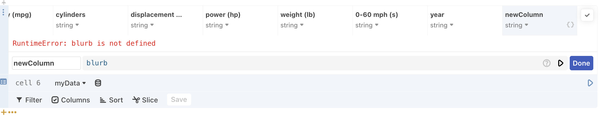
  <figcaption>A runtime error when you enter <code>Shift+Enter</code> or select the play button.</figcaption>
</figure>

- When you cause a runtime error, but select the **Done** button instead of `Shift+Enter` or the play button first, the table collapses and the expression editor is closed. You can open the editor back up by selecting the `{}` button at the top of the new column and fix your the code accordingly.

<figure>
  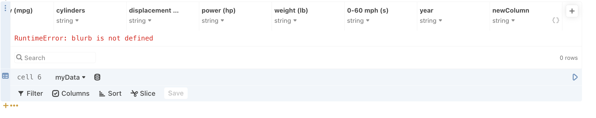
  <figcaption>Select the {} button to reopen the data table cell expression editor.</figcaption>
</figure>

### Sort

Use **Sort** to arrange the items in the table into order: 
<figure>
  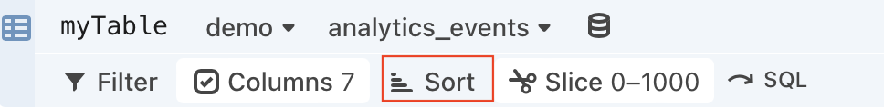
  <figcaption>Select <b>Sort</b> to define the sorting criteria.</figcaption>
</figure>

using any of the columns as a sort key:

<figure>
  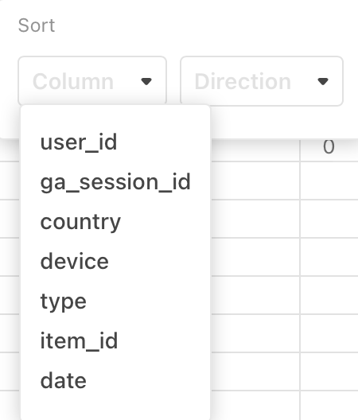
  <figcaption>Select the black triangle to display the available sort key choices for the Column field.</figcaption>
</figure>

You can define multiple sort keys, which is useful when there are duplicate values in some columns.

For each sort key column, use the **Direction** pulldown to select a **Descending** sort or an **Ascending** sort.

<figure>
  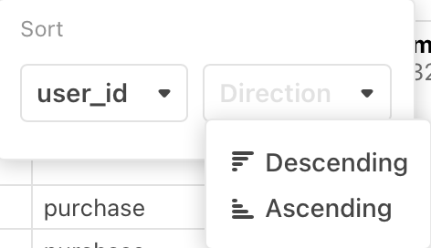
  <figcaption>Choose either a <b>Descending</b> or an <b>Ascending</b> sort order.</figcaption>
</figure>

You may wish to define your Filter criteria first, to limit the returned results, and then do sorting.

### Slice

Use **Slice** to display only a limited number of rows from the table—for example, the first *N* rows. (You may want to define your filter and sorting criteria first.) 

<figure>
  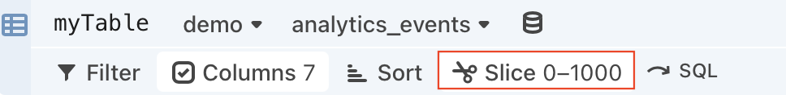
  <figcaption>Select <b>Slice</b> to define a reduced portion of the tabular data to display</figcaption>
</figure>

By default, **Slice** is set to display rows 0-1000:

<figure>
  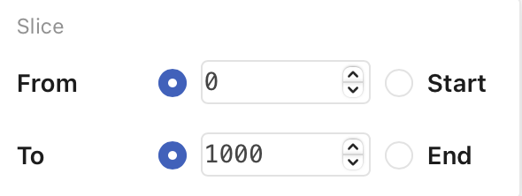
  <figcaption>Select <b>Start</b> to start the slice from the start of the data. Select <b>End</b> to conclude the slice at the end of the data.</figcaption>
</figure>

Once you have defined the lower and upper limits of the slice, press Enter to apply the limits (or click the **Slice** button again). 

## Summary charts

These small graphics at the top of each column provide a quick summary of key data characteristics for each column below.

<figure>
  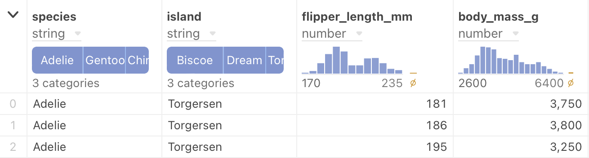
  <figcaption>Each small chart provides a summary of that column's data. Columns are width-adjustable.</figcaption>
</figure>  

Note also, that the small charts are *interactive*. When you hover the pointer over each chart, you can get even more detailed information. By sliding your mouse along the displayed values, you can see individual values for each histogram or bar chart segment. Compare the following figure with the previous one:

<figure>
  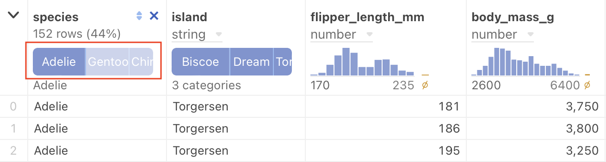
  <figcaption>Highlighting an individual value in a summary chart causes the text above to reflect that value's data.</figcaption>
</figure>

By hovering over the dark bar in the highlighted chart above, we now see additional information:
- The bar represents 152 rows of the total, or 44%.
- The variety of penguin selected is "Adelie".

Here is another example, this time a histogram. Before hovering under an individual vertical bar:

<figure>
  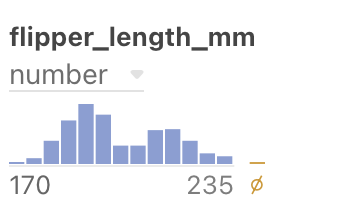
  <figcaption>Highlighting an individual value in a summary chart causes the text above to reflect that value's data.</figcaption>
</figure>

Here is the same histogram, after the pointer is hovered just under the tallest vertical bar:

<figure>
  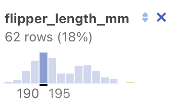
  <figcaption>Highlighting an individual value in a summary chart causes the text above to reflect that value's data.</figcaption>
</figure>

We now see additional information:
- The bar represents 62 rows of the total, or 18%.
- The values in that column range from 190 to 195.

### Null sign results

Earlier we saw a histogram bar with the null sign:

<figure>
  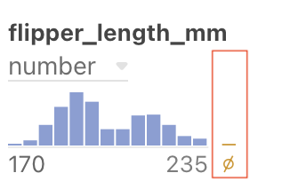
  <figcaption>The null sign represents invalid values.</figcaption>
</figure>

This bar represents results that are invalid. Hovering under this bar causes a message to that effect to be displayed. If you click the bar, the column will display the invalid results. In the following example, "NaN" stands for "Not a Number". 

<figure>
  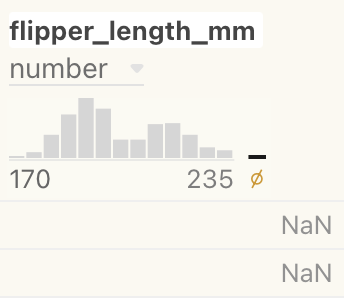
  <figcaption>"NaN" stands for "Not a Number".</figcaption>
</figure>

To de-select the invalid results, select the null set bar again.

### Selecting results

By pressing the Command/Ctrl key while clicking on a summary chart, you can select partial results in a column. Only the selected results display:

<figure>
  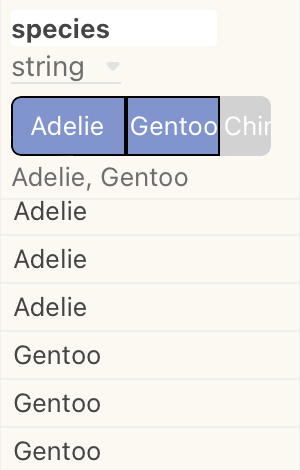
  <figcaption>Use the <code>Command/Ctrl</code> key to select results within a column.</figcaption>
</figure>

Notice also that the background shading of the column changes. To clear the selection, click on the selected result again.

For a column displaying continuous results in a histogram, you can define a selection range, which can be adjusted in size, or dragged to a new location.

:::info NOTE
When defining a selection range, be sure the crosshair (+) cursor is visible.
:::

To clear a selection in a histogram, click the crosshair cursor outside the selection (but still in the histogram area).

### Saving column result selections

If you have defined a column result selection, as described in [Selecting results](#selecting-results) above, you can click the blue **Save** button and your selections are saved as a filter:

<figure>
  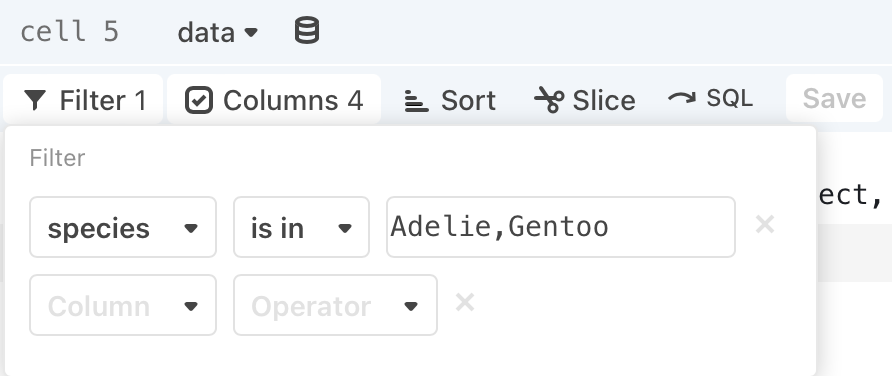
  <figcaption>Column result selections can be saved as a filter.</figcaption>
</figure>

To clear the filter, select the **X** at the right of the filter specification.

#### Text results 

If the column contains values that are best represented by text only, the summary charts display a descriptive message:

<figure>
  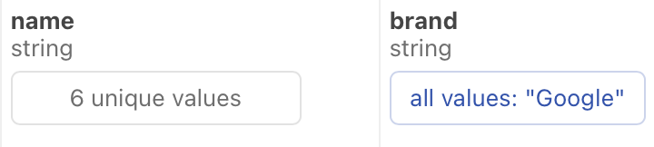
  <figcaption>Summary charts display text when appropriate.</figcaption>
</figure>

### Interacting with rows of data

In addition to interacting with the columns in the summary charts, you can interact with  the rows of data. Hovering over a row of data causes individual marks in the summary chart to highlight. 

In the following example, the pointer is hovered over the highlighted row. The summary charts have changed to reflect the values in that row.

<figure>
  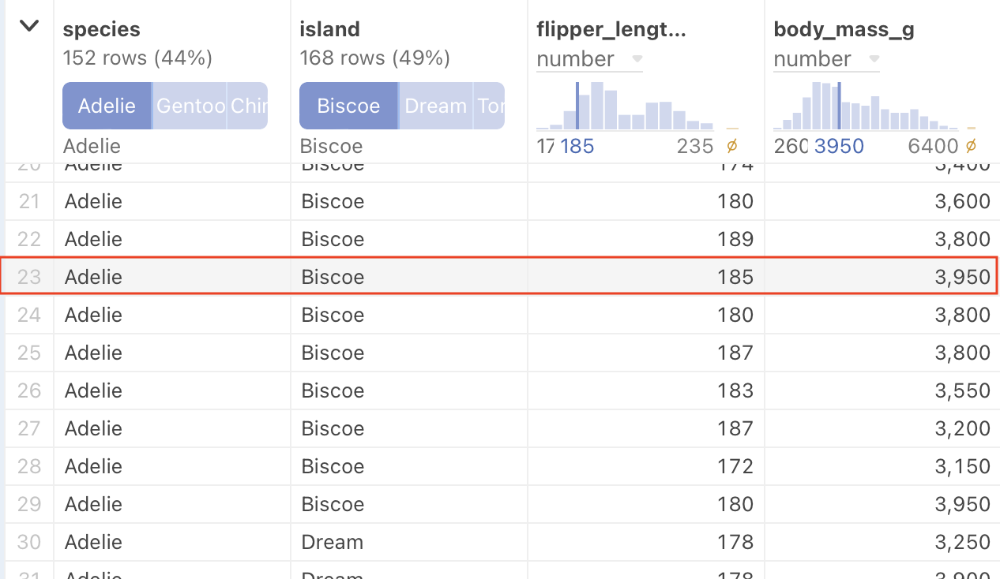
  <figcaption>Hovering over a row of data highlights individual marks in the summary charts.</figcaption>
</figure>

:::info NOTE
The summary charts are an extension of previous work on the [Summary Table](https://observablehq.com/@observablehq/summary-table)
:::

## Convert to SQL

If you want to create a hand-tuned SQL query on selected results, you can convert a populated data table cell to a [SQL cell](/cells/sql). Select the **+** below a data table cell and select **Convert to SQL**.

<figure>
  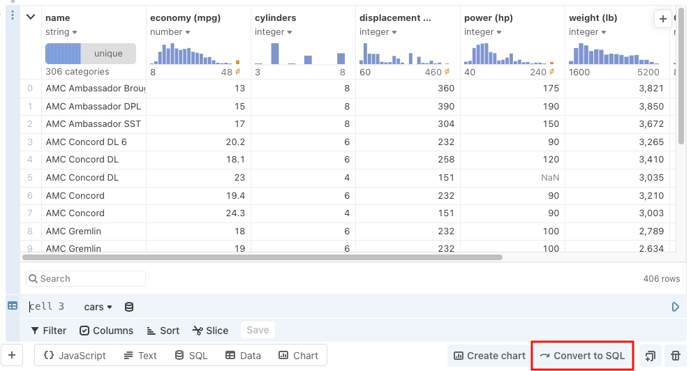
  <figcaption>Select <b>Convert to SQL</b> to make a new SQL cell with the equivalent query.</figcaption>
</figure>

A new SQL cell appears, with the same columns, filters, sorts, and slices:

<figure>
  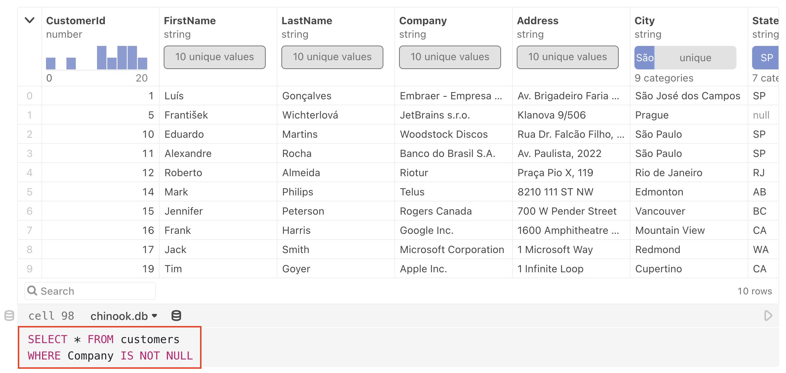
  <figcaption>The SQL code in the converted cell.</figcaption>
</figure>

## Additional info
- If you want to refer to the results from your data table cell in another cell, you will need to give the data table cell a name.
- You can also use a custom database client as a data source for a data table cell. In order for a database client to be recognized as a valid data source, it must satisfy the requirements outlined in [DatabaseClient Specification](/data/databases/databaseclient-specification).