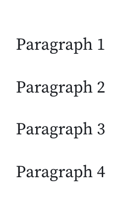

# HTML cell

Observable's HTML cell allows you to write your own custom HTML in notebooks. 

```html
<p>Hello, HTML cell!</p>
```

Just like text cells, you can embed variables in your HTML cell using string interpolation `${}`:

```js
myVariable = new Date()
```

```html
<p>Today is ${myDate}</p>
```

HTML cells function as you would expect: write valid HTML and see the output above the cell. The only caveat is when you use the `<style>` tag. Given Observale is a website like any other, writing an unscoped styling will affect tags on the entire page. It's best practice to scope your styling to the contents of the HTML cell to return expected results:

```html
<style> 
#parent-container p {
  text-decoration: underline;
}
</style>

<div id='parent-container'>
    <p> Hello, scoped HTML styling!</p>
</div>
```

Since SVG is a supported HTML tag, you can use the HTML cell to write SVG code.

```html
<svg width=100 height=100 style='border: 1px solid #000;'>
    <circle cx=50 cy=50 r=25 style='fill: steelblue'></circle>
</svg>
```

<figure>
  
  <figcaption>The output of an HTML cell with SVG code.</figcaption>
</figure>


::: info NOTE
HTML cells by default are unpinned, which means when you navigate to another cell, the code for your HTML cell will close.
:::

It is possible to write HTML using Javascript with [Hypertext Literal](https://github.com/observablehq/htl). This can be advantageous when working with data, like so: 


```js
myData = [1, 2, 3, 4]
```

```html
${myData.map(d => htl.html`<p>Paragraph ${d}</p>`)}
```
<figure>
  
  <figcaption>The output of an HTML cell using JavaScript and Hypertext Literal.</figcaption>
</figure>


Hypertext Literal is part of our standard library, and can be called by using `htl`.