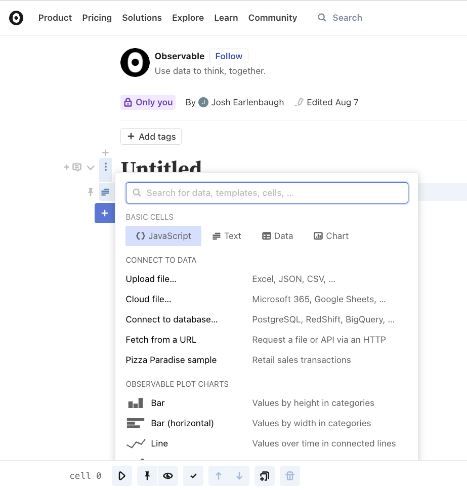
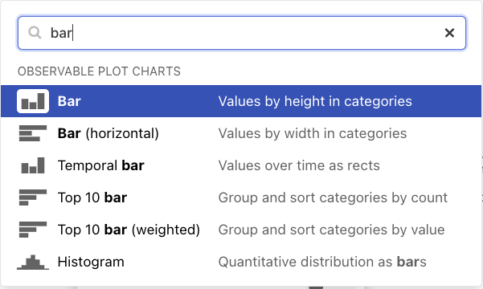
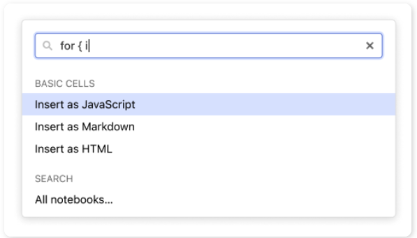
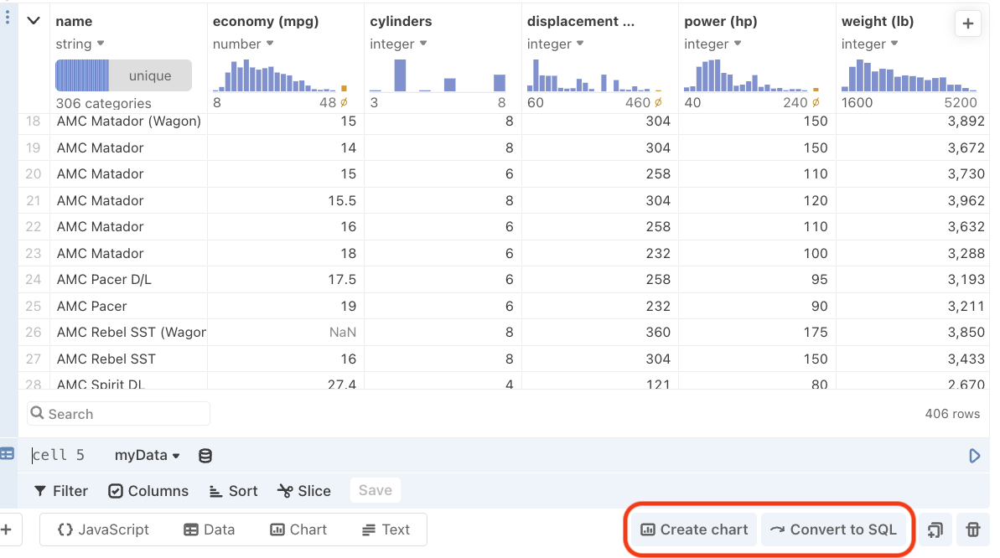
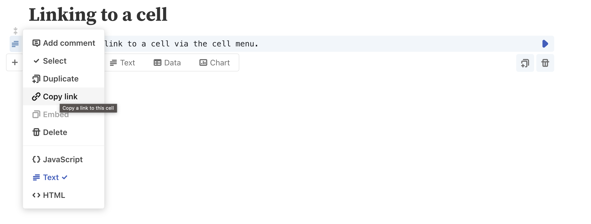
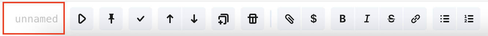
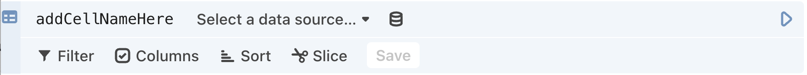

# Cells

All of Observable notebooks are made of **cells**. To build a notebook is to add cells to a notebook.

<figure>
  
    <figcaption>A notebook divided into <b>cells</b>.</figcaption>

</figure>

Cells can be added in a few different ways in Observable.

## Add cell menu

The **Add cell menu** appears as the first thing you see upon opening a blank notebook.

<figure>
  
    <figcaption>The <b>Add cell menu</b>.</figcaption>
</figure>

It also appears when you click the "+" button to the left of the **Add cell bar**. To open see the menu between _unfocused cells_, click either the gray "+" button or anywhere between two cells to open the **Add cell menu**.

Besides providing options to add any of the top four cell types - *JavaScript*, *Text* (Markdown), *Data* table, *Chart* - the **Add cell menu** gives users the ability to:
- Connect to data
- Insert Plot snippets
- Create Inputs
- Insert D3 (and other code) snippets
- Create tables
- Upload and insert images
- Import a notebook cell or library
- Browse sample data sets

### Searching the Add cell menu

The search bar is ready at the top of the **Add cell menu**. Selecting an option will insert the corresponding type of cell into your notebook.

<figure>
  
  <figcaption>The <b>Add cell menu</b> search bar.
</figcaption>
</figure>

All of the components and code snippets are immediately executable, so you can quickly preview them with some included sample data. Just replace the sample references to see your own data represented.

## Add cell bar

After the initial **Add cell menu** is closed, likely the first thing you will notice in a blank notebook, is the **Add cell bar**:

<figure>
  
  <figcaption>The <b>Add cell bar</b>.</figcaption>
</figure>

Like the **Add cell menu**, the **Add cell bar** highlights the most commonly used cell types in the platform:
- **JavaScript**: A code cell that stores and executes JavaScript
- **Text**: A markdown cell, for formatting text quickly and easily
- **Data**: The Data Table cell, capable of visualizing tabular data, offering interactive filters
- **Chart**: The Chart cell, delivering no-code charts and visual data exploration

The bar appears below _the currently focused cell_.

### Freeform text input

When you input freeform text into the search box that does not match any known menu items, you are prompted to insert the content typed as a JavaScript cell, or optionally as a Markdown or HTML cell.

<figure>
  
  <figcaption>An unmatched search query.
</figcaption>
</figure>

## Cell suggestions

Cell suggestions are over to the right side of the space that the next cell's **Add cell bar** occupies:

<figure>
  
  <figcaption>The <b>Create chart</b> button and <b>Convert to SQL</b> button.
</figcaption>
</figure>

Some suggestions create a new cell below in an effort to keep you moving to the next logical step in the analysis process (e.g. the **Create chart** suggestion in the screenshot above). Suggestions that show an arrow indicate that the focused cell will be non-destructively transformed into another cell (e.g. the **Convert to SQL** suggestion in the screenshot above).

## Evaluating cells

To have the results of your cell appear, click the Play <Icon name="playButton" /> button, or type <Keys set="Shift-Enter" /> to run your cell.

## Anchor links

You can link directly to a section of the notebook with an auto-generated anchor link using the "Copy Link" action in the cell menu. This will copy a special URL to the clipboard like:

```
https://observablehq.com/@observablehq/a-taste-of-observable#cell-0
```

<figure>
  
  <figcaption>Using the cell menu to select the "Copy Link" option.</figcaption>
</figure>

## Naming cells

Naming cells allows you to call the cell elsewhere in a notebook, or import cell contents for reuse in another notebook.

Name a **JavaScript cell** in one of four ways:

- Name a cell expression:

```js
expressionName = 8
```

- Name a block:

```js
blockName = {return 80;}
```

- Name a function declaration:

```js
function functionName() {return 800;}
```

- Name a class:

```js
class className {}
```

Name a **Markdown cell** by entering the name of the cell in the following area (visible at the bottom of your browser window when you are editing the cell):

<figure>
  
</figure>

For specialty cells like the Data Table, SQL and Chart cell, you can either edit the cell name from the menu in the bottom of the browser as shown above, or you can update the cell name in the top left of the cell:

<figure>
  
</figure>


