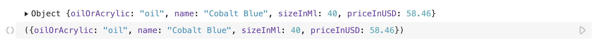

# JavaScript code in Observable

Observable notebooks are often written in [JavaScript](https://developer.mozilla.org/docs/Web/JavaScript) cells, using the Web's native language, but [with a few changes](https://observablehq.com/@observablehq/observable-javascript?collection=@observablehq/javascript-in-observable). It's helpful if you have some JavaScript experience, but don't panic if you're rusty or not an expert! Instead, try tinkering with the code to get a feel for how it works. Even the most wizened developer may yet learn by trial and error. (If you *are* an experienced JavaScript developer, definitely look at [Observable JavaScript](https://observablehq.com/@observablehq/observable-javascript?collection=@observablehq/javascript-in-observable).)

## Evaluating cells

To have the results of your edits appear, click the Play (▶︎) button, or type <Keys set="Shift-Enter" />.

## Cells—for expressions, variable definitions, blocks

JavaScript cells can be in one of two primary forms: expressions and blocks. Expression cells are concise and are intended for simple definitions, such as basic arithmetic:

<figure>
  
  <figcaption>A JavaScript expression cell opened to show the code. The result appears above the code.</figcaption>
</figure>

or variable definitions:

<figure>
  
  <figcaption>A variable definition cell opened to show the code. The result appears above the code.</figcaption>
</figure>

Variables can also be strings of text:

<figure>
  
  <figcaption>Two variables defined by strings.</figcaption>
</figure>

Blocks of code are surrounded by curly braces ({}) and are intended for more complex definitions, such as ones involving local variables or loops.

<figure>
  
  <figcaption>An open JavaScript cell featuring a block of code in curly braces ({}).</figcaption>
</figure>

::: info NOTE
Any cell that you see with visible shading is _pinned_. This leaves the cell open so that the code is visible. A blue pushpin symbol appears in the left margin when you mouseover the cell.
:::

## Variables inside blocks are *local* to a cell

Local variables, like the `x` seen in the block above, can't be referenced from other cells; trying to reference an unknown variable results in a runtime error:

<figure>
  
  <figcaption>An open JavaScript cell showing a runtime error.</figcaption>
</figure>

However, this error is localized to the broken cell the rest of the notebook is able to run and you are still able to access variables that are not inside blocks.

## Special case: Object literals

Using curly braces is necessary not only when you are defining a block, but also when you are defining an [object literal](https://developer.mozilla.org/en-US/docs/Web/JavaScript/Guide/Grammar_and_types#Object_literals).

An [object literal](https://developer.mozilla.org/en-US/docs/Web/JavaScript/Guide/Grammar_and_types#Object_literals) is an object with a set of name–value pairs that define properties of the object:

<figure>
  
  <figcaption>An open JavaScript cell featuring an object literal.</figcaption>
</figure>

Notice the curly braces (like a block), but with parentheses surrounding the curly braces (unlike a block). If you want to define a cell as an object literal, you must wrap the literal in parentheses to disambiguate it from a block.

## Functions

To repeat operations or share code between cells without copying and pasting, define a function:

<figure>
  
  <figcaption>An open JavaScript cell featuring a function.</figcaption>
</figure>

This `greet` function now can be called from other cells to display greetings:

<figure>
  
  <figcaption>The same `greet` function being invoked in two different cells with different arguments with two different results.</figcaption>
</figure>

## Naming cells and referencing cells' values

While local variables are not visible across cell boundaries, you can name cells to reference their values. Here's a cell named 'color' for example:

<figure>
  
  <figcaption>A cell variable named 'color'.</figcaption>
</figure>

Here's another cell named 'letters' created by using the JavaScript `split()` function on a string of the alphabet capitalized, such that each character is returned as a member of an array:

<figure>
  
  <figcaption>A cell variable named 'letters'.</figcaption>
</figure>

::: info NOTE
You can read more about split() [here.](https://developer.mozilla.org/en-US/docs/Web/JavaScript/Reference/Global_Objects/String/split)
:::

You can refer to any named cell like `letters` from other cells:

<figure>
  
  <figcaption>Calling `letters` from another cell.</figcaption>
</figure>

::: info NOTE
You can read more about map() [here.](https://developer.mozilla.org/en-US/docs/Web/JavaScript/Reference/Global_Objects/Array/map)

You can read more about toLowerCase() [here.](https://developer.mozilla.org/en-US/docs/Web/JavaScript/Reference/Global_Objects/String/toLowerCase)
:::
You needn't define named cells before you reference them: order your cells however you like, and Observable will automatically execute them in topological order. Out-of-order execution is especially helpful for improving the narrative flow of your notebook.

<figure>
  
  <figcaption>Here we call the variables in the first cell that are defined in latter cells.</figcaption>
</figure>

Cells can also be (re)named via the cell toolbar:

<figure>
  
  <figcaption>The renaming field in the cell toolbar is in the lower left-hand corner of the screen when a cell is selected.</figcaption>
</figure>

## Reactivity—cells revaluate automatically

A cell that references other cells is revaluated automatically whenever the referenced values change. In our example above where `firstName` and `lastName` were defined after `fullName`, if we were to change the value of `firstName`, then `fullName` would update automatically without needed to be revaluated. 

This reactivity is similar to live reload, with an important difference: when a value changes, only referencing cells are revaluated, rather than the entire notebook. This makes editing more responsive—notebooks update rapidly in response to changes—and you don’t lose independent transient state.

For example, the cell below computes a random walk in the cell `randomWalk`, the next cell strokes a line, the shape of which is based on the value of the `randomWalk`, and the third cell, `stroke`, defines the color of the line. If you edit the `stroke` cell, the random walk will change color, but the shape of the line remains the same. A new walk is only computed if you edit the `randomWalk` cell.`

<figure>
  
  <figcaption>Three different cells where the color of the middle cell's drawn line is dependent upon the third cell `stroke`, but where the shape of the line is determined by the first cell `randomWalk`.</figcaption>
</figure>

### More about reactivity 

To understand reactivity, think of each cell as a function. For example, the cell `sum = a + b` becomes a function that takes `a` and `b` as arguments, returning their sum; the runtime waits for the value of `a` and `b` to resolve and then invokes the `sum` function. The runtime invokes `sum` again whenever `a` or `b` change.

If a cell contains a `yield` statement, the runtime creates a [generator function](https://observablehq.com/@observablehq/introduction-to-generators) instead of a normal function. Likewise if the definition uses `await`, the runtime creates an [async function](https://observablehq.com/@observablehq/introduction-to-asynchronous-iteration). Reactivity greatly simplifies how you build user interfaces, script animations, and consume real-time data. 
