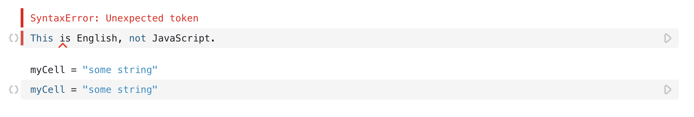
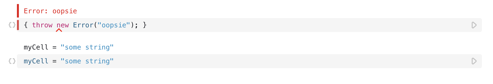
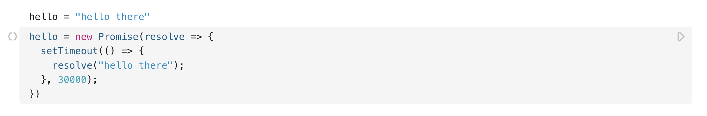
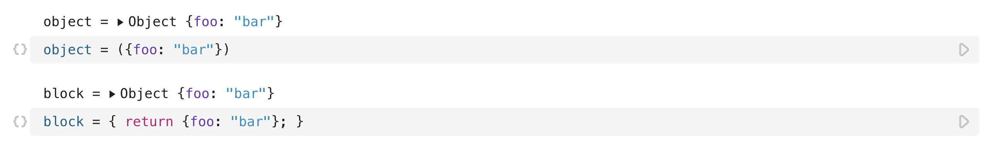
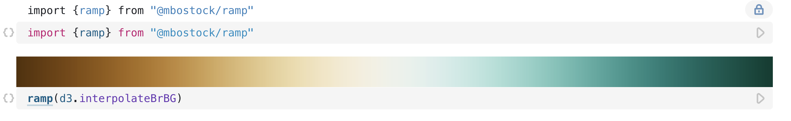
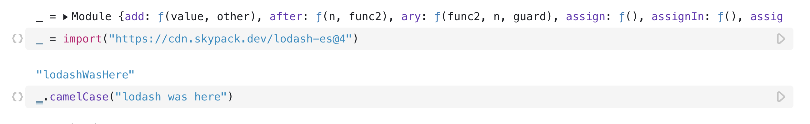

# Observable JavaScript

JavaScript on Observable is almost—_but not entirely_ —vanilla. This is intentional: by building on the native language of the web, Observable is familiar. And you can use the libraries you know and love, such as D3, Lodash, and Apache Arrow. Yet for [dataflow](https://observablehq.com/@observablehq/how-observable-runs), Observable needed to change JavaScript in a few ways. 

Here's a quick overview of what's different from vanilla.

## Cells are separate scripts

Each cell in a notebook is a separate script that runs independently. A syntax error in one cell won't prevent other cells from running. 

<figure>
  
  <figcaption>A syntax error in one cell doesn't affect the running of the other cells in the notebook.</figcaption>
</figure>

The same holds true for a runtime error:

<figure>
  
  <figcaption>A runtime error in one cell doesn't affect the running of the other cells in the notebook.</figcaption>
</figure>

Likewise, local variables are only visible to the cell that defines them. Here in the following screenshot, you can see the constant `local` is defined within curly braces and is therefore local to the cell/block. Therefore, when the variable is called in the next cell, there is a runtime error:

<figure>
  
  <figcaption>Calling a local variable from a cell for which it is not defined causes a runtime error.</figcaption>
</figure>

## Cells run in topological order

In vanilla JavaScript, code runs from top to bottom. Not so here; Observable runs [like a spreadsheet](https://observablehq.com/@observablehq/how-observable-runs), so you can define your cells in whatever order makes sense.

<figure>
  
  <figcaption>You can define cells in whatever order you like. Here `a` is successfully used as a variable in the cell before the one in which it is defined.</figcaption>
</figure>

By extension, circular definitions are not allowed:

<figure>
  
  <figcaption>Circular definitions cause errors.</figcaption>
</figure>

## Cells re-run when any referenced cell changes

You don't have to run cells explicitly when you edit or interact—the notebook updates automatically. Run the cell below by clicking the play button <Icon name="playButton" />, or by focusing and hitting <Keys set="Shift-Enter" />. Only the referencing cells run, then *their* referencing cells, and so on—other cells are unaffected.

If a cell allocates resources that won't be automatically cleaned up by the garbage collector, such as an animation loop or event listener, use the [invalidation promise](https://observablehq.com/@observablehq/invalidation) to dispose of these resources manually and avoid leaks.

<figure>
  
  <figcaption>Use the invalidation promise to dispose of resources like an animation loop or an event listener, as they won't be automatically cleaned up by the garbage collector.</figcaption>
</figure>

## Cells implicitly await promises

You can define a cell whose value is a promise:

<figure>
  
  <figcaption>A cell whose value is a promise.</figcaption>
</figure>

If you reference such a cell, you don't need to `await`; the referencing cell won't run until the value resolves. 

## Cells implicitly iterate over generators

If a cell `yield`s, any referencing cell will see the most recently yielded value.

<figure>
  
  <figcaption>When you reference a cell with yields, the most recently yielded value is returned.</figcaption>
</figure>

Also, yields occur no more than once every animation frame: typically sixty times a second, which makes generators handy for [animation](https://observablehq.com/@observablehq/animation-loops). If you yield a DOM element, it will be added to the DOM before the generator resumes.

## Named cells are declarations, not assignments

Named cells look like, and function *almost* like, assignment expressions in vanilla JavaScript. But cells can be defined in any order, so think of them as hoisted function declarations.

You can't assign the value of another cell (though see mutables below):

<figure>
  
  <figcaption>You will get an error if you assign the value of another cell.</figcaption>
</figure>

Cell names must also be unique. If two or more cells share the same name, they will all error:

<figure>
  
  <figcaption>You will get an error if you assign the value of another cell.</figcaption>
</figure>

:::info NOTE
Observable doesn't yet support destructuring assignment to declare multiple names, but we hope to add that soon.
:::

## Statements need curly braces, and return or yeild

A cell body can be a simple expression, such as a number or string literal, or a function call. But sometimes you want statements, such as for loops. For that you'll need curly braces, and a `return` statment to give the cell a value. Think of a cell as a function, except the function has no arguments.

<figure>
  
  <figcaption>A statement inside curly braces with a `return` so that the cell has a value.</figcaption>
</figure>

For the same reason, you'll need to wrap object literals in parentheses, or use a block statment with a `return`:

<figure>
  
  <figcaption>The first cell uses parentheses to define the object literal and the second cell uses a return statment.</figcaption>
</figure>

The below cell is interpreted as a block with a single [labeled statement](https://developer.mozilla.org/en-US/docs/Web/JavaScript/Reference/Statements/label), followed by a string literal expression. The cell value is undefined because the block doesn't return anything.

<figure>
  
  <figcaption>A cell defining an object literal without using parentheses. It is therefore not recognized by Observable as an object literal.</figcaption>
</figure>

## Cells can be views

Observable has a special [`viewof` operator](https://observablehq.com/@observablehq/views) which lets you define interactive values. A view is a cell with two faces: its user interface, and its programmatic value.

<figure>
  
  <figcaption>The `viewof` operator named `text` renders a text field. The value of that field can be accessed elsewhere by calling `text`.</figcaption>
</figure>

## Cells can be mutables

Observable has a special [`mutable` operator](https://observablehq.com/@observablehq/mutable) so you can opt-in to mutable state: you can set the value of a mutable from another cell:

<figure>
  
  <figcaption>The mutable operator makes it so that you can opt-in to a mutable state and affect the value from another cell.</figcaption>
</figure>

## Observable has a standard library

Observable provides a small [standard library](https://github.com/observablehq/stdlib/blob/master/README.md) for essential features, such as a reactive `width` and [Inputs](https://observablehq.com/@observablehq/inputs).

## Cells can be imported from other notebooks

You can [import any named cell](https://observablehq.com/@observablehq/import) from any notebook, with syntax similar to static ES imports. But Observable imports are lazy: if you don't use it, it won't run.

<figure>
  
  <figcaption>Importing a cell and then calling that cell.</figcaption>
</figure>

Also, you can [import-with](https://observablehq.com/@d3/bar-chart-remix), which allows you to inject cells from the current notebook into the imported notebook, overriding the original definition. You can treat any notebook as an extensible template!

## Static ES imports are not supported; use dynamic imports

Since everything in Observable is inherently dynamic, there's not really a need for static ES imports—though, we might add support in the future. Note that only the most-recent browsers support dynamic imports, so you might consider using require for now.

<figure>
  
  <figcaption>Importing lodash in one cell and using it in another.</figcaption>
</figure>
