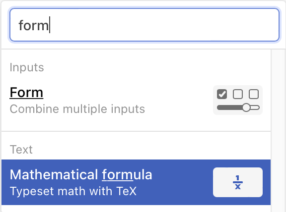
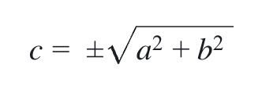
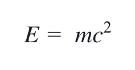
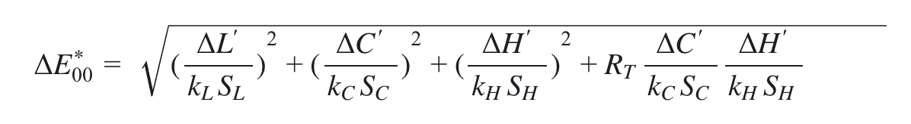

# TeX cells

For the mathematically inclined, you can use KaTeX leveraging our mathematical formula cell.

To enter an equation in TeX, start typing 'math' into the search input in the Add cell menu to display the Mathematical formula option:

<figure>
  
  <figcaption>Type "math", then choose <b>Mathematical formula</b>.</figcaption>
</figure>

When you first choose the 'Mathematical formula' option, Observable will supply some boilerplate code in TeX for the math cell:

```
c = \pm\sqrt{a^2 + b^2}
```

<figure>
  
  <figcaption>The mathematical formula boilerplate code rendered.</figcaption>
</figure>


Use this if helpful, or replace with your own custom inline TeX code:

```
E = mc^2
```

<figure>
  
  <figcaption></figcaption>
</figure>

or more complicated blocks of TeX:

```
\Delta E^*_{00} = \sqrt{
  \Big(\frac{\Delta L'}{k_LS_L}\Big)^2 +
  \Big(\frac{\Delta C'}{k_CS_C}\Big)^2 +
  \Big(\frac{\Delta H'}{k_HS_H}\Big)^2 +
  R_T
  \frac{\Delta C'}{k_CS_C}
  \frac{\Delta H'}{k_HS_H}}
```

<figure>
  
  <figcaption>A block of TeX in a mathematical formula cell.</figcaption>
</figure>

For more details, please check out [KaTeX's document website](https://katex.org/).

