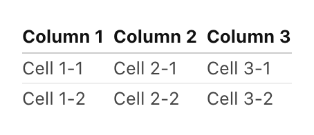

# Text cell

Observable notebooks are great for telling compelling stories with data, but to do that well you need more than beautiful visualizations! You'll also want text, lists, and other text elements to help add context, explanations, and structure. This short guide gives you an introduction to Markdown text in Observable.

## Creating a text cell

To create a new text cell, select the plus sign (+) that appears to the left-side of the notebook between any two cells. As a result, you'll see the [add cell menu](/cells/#add-cell-menu) appear. Use the mouse to select **Text** at the top of the menu or search for it in the search bar. Text cells are Markdown cells, so you can leverage your Markdown knowledge when defining these cells. 

<figure>
  
  <figcaption>Opening the Add cell menu for the Text button.</figcaption>
</figure>

There are many other options available when you are adding cells, but in this guide we'll focus on some common formatting options for text/Markdown cells.


## Basic Formatting

Basic text formatting includes *italics*, **bold**, and ~~strikethrough~~.

To put a word or series of words in italics, wrap the word or series of words in asterisks (*):

```
*italics*
```

<figure>
  
  <figcaption>The word 'italics' in italics by wrapping the word in asterisks, (*).</figcaption>
</figure>

To put a word or series of words in bold, wrap the word or series of words in double-asterisks (**):

```
**bold**
```

<figure>
  
  <figcaption>The word 'bold' in bold by wrapping the word in double-asterisks, (**).</figcaption>
</figure>

To strikethrough a word or series of words, wrap the word or series of words in double-tildes (~~):

```
~~strikethrough~~
```

<figure>
  
  <figcaption>The word 'strikethrough' being struckthrough by wrapping the word in double-tildes, (~~).</figcaption>
</figure>

To make a horizontal divider across the page, use three hyphens in a row, (---), on their own line:

```
---
```

## Lists

### Unordered lists

Here is an example of an unordered list in a text cell:

```
- Item 1
  - Sub-item 1
    - Sub-sub-item 1
    - Sub-sub-item 2
- Item 2
- Item 3
```

<figure>
  
  <figcaption>An unordered list in Markdown.</figcaption>
</figure>

As seen here, it is created using a series of dashes, one dash in the first space of each line signifying one item of the list followed by the item's name, with sub-items being created by indenting dashes one space in on the lines below their parent item's line, each signifying a sub-item on the list. You continue this pattern to nest further items such as sub-sub-items. 

### Ordered lists

Here is an example of an ordered list in a text cell:

```
1. Item 1
  1. Sub-item 1
    1. Sub-sub-item 1
    2. Sub-sub-item 2
2. Item 2
3. Item 3
```

<figure>
  
  <figcaption>An ordered list in Markdown.</figcaption>
</figure>

As seen in the screenshot above, ordered lists are created just like unordered lists except that instead of using dashes for each item you instead use numerals (followed by the name of the item) starting at 1 and increasing +1 for each item at that nesting level.

## Headings

Headings in Markdown and Observable text cells are created by placing pound symbols, (#), in front of the name of the intended heading—one pound symbol for each level of heading you wish to render:

```
# Heading 1

## Heading 2

### Heading 3

#### Heading 4

##### Heading 5
```

<figure>
  
  <figcaption>Examples of headings 1 through 5 in Markdown.</figcaption>
</figure>

## Block Quotes

Block quotes are created using the `>` symbol at the beginning for each line, with the quote wrapped in quotation marks (""). Skipping the line after the quotation, the last part of the block quote is created by using the hyphen, `-` followed by the name of the person responsible for originally saying the quote:

```
> "Above all else show the data."
>
> — Edward Tufte
```

<figure>
  ` symbol. The first line has the quote 'Above all else show the data' in double-quotes. The second line is blank other than the `>` symbol at the beginning, and the third line has the byline with the author of the quote Edward Tufte. In the presentation section of the cell in the upper half."
  />
  <figcaption>Example of a block quote.</figcaption>
</figure>

## Links

URLs automatically turn into links, but you can also add links to text by wrapping the text in brackets, `[]`, immediately followed by the URL in parentheses, `()`:

```
[Observable](https://observablehq.com)
```

<figure>
  
  <figcaption>Example of a URL and hyperlinked text in Markdown.</figcaption>
</figure>

## Images

### Images in Markdown

You can add a markdown image using similar syntax to a link (though prepended with a `!`). Remember to use the await keyword to allow the file attachment to load.

```
.url()})
```

<figure>
  
  <figcaption>Example of loading an image using Markdown in a text cell.</figcaption>
</figure>

## Displaying code

You can display code in a text cell inline by wrapping the intended code in backticks (``). To make a codeblock, put the code in between two lines, each with three backticks. To add syntax highlighting, add the name of the language after the first three backticks:

<figure>
  
  <figcaption>An example of inline code treatment, an example of creating a code block, and an example of syntax highlighting in a code block.</figcaption>
</figure>

## Adding dynamic values

If you have JavaScript variable you would like to access in Markdown from a text cell, you would call the variable inline by wrapping the variable name in curly braces ({}) preceded by the `$` symbol. For instance, if you had the variable `favNumber`, you would use this code:

```
${favNumber}
```

inline as seen here:

<figure>
  
  <figcaption>A variable, `favNumber` defined in a JavaScript cell, but being called in a Markdown text cell to use its value, 29, inline with the text there.</figcaption>
</figure>

## Tables

### A basic table

The following Markdown code in this format:

```
Column 1 | Column 2 | Column 3
-------- | -------- | --------
Cell 1-1 | Cell 2-1 | Cell 3-1
Cell 1-2 | Cell 2-2 | Cell 3-2
```
can be used to create a basic table:

<figure>
  
  <figcaption>An example of a basic table in a Markdown text cell.</figcaption>
</figure>

### Table with text alignment options

Markdown code in this format:

```
Column 1 | Column 2 | Column 3
   :--   |    :-:   |    --:  
Cell 1-1 | Cell 2-1 | Cell 3-1
Cell 1-2 | Cell 2-2 | Cell 3-2
```

renders a text-aligned table in a text cell:

<figure>
  
  <figcaption>An example of a text-aligned table in a Markdown text cell.</figcaption>
</figure>

### Tables as explanatory text

The following Markdown code in this format:

```
|Note: Tables aren't just for tables|
| --- |--- | --- |
|For example, by having a header and one cell we can write a side note with a title and some explanatory text.|
```

renders a helpful way to add a side-note-like visual aide to your text:

<figure>
  
  <figcaption>An example of a text-aligned table in a Markdown text cell.</figcaption>
</figure>
