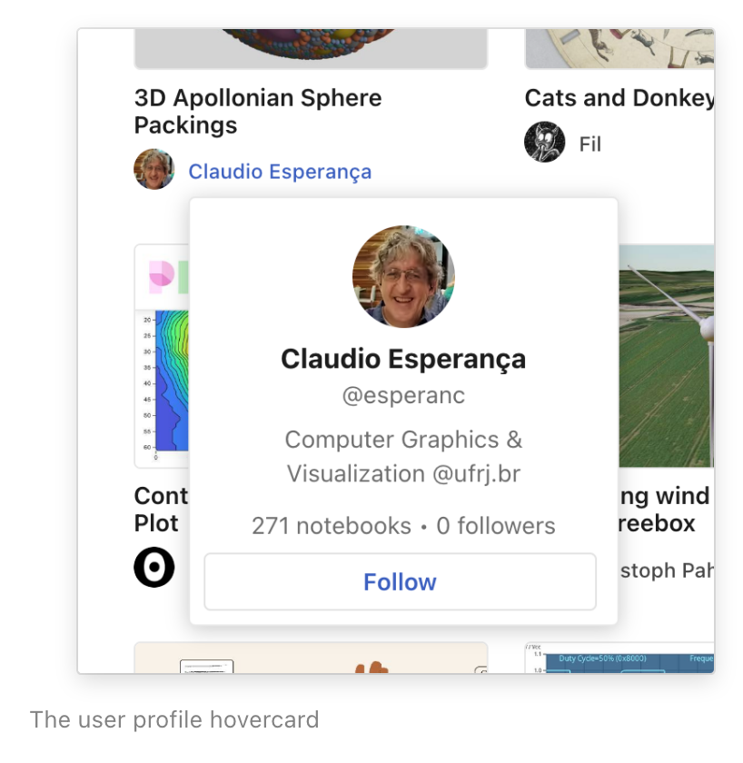
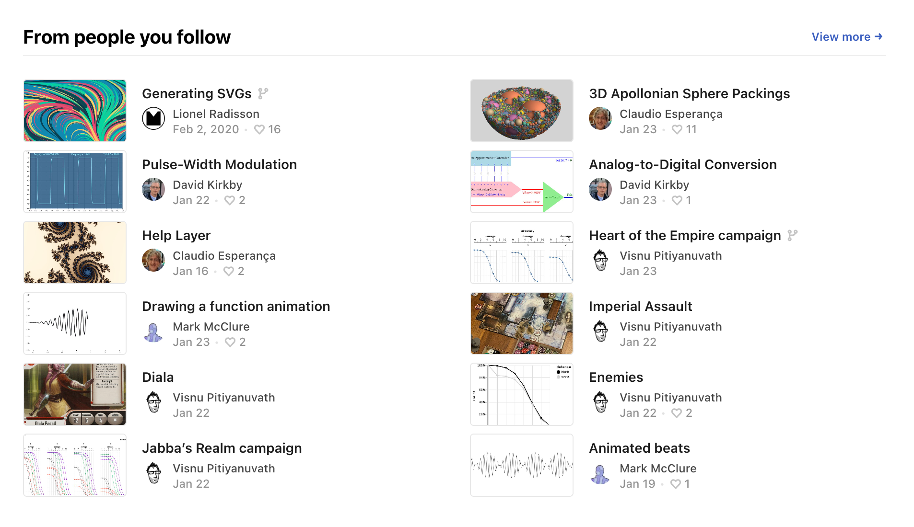
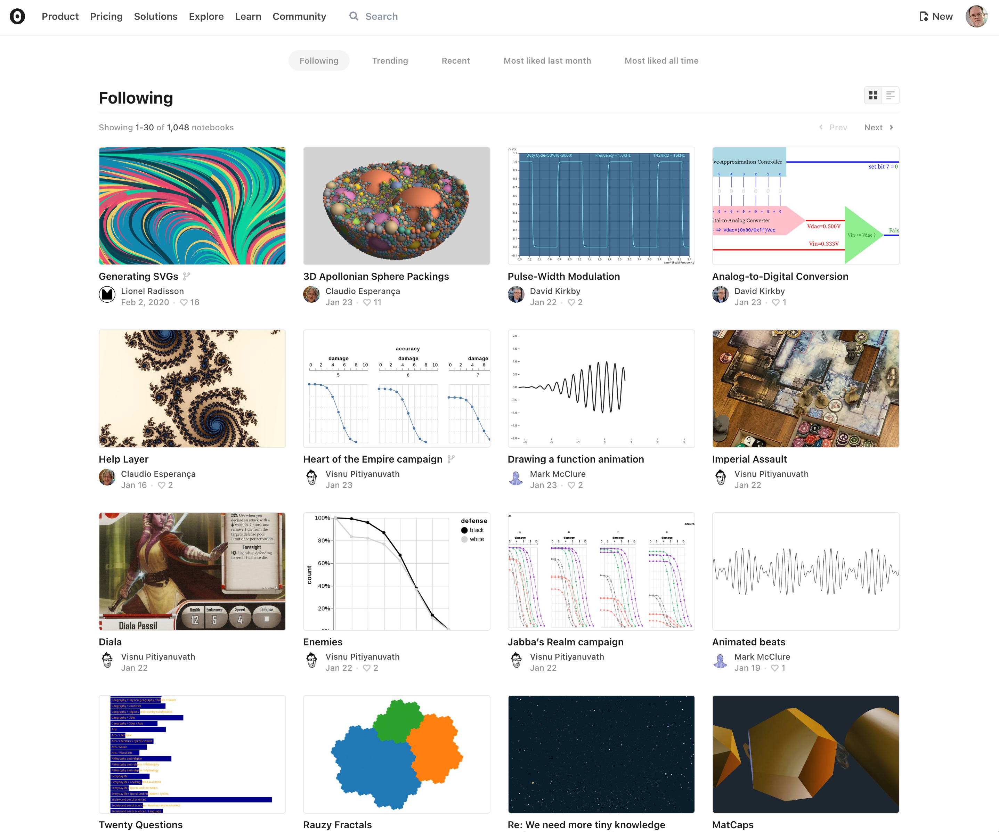
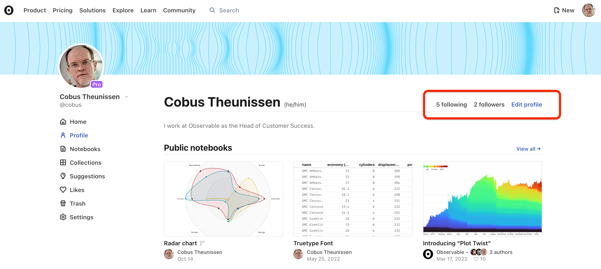
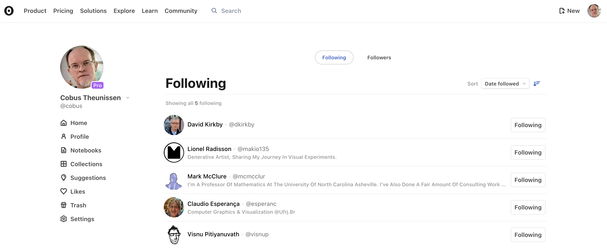

# Following users and teams

If you want to be able to see what your favorite people or teams in Observable are doing, you can do that by **Following** them. By following a user or team you will be able to see a list of their recently edited notebooks on your home page and a new [Following](https://observablehq.com/following) page.

## How to follow (or unfollow) someone

You can follow someone by clicking the 'Follow' button shown in various places. We show a hovercard whenever you hover over a user or team's avatar or name throughout the site:

<figure>
  
  <figcaption>The user profile hovercard.</figcaption>
</figure>

You can also follow a user from the user's full profile page or from a notebook's header.

If you are following a user, the 'Follow' button is updated to 'Unfollow' to allow you to unfollow the user.

## Your following feed
On your home page, you will see a list of recent notebooks from the people you follow:

<figure>
  
  <figcaption>Recent notebooks from the people you follow on your home page.</figcaption>
</figure>

You can also navigate to [https://observablehq.com/following](https://observablehq.com/following) (linked from your home page) to scroll through all their notebooks.

<figure>
  
  <figcaption>Recent notebooks from the people you follow.</figcaption>
</figure>

## Who is following whom?

When you look at a user's profile page, you can see their followers and also who they are following. This is a great way for you to expand your network of people to follow.

<figure>
  
  <figcaption>See following information on a user's profile page.</figcaption>
</figure>

<figure>
  
  <figcaption>The users someone is following.</figcaption>
</figure>

If you are looking at your own profile, you are able to manage the people you follow from this page, and while looking at the followers page, you can choose to follow your followers!