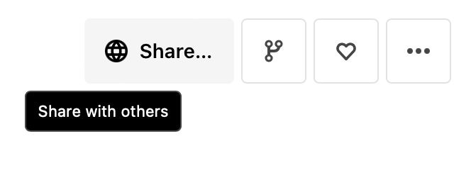
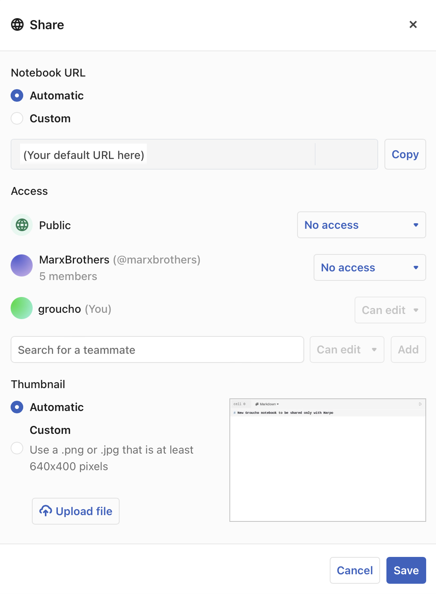
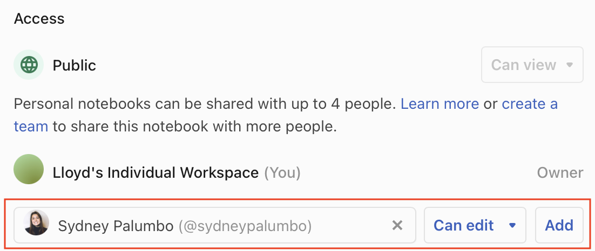
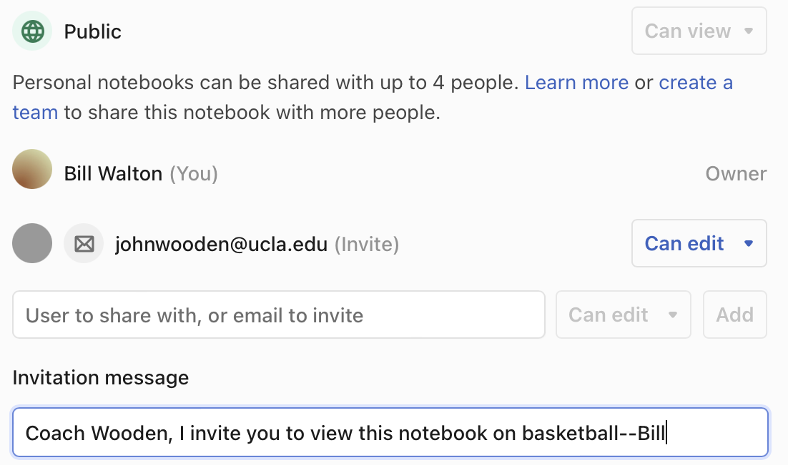
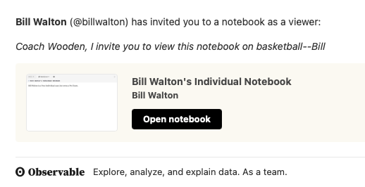
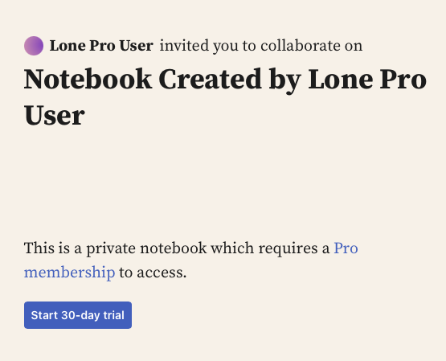

# Sharing

Observable makes sharing your work with others easy and productive. Whether you are a [Free, Pro, or Enterprise](#moving-up-to-a-team-workspace) user, you can directly share a notebook with selected individuals, allowing them to view and edit the notebook. If you are a team member, you can share your notebooks with the entire team or only individuals on the team.

Users who receive an invitation to share a notebook will receive an email message with an optional message from the person sharing the notebook.

## Free, Pro & Enterprise sharing

### Free workspaces
- The Share modal for a Free workspaces allows you to:
  - Define access granted to other individuals (up to four).
    - **Can edit** makes the notebook viewable and editable by the specified individual.
    - **Can view** makes the notebook viewable but not editable by the specified individual.
  - Sign up for a free trial of Pro Individual, which enables private notebooks.
 
### Pro and Enterprise workspaces
- The Share modal for a Pro workspaces allows you to:
  - Define Access granted to the public:
    - **Can view** makes the notebook viewable by the public
    - **Can view (unlisted)** makes the notebook viewable by the public but only if they know the URL
    - **No access** makes the notebook invisible to the public and to search queries in Observable
  - Define Access granted to your team
    - **Can view or edit** makes the notebook viewable and editable by your team
    - **Can view** makes the notebook viewable but not editable by your team
    - **No access** makes the notebook invisible to your team and to search queries in Observable
  - Define Access granted to specific team members
    - After specifying an individual team member, you can set their access to **Can edit** or **Can view**. 
    
You can also grant permission to specific notebooks to users who are outside of your team using guest viewer or guest editor roles.

- **Guest viewer:** The person who needs to read, search and comment on team notebooks explicitly shared with them.
- **Guest editor:** The person who needs edit notebooks explicitly shared with them. Guests are not able to create new notebooks, fork and suggest on notebooks, or update the sharing for other members on a notebook.

## How do I enable sharing?

Sharing can be controlled using the **Share** button. 

<figure>
  
  <figcaption>Click <b>Share</b> to display sharing options.</figcaption>
</figure>

The Share modal displays the available sharing options, which will vary depending on whether you are a member of a team and what tier your team is on.

<figure>
  
  <figcaption>Sharing options for a Pro team.</figcaption>
</figure>

When you open the sharing options, you will see a list of users that you have shared the notebook with already and whether their sharing is restricted to viewing, or includes editing. 

<figure>
  
  <figcaption>To share your notebook with additional people, click <b>Add</b>; to remove a user, click the <b>x</b>.</figcaption>
</figure>

You can remove users or add additional ones by entering their Observable login names.  When a notebook is shared with you, meaning you are not the owner, you can still see who else the notebook is shared with, and you can remove yourself from the list if you choose, but only the owner can add additional users.

## Inviting new users to share

If the person you wish to collaborate with is not already an Observable user, or you're not sure, you can invite them to share the notebook by entering their email address in the sharing dialog. This will send them an invitation which they can accept and create their own Observable login, or use one they already have. A sharing invitation can only be used by one user, and you can rescind the invitation before it is used if you want.

When you invite someone to share your notebook, you can add an invitation message if you like:

<figure>
  
  <figcaption>Example invitation message.</figcaption>
</figure>

The invitee then receives the message via email:

<figure>
  
  <figcaption>How the invitation message looks when received in email.</figcaption>
</figure>

<figure>
  
  <figcaption>To share your notebook with someone who is possibly not yet an Observable user, enter their email address.</figcaption>
</figure>

Note that if you invite a user to collaborate on a private notebook, and they are not in a Pro or Enterprise workspace, they will see a message indicating that they must have a Pro membership to access the notebook:

<figure>
  
  <figcaption>Private notebooks require a Pro or Enterprise membership to access.</figcaption>
</figure>

## Moving up to a team workspace

Invidual sharing is limited to four users besides yourself. To share your notebook with an unlimited number of users, you can create an Observable Team. See our [pricing page](https://observablehq.com/pricing) for details about Free teams, Pro teams, and Enterprise teams.

## Group Sharing
Enterprise workspaces have the ability to share notebooks with **Groups**, which are defined lists of users on a given workspace. To learn more about how to setup and use groups, check out our [Enterprise workspace settings.](https://observablehq.com/@observablehq/workspace-settings#cell-145).