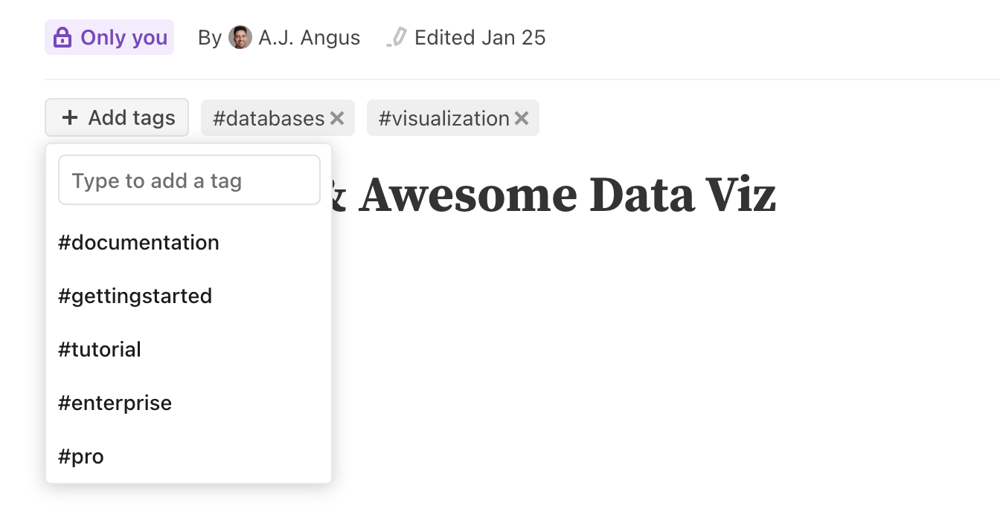
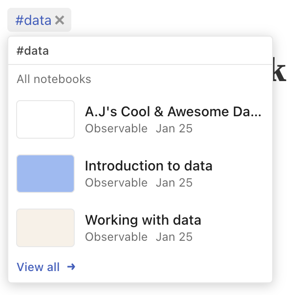
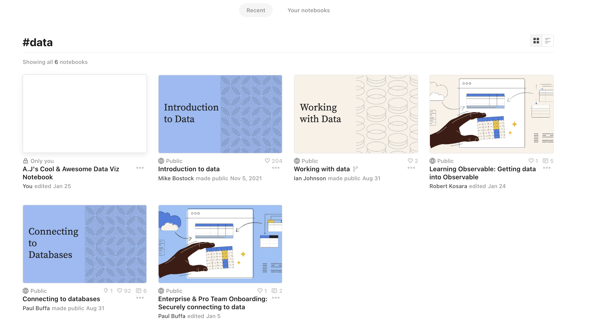

# Tags to organize your work

Individuals and teams can organize their notebooks on Observable by using our **Tag** feature. By adding one or more tags to your notebooks, you gain the following benefits:

- For authors: Allow others to find your notable work by adding tags.
- For readers: Discover notebooks across the entire universe of content on Observable.
- For teams: Organize your workspace by tagging notebooks with team or department specific tags. 

## Using tags

Editors can add tags to a notebook using the `+ Add tags` button, and can remove them using the <svg width="16" height="16" viewBox="0 0 16 16" fill="none" style="display: inline !important;"><path d="M3.99999 4.00001L7.99999 8.00001M12 12L7.99999 8.00001M7.99999 8.00001L12 4.00001M7.99999 8.00001L4.00001 12" stroke="currentColor" strokeWidth="2"/></svg> shown on each tag. Viewers will see the added tags displayed above the notebook's title. 

<figure>
  
  <figcaption>Create or remove tags in an Observable notebook.</figcaption>
</figure>

Tags added to a public notebook will be visible and reusable by everyone. Each publicly used tag has its own [explore page](https://observablehq.com/tag/data).

Tags added exclusively to a private notebook will not be shared outside that notebook's workspace. Your private information will always stay private.

## Discovering more

Clicking on a tag allows you see more notebooks with the same tag. For those with content across multiple workspaces, you will see this divided between your notebooks and the rest of the Observable universe. This snippet will allow you to see the three most recently updated notebooks for a tag. To dive deeper, select `View all`.

<figure>
  
  <figcaption>Click on a tag to see other notebooks sharing the same tag.</figcaption>
</figure>

### Tag discovery

The tag page ([example for "data"](https://observablehq.com/tag/data)) allows you to see the entire universe of Observable content related to a tag. By default this page will be organized by the most recently updated notebooks with this tag. You can also use the `Your notebooks` link to find notebooks in your workspace.

<figure>
  
  <figcaption>Discover more related content in the tag page.</figcaption>
</figure>