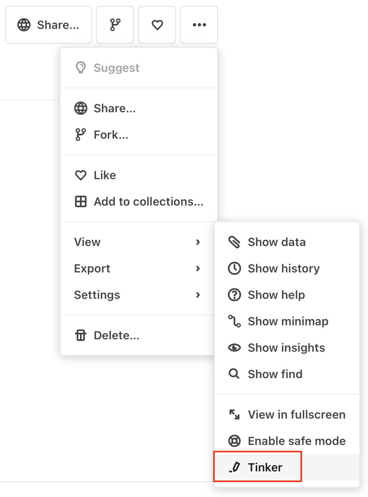

# Tinker mode: temporary edits to a notebook

When you encounter a notebook that you want to experiment with but do not have permission to edit, you will see a banner atop the notebook when you make changes:

<figure>
  
  <figcaption>This banner appears when you begin to modify a notebook that you do not have permission to edit.</figcaption>
</figure>

This banner indicates that you are in *Tinker mode*. This mode is intended for experimentation and "tinkering". If you find that you want to save what you did while tinkering, use **Fork** to create your own copy of the notebook; otherwise, use **Discard** and your changes will not be saved. In either case, the original notebook remains unchanged.

## Modifying your own notebook temporarily

There is another use for Tinker mode: modifying a notebook temporarily, even though you do have permission to edit. In that case, you would use the **Tinker** menu item available from **View** on the notebook menu:

<figure>
  
  <figcaption>Use Tinker to make temporary edits to a notebook even though you have permission to edit.</figcaption>
</figure>

Using **Tinker** allows you to try out a quick modification or idea without having to fork the notebook, yet you can be assured that the original will remain unchanged.