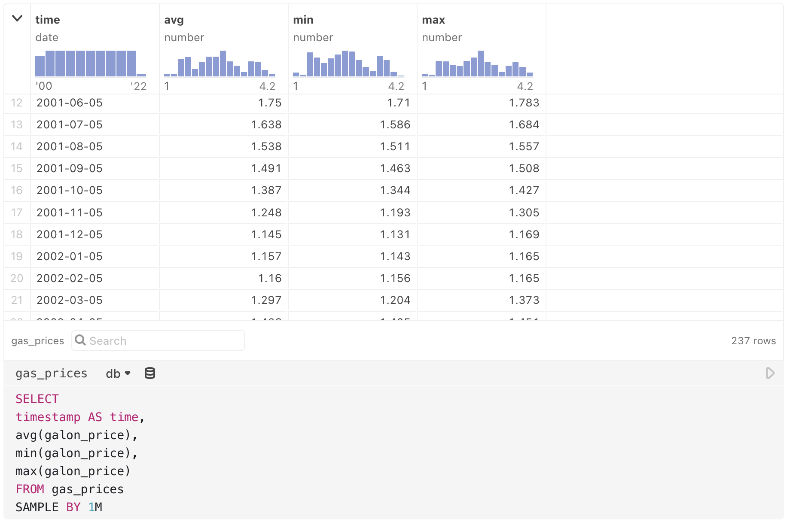

# Database clients

The following is a list of database types we support along with instructions on how to connect to them.

## Amazon Redshift (PostgreSQL driver)

See our standard instructions for [Connecting to databases](/data/databases/overview), choosing PostgreSQL for the database Type where prompted.

## BigQuery

See our standard instructions for [Connecting to databases](/data/databases/overview).

## Databricks

See our standard instructions for [Connecting to databases](/data/databases/overview).

## Datasette

::: info NOTE
This content is updated from Alex Garcia's original notebook [Hello, Datasette](https://observablehq.com/@ambassadors/datasette-client?collection=@observablehq/database-clients).
:::

[Datasette](https://datasette.io/) allows you to easily publish a SQLite database online, with a helpful UI for exploring the dataset and an API that you can use to programmatically query the database with SQL.

This client, which you can import into your own notebooks, simplifies access to that API, allowing you to query Datasette instances using Observable's new [SQL cell](https://observablehq.com/@observablehq/sql-cell).

Make sure your Datasette instance has CORS enabled (pass in the `--cors` flag), and it will be ready to go with Observable.

To use in your Observable notebook, first import the client: 

```js
import {DatasetteClient} from "@ambassadors/datasette-client"
```

To create a new database cell that points to a Datasette instance, use `new DatasetteClient(url)` like so:

```js
congress = new DatasetteClient(
  "https://congress-legislators.datasettes.com/legislators"
)
```

Now you can use the `congress` cell as a database in a SQL cell. Insert a new SQL cell from the Add cell menu, then choose the database as a source (note that *congress* is selected as the database in the SQL cell below):

<figure>
  
  <figcaption>Query a Datasette database in Observable's SQL cell.</figcaption>
</figure>

<details>
  <summary><i>Expand for Datasette implementation details</i></summary>

### Implementation

```js
class DatasetteClient {
  constructor(baseUrl) {
    this.baseUrl = baseUrl;
  }

  _getFetchURL(sql, params, _shape = "array") {
    const searchParams = new URLSearchParams();
    searchParams.append("sql", sql);
    if (params)
      for (const key in params) {
        searchParams.append(key, params[key]);
      }
    searchParams.append("_shape", _shape);
    return `${this.baseUrl}.json?${searchParams.toString()}`;
  }

  _parseTemplate(strings, ...values) {
    let sql = "";
    const params = {};
    let paramsI = 0;
    for (const [i, s] of strings.entries()) {
      if (i < values.length) {
        // If an array is given inside ${}, then create a new parameter
        // for each element and join the param names together in SQL
        // ex "select 1 in ${[1,2,3]}" ->
        // {sql: "select 1 in (:p0,p1,:p2)", params:{p0:1, p1:2, p2:3} }
        if (Array.isArray(values[i])) {
          const sqlArrayParts = [];
          for (const v of values[i]) {
            const param = `p${paramsI++}`;
            sqlArrayParts.push(`:${param}`);
            params[param] = v;
          }
          sql += `${s}(${sqlArrayParts.join(",")})`;
        }
        // Otherwise just replace element with string
        else {
          const param = `p${paramsI++}`;
          sql += `${s}:${param}`;
          params[param] = values[i];
        }
      } else {
        sql += s;
      }
    }

    return { sql, params };
  }

  _element(name, props, children) {
    if (arguments.length === 2) (children = props), (props = undefined);
    const element = document.createElement(name);
    if (props !== undefined) for (const p in props) element[p] = props[p];
    if (children !== undefined)
      for (const c of children) element.appendChild(c);
    return element;
  }

  _text(value) {
    return document.createTextNode(value);
  }

  async query(query, params) {
    const fetchUrl = this._getFetchURL(query, params);
    const data = await fetch(fetchUrl).then((r) => r.json());
    if (typeof data.ok !== "undefined" && !data.ok) throw Error(data.error);
    return Object.assign(data, {
      columns: data.length ? Object.keys(data[0]) : []
    });
  }

  // have to redefine bc Datasette doesnt use non-named parameters ("?")
  async describe(object) {
    const rows = await (object === undefined
      ? this.query(`SELECT name FROM sqlite_master WHERE type = 'table'`)
      : this.query(`SELECT * FROM pragma_table_info(:p0)`, { p0: object }));
    if (!rows.length) throw new Error("Not found");
    const { columns } = rows;
    return this._element("table", { value: rows }, [
      this._element("thead", [
        this._element(
          "tr",
          columns.map((c) => this._element("th", [this._text(c)]))
        )
      ]),
      this._element(
        "tbody",
        rows.map((r) =>
          this._element(
            "tr",
            columns.map((c) => this._element("td", [this._text(r[c])]))
          )
        )
      )
    ]);
  }

  async sql(strings, ...values) {
    const { sql, params } = this._parseTemplate(strings, ...values);
    return this.query(sql, params);
  }
}
```
</details>

## Dolt

To use in your Observable notebook:

```js
import {DoltDatabaseClient} from "@observablehq/dolt"
```

Then call the DoltDatabaseClient constructor:

```js
db = new DoltDatabaseClient({
  host: "https://www.dolthub.com",
  owner: "dolthub",
  repo: "SHAQ"
})
```

Query the database (*db*) in Observable's SQL cell: 

<figure>
  
  <figcaption>Query a Dolt database (like <i>db</i> created in the code above) in Observable's SQL cell.</figcaption>
</figure>

<details>
  <summary><i>Expand for Dolt implementation details</i></summary>

#### Implementation

```js
class DoltDatabaseClient {
  constructor({
    host = "https://www.dolthub.com",
    owner, // e.g., "dolthub"
    repo, // e.g., "SHAQ"
    branch = "main",
    origin = `${host}/api/v1alpha1/${owner}/${repo}/${branch}`
  }) {
    this.origin = `${origin}`;
  }
  async sql(strings, ...args) {
    if (strings.length > 1) throw new Error("query parameters not supported");
    return fetch(`${this.origin}?${new URLSearchParams({q: strings[0]})}`)
      .then(response => response.json())
      .then(formatResults);
  }
}
```

```js
function formatResults({query_execution_status, query_execution_message, schema, rows}) {
  if (query_execution_status !== "Success") throw new Error(query_execution_message);
  return Object.assign(
    rows.map(row => {
      for (const {columnName, columnType} of schema) {
        row[columnName] = formatValue(row[columnName], columnType);
      }
      return row;
    }),
    {columns: schema.map(({columnName}) => columnName)}
  );
}
```

```js
// https://docs.dolthub.com/interfaces/sql/sql-support/data-description
function formatValue(value, type) {
  switch (type) {
    case "TINYINT": return value === "1"; // boolean?
    case "INT": case "DOUBLE": case "FLOAT": return +value;
    case "DATETIME": return new Date(value.replace(" ", "T") + "Z");
    case "DATE": return new Date(value);
    default: return value;
  }
}
```

</details>


## DuckDB 

Observable's [DuckDB](https://duckdb.org/) client lets you query tabular data of any form using SQL. DuckDB supports a variety of popular file formats, including CSV, TSV, JSON, [Apache Arrow](https://arrow.apache.org/), and [Apache Parquet](https://parquet.apache.org/). You can also query in-memory data such as arrays of objects and Apache Arrow tables.

To get started, first create a client by calling DuckDBClient.of(_tables_) in a JavaScript cell. For example, the _gaiadb_ client below has a single table, _gaia_, populated from an Arrow file, _gaia-sample.arrow_. (This astronomical data is from the [Gaia Archive](https://gea.esac.esa.int/archive/) via [Jeff Heer](https://observablehq.com/@uwdata/peeking-into-the-gaia-star-catalog).)

```js
gaiadb = DuckDBClient.of({
  gaia: FileAttachment("gaia-sample.arrow")
})
```

The _tables_ argument to DuckDBClient.of defines the tables of the database. Each key represents a table name, while the value corresponds to the table's data. Data can be expressed in a variety of forms:

* A CSV file (.csv)
* A TSV file (.tsv)
* A JSON file (.json)
* An Arrow file (.arrow)
* A Parquet file (.parquet)
* An Arrow table (Apache Arrow version 9 or later)
* An array of objects

Once you've declared your DuckDBClient in a cell, create a [SQL cell](https://observablehq.com/@observablehq/sql-cell) or [data table cell](https://observablehq.com/@observablehq/data-table-cell) and select your client as the data source. For example, the SQL cell below selects a random sample from the _gaia_ table.

<figure>
  
  <figcaption>Random sample from the gaia table in the gaiadb database, with query output previewed above.</figcaption>
</figure>

By naming the SQL cell, such as _stars_ above, you can access the query results from another cell. The query results are represented as an array of objects.

You can specify multiple tables when creating your DuckDBClient. Tables do not need to come from identical file types—you can mix and match data formats for different tables, for example to join data from a CSV file with JSON data fetched from an API. Conveniently, DuckDB does automatic type inference on CSV and TSV files.

The code below (in a JavaScript cell) creates a new database client named *stocks*. The database contains four tables: *aapl*, *amzn*, *goog*, and *ibm*.

```js
stocks = DuckDBClient.of({
  aapl: FileAttachment("aapl.csv"),
  amzn: FileAttachment("amzn.csv"),
  goog: FileAttachment("goog.csv"),
  ibm: FileAttachment("ibm.csv")
})
```

To pass additional options to the underlying [AsyncDuckDB](https://shell.duckdb.org/docs/classes/index.AsyncDuckDB.html) instance when creating tables, pass a {_file_, ..._options_} object as the table value instead of a bare file, or similarly a {_data_, ..._options_} object instead of the data directly. For example, below we specify the _dateFormat_ option for CSV files, allowing DuckDB to parse dates not in the ISO 8601 format.

```js
moviesdb = DuckDBClient.of({
  movies: {
    file: FileAttachment("movies.csv"),
    dateFormat: "%b %d %Y" // e.g. Jun 12 1998
  }
})
```

You can also use the JavaScript DuckDBClient API directly:

* _db_.**query**(_string_, _params_, _options_)
* _db_.**queryRow**(_string_, _params_, _options_)
* _db_.**queryStream**(_string_, _params_, _options_)
* _db_.**sql**(_strings_, ..._params_)
* _db_.**describeTables**({_schema_, _database_})
* _db_.**describeColumns**({_table_, _schema_, _database_})

For example, using the *stocks* database created above, you can use the API directly in a JavaScript cell: 

```js
stocks.query("SELECT Open, Close, Volume FROM aapl WHERE Volume > ?", [100_000_000])
```

See the [DatabaseClient specification](https://observablehq.com/@observablehq/database-client-specification) for details on JavaScript DuckDBClient API methods. 

In some cases, it may also be convenient to create [derived views](https://observablehq.com/@observablehq/derived-views-with-duckdb) with DuckDB.

::: info NOTE
Our DuckDB [database client](https://observablehq.com/@observablehq/database-client-specification) [implementation](https://github.com/observablehq/stdlib/blob/main/src/duckdb.js) is based on [previous work](https://observablehq.com/@cmudig/duckdb) by the [CMU Data Interaction Group](https://dig.cmu.edu/) and uses the [WebAssembly version of DuckDB](https://github.com/duckdb/duckdb-wasm). It is released under the [ISC license](https://github.com/observablehq/stdlib/blob/main/LICENSE) as part of the [Observable standard library](https://github.com/observablehq/stdlib).
:::

## HEAVY.AI

To use HEAVY.AI (formerly known as OmniSci and MapD) in your notebook:

```js
import {HeavyAIDatabaseClient} from "@observablehq/heavyai"
```

Then call `HeavyAIDatabaseClient.open`, and use the result with a [SQL cell](https://observablehq.com/@observablehq/sql).

```js
demo = HeavyAIDatabaseClient.open({
  protocol: "https",
  host: "demo-flights.heavy.ai",
  port: "443",
  dbName: "newflights",
  user: "demouser",
  password: "HyperInteractive"
})
```

<figure>
  
  <figcaption>Query a HEAVY.AI database (here, named <i>demo</i> in the code above), in Observable's SQL cell.</figcaption>
</figure>

<details>
  <summary><i>Expand for HEAVY.AI implementation details</i></summary>

#### Implementation

```js
class HeavyAIDatabaseClient {
  static async open({
    protocol = "https", 
    port = protocol === "https" ? "443" : undefined,
    host,
    dbName,
    user,
    password
  } = {}) {
    const connector = new HeavyAI.DbCon();
    if (protocol !== undefined) connector.protocol(protocol);
    if (host !== undefined) connector.host(host);
    if (port !== undefined) connector.port(port);
    if (dbName !== undefined) connector.dbName(dbName);
    if (user !== undefined) connector.user(user);
    if (password !== undefined) connector.password(password);
    return new HeavyAIDatabaseClient(await connector.connectAsync());
  }
  constructor(connector) {
    Object.defineProperty(this, "connector", {value: connector});
  }
  async describe(name) {
    if (name !== undefined) {
      const fields = await this.connector.getFieldsAsync(name);
      const table = htl.html`<table>
  <thead><tr><th>name</th><th>type</th><th>precision</th><th>is_array</th><th>is_dict</th></tr></thead>
  <tbody>${fields.columns.map(c => htl.html`<tr>
      <td>${c.name}</td>
      <td>${c.type}</td>
      <td>${c.precision}</td>
      <td>${c.is_array}</td>
      <td>${c.is_dict}</td>
    </tr>`)}</tbody>
</table>`;
      table.value = fields.columns;
      return table;
    }
    const tables = await this.connector.getTablesAsync();
    const table = htl.html`<table>
  <thead><tr><th>name</th><th>label</th></tr></thead>
  <tbody>${tables.map(t => htl.html`<tr>
      <td>${t.name}</td>
      <td>${t.label}</td>
    </tr>`)}</tbody>
</table>`;
    table.value = tables;
    return table;
  }
  async sql(strings, ...args) {
    if (strings.length > 1) throw new Error("query parameters not supported");
    return this.connector.queryAsync(strings[0]);
  }
}
```

```js
MapDDatabaseClient = HeavyAIDatabaseClient // for backwards compatibility
```

```js
HeavyAI = (await import("https://cdn.jsdelivr.net/npm/@heavyai/connector@7/+esm")).default
```
</details>

## MariaDB (MySQL driver)

See our standard instructions for [Connecting to databases](/data/databases/overview), choosing MySQL for the database Type where prompted.

## Mongo SQL

See our standard instructions for [Connecting to databases](/data/databases/overview).

## MySQL

See our standard instructions for [Connecting to databases](/data/databases/overview).

## Oracle

The database proxy is a simple Node.js webserver that accepts secure requests from your Observable notebooks, and proxies queries to a PostgreSQL, MySQL, Snowflake, SQL Server, Databricks or Oracle database—one that is not necessarily exposed to the web. You can use the database proxy to securely connect to databases on your local computer, on an intranet or within a VPN.

Install the database proxy locally or globally with `npm` or `yarn`:

```
npm install -g @observablehq/database-proxy
```

```
yarn global add @observablehq/database-proxy
```

### Installing for Oracle databases

To use the Oracle database client, you will also need to install the `oracledb` npm library with `npm` or `yarn`: 

```
npm install -g oracledb
```

```
yarn global add oracldeb
```

#### Architecture 
Node-oracledb is an [add-on](https://nodejs.org/api/addons.html) available as C source code. Pre-built binaries are available as a convenience for common architectures (Windows 64-bit, Linux x86_64, and macOS (Intel x86)). For other architectures (i.e `macOS (ARM64)`), you will need to build from the source code as described [here](https://node-oracledb.readthedocs.io/en/latest/user_guide/installation.html#quick-start-node-oracledb-installation). 

#### Oracle Client Library
One of the Oracle Client libraries version 21, 19, 18, 12, or 11.2 needs to be installed in your operating system library search path such as `PATH` on Windows or `LD_LIBRARY_PATH` on Linux. On macOS link the libraries to `/usr/local/lib`.

For more information see [node-oracldb](https://node-oracledb.readthedocs.io/en/latest/user_guide/installation.html) documentation.

### Running the database proxy

Usage: `observable-database-proxy <command> <name> [options]`

Commands:

- `start <name> [ssl options]` Start a database proxy server
- `add <name>` Add a new database proxy configuration
- `remove <name>` Remove an existing database proxy configuration
- `reset <name>` Reset the shared secret for an existing database proxy configuration
- `list` List all configured database proxies

When adding a database proxy configuration, a window will be opened to ObservableHQ.com to configure the connection in your Database Settings and set the shared secret. Subsequent starts of the database proxy do not require re-configuration.

Examples:

```
  $ observable-database-proxy start localdb

  $ observable-database-proxy add localssl
  $ observable-database-proxy start localssl --sslcert ~/.ssl/localhost.crt --sslkey ~/.ssl/localhost.key
```

### Configuration storage

All proxy configuration is stored in `~/.observablehq`. You can delete the file to remove all of your database proxy configuration at once.

### SSL Certificates

If you're using Chrome or Edge, and running the database proxy on your local computer (at 127.0.0.1), you can connect to it directly with HTTP—there's no need to set up a self-signed SSL certificate for the proxy.

If you're using Firefox or Safari, or if you wish to run the database proxy on a different computer on your intranet, you can create a self-signed SSL certificate and configure the database proxy to use it in order to proxy over HTTPS. Be sure to "Require SSL/TLS" in the Observable configuration, and specify the `--sslcert` and `--sslkey` options when running the database proxy.

### Using from notebooks

After the proxy is running, in one of your private notebooks, use `DatabaseClient("name")` to create a database client pointed at your local proxy. When querying, your data and database credentials never leave your local computer. See [Self-hosted database proxies](https://observablehq.com/@observablehq/self-hosted-database-proxies) for more information about how to use it from Observable.

## PostgreSQL

See our standard instructions for [Connecting to databases](/data/databases/overview).

## QuestDB

To use [QuestDB](https://questdb.io) in an Observable notebook:

```js
import {QuestDatabaseClient} from "@observablehq/questdb"
```

Call the QuestDatabaseClient constructor (here using the QuestDB demo instance), then query the database in Observable's SQL cell:

```js
db = new QuestDatabaseClient("https://demo.questdb.io")
```

<figure>
  
  <figcaption>Query a QuestDB database (here, named <i>db</i> in the code above), in Observable's SQL cell.</figcaption>
</figure>

Named query outputs (like *gas_prices* above) can be piped into other cells, for example into a JavaScript cell to create a chart with Observable Plot:

<figure>
  gas_prices</i> are used as a source for a line chart in Observable Plot."
  />
  <figcaption>Named SQL cells can be called in other cells, for example as a data source for Observable Plot charts.</figcaption>
</figure>

<details>
  <summary><i>Expand for QuestDB implementation details</i></summary>

#### Implementation

```js
class QuestDatabaseClient {
  constructor(host) {
    this.host = host;
  }
  async sql(strings, ...args) {
    if (strings.length > 1) throw new Error("query parameters not supported");
    return fetch(`${this.host}/exec?${new URLSearchParams({query: strings[0]})}`)
      .then(response => response.json())
      .then(formatResults);
  }
}
```

```js
async function exec(query) {
  return fetch(`https://demo.questdb.io/exec?${new URLSearchParams({query})}`)
    .then(response => response.json())
    .then(formatResults);
}
```

```js
function formatResults({error, columns, dataset}) {
  if (error) throw new Error(error);
  const rows = dataset.map(row => {
    return Object.fromEntries(columns.map(({name, type}, i) => {
      return [name, formatValue(row[i], type)];
    }));
  });
  rows.columns = columns.map(({name}) => name);
  return rows;
}
```

```js
function formatValue(value, type) {
  switch (type) {
    case "TIMESTAMP": return new Date(value);
    default: return value;
  }
}
```
</details>

## Snowflake

See our standard instructions for [Connecting to databases](/data/databases/overview).

## SQL Server

See our standard instructions for [Connecting to databases](/data/databases/overview).

## SQLite

See our documentation for attaching and working with [SQLite files in Observable](/data/files/file-attachments#sqlite).

## Trino/Presto

Observable's [Trino/Presto](https://trino.io/) client lets you explore and querytables hosted on Trino servers in your notebooks.  The client is intended to conform to the Trino's [client REST API](https://trino.io/docs/current/develop/client-protocol.html), and Observable's [DatabaseClient Specification](https://observablehq.com/@observablehq/database-client-specification).  

To use in an Observable notebook: 

```js
import { TrinoDatabaseClient } from "@observablehq/trino-presto"
```

```js
trinoDatabase = new TrinoDatabaseClient({ ...options })
```

### Options

| <b>NAME</b> | <b>DESCRIPTION</b> | <b>DEFAULT VALUE</b> |
|------|-------------|---------------|
|<b>host</b>|Trino host name|\[REQUIRED\]|
|<b>user</b>|Trino user name|"trino"|
|<b>customFetchHeaders</b>|An object with custom headers added to all fetch requests|{}|
|<b>customFetchOptions</b>|An object with custom options added to all fetch requests|{}|
|<b>corsMode</b>|The CORS fetch mode value|"cors"|
|<b>excludedCatalogs</b>|An array of Trino catalogs excluded from table search|\["jmx"\]|
|<b>pollDelayMs</b>|Delay (in milliseconds) between polling database service|\[REQUIRED\]|

::: info NOTES

- By default the client excludes the [JMX catalog](https://trino.io/docs/current/overview/concepts.html#:~:text=A%20Trino%20catalog,Trino%20configuration%20directory.) from the catalog list when browsing tables.  You can change this behavior with the **excludedCatalogs** option.
- We have been unable to find [Trino configuration](https://trino.io/docs/current/admin/properties-http-client.html) to allow [cross-origin](https://developer.mozilla.org/en-US/docs/Web/HTTP/CORS) requests.  We recommend you setup your own CORS proxy, for example [CORS Anywhere](https://github.com/Rob--W/cors-anywhere).  You can also use something like [CorsProxy.io](https://corsproxy.io/), though involving a 3rd party is less secure.
:::

### Example

The example code below configures a **TrinoDatabaseClient** to connect to a demonstration Trino database and use [CorsProxy.io](https://corsproxy.io/) to allow cross-origin requests.

```js
trinoDatabase = new TrinoDatabaseClient({
  host: `${CORS_PROXY}${DEMO_TRINO_HOST}`, 
  user: DEFAULT_TRINO_USER 
})
```

### Explore and SQL Query

Once you have created the database client, you can explore tables using [Data Table cells](https://observablehq.com/@observablehq/data-table-cell) (shown below), or query the database in a [SQL cell](https://observablehq.com/@observablehq/sql-cell):

<figure>
  
  <figcaption>Explore database contents in Observable's Data Table cell.</figcaption>
</figure>

<details>
  <summary><i>Expand for Trino/Pesto implementation details</i></summary>

#### Implementation

Code:

```js
class TrinoDatabaseClient {
  constructor({
    host,
    user = DEFAULT_TRINO_USER,
    pollDelayMs = DEFAULT_POLL_DELAY_MS,
    excludedCatalogs = DEFAULT_EXCLUDED_CATALOGS,
    corsMode = DEFAULT_CORS_MODE,
    customFetchHeaders = {},
    customFetchOptions = {}
  } = {}) {
    if (!host) {
      throw new Error("host is a required paramater");
    }
    this.host = host;
    this.user = user;
    this.corsMode = corsMode;
    this.pollDelayMs = pollDelayMs;
    this.excludedCatalogs = excludedCatalogs;
    this.customFetchHeaders = customFetchHeaders;
    this.customFetchOptions = customFetchOptions;
  }

  async sql(strings) {
    if (strings.length > 1) throw new Error("query parameters not supported");

    return this.#fetchQuery({ query: strings[0] }).then((result) =>
      this.#formatResults(result)
    );
  }

  async describeColumns({ database, schema, table } = {}) {
    const columns = await this.sql([`DESCRIBE ${database}.${schema}.${table}`]);
    return this.#establishColumnMetaData(columns).schema;
  }

  async describeTables() {
    const schemas = await this.#queryAllSchemas();
    const tables = await Promise.all(
      schemas.map(({ Catalog, Schema }) => {
        return this.sql([`SHOW TABLES FROM ${Catalog}.${Schema}`]).then(
          (tables) =>
            tables.map(({ Table }) => ({
              database: Catalog,
              schema: Schema,
              name: Table
            }))
        );
      })
    );

    return tables.flat();
  }

  async #queryAllSchemas() {
    const catalogs = (await this.sql(["SHOW CATALOGS"])).filter(
      ({ Catalog }) => !this.excludedCatalogs?.includes(Catalog)
    );

    return (
      await Promise.all(
        catalogs.map(({ Catalog }) => {
          return this.sql([`SHOW SCHEMAS FROM ${Catalog}`]).then((schemas) =>
            schemas.map(({ Schema }) => ({ Catalog, Schema }))
          );
        })
      )
    ).flat();
  }

  #formatResults({ error, columns, dataset }) {
    if (error) {
      console.error(error);
      throw new Error(error);
    }

    const { schema, metaMap } = this.#establishColumnMetaData(
      columns,
      (d) => d.name,
      (d) => d.type
    );

    const rows = dataset.map((row) => {
      return Object.fromEntries(
        columns.map(({ name, type }, i) => [
          name,
          metaMap.get(name).transform(row[i])
        ])
      );
    });

    rows.schema = schema;

    return rows;
  }

  #establishColumnMetaData(
    columns,
    getName = (d) => d.Column,
    getType = (d) => d.Type
  ) {
    const meta = columns
      .map((column) => ({
        name: getName(column),
        databaseType: getType(column)
      }))
      .map(({ name, databaseType }) => ({
        name,
        databaseType,
        type: "other", // default to "other" type
        transform: (d) => d, // default to identity
        ...this.#establishColumnType(databaseType)
      }));

    // strip out just the minimun for the schema

    const schema = meta.map(({ name, type, databaseType }) => ({
      name,
      type,
      databaseType
    }));

    // the meta map provides all meta data indexed by field name

    const metaMap = d3.index(meta, (d) => d.name);

    return { schema, metaMap };
  }

  #establishColumnType(trinoType) {
    return this.#types.find(({ test }) => test.test(trinoType));
  }

  // ensure that the host on the URI is the host as stated by
  // this class, and not the host returned by trio instance
  // because there could be some kind of proxying in between

  #formatUri(uri) {
    const { pathname, searchParams } = new URL(uri);
    const paramsString = searchParams.toString();
    const hasParams = paramsString.length > 0;

    return `${this.host}${pathname}${hasParams ? `?${paramsString}` : ""}`;
  }

  async #fetchQuery({ query }) {
    //initial query is a POST
    let queryFetch = this.#fetch({
      path: `${this.host}/v1/statement`,
      method: HTTP_POST,

      // WARNING: dangerous hack!
      //
      // the LIMIT and OFFSET clauses must come in the order: OFFSET <n> LIMIT <n>
      // though not explicitly stated in the documentation:
      //
      //   https://trino.io/docs/current/sql/select.html#offset-clause
      //
      // queries with the LIMIT <n> OFFSET <n> order error out.
      //
      // this code swaps the clauses if they appear in the "wrong" order

      body: query.replace(/(limit \d+)(.+)(offset \d+)/i, "$3$2$1")
    });

    // variable to collect results

    let dataset = [];
    let columns = null;
    let error = null;

    // continue to query while nextUri is returned in the response

    while (!!queryFetch && !error) {
      await queryFetch
        .then((response) => {
          // if the response contains columns, record those

          if (!!response.columns) {
            columns = response.columns;
          }

          // if the response contains data, append that to the dataset

          if (!!response.data) {
            dataset = dataset.concat(response.data);
          }

          // if the response contains an error, record message

          if (!!response.error) {
            error = response.error.message;
          }

          // if nextUri exists, fetch again

          queryFetch = !!response.nextUri
            ? this.#fetch({ path: this.#formatUri(response.nextUri) })
            : null;
        })
        .catch((_error) => {
          error = _error;
        });

      // in case slamming the database is an issue, optionally pause between polls
      // if this is likely to be a real issue maybe we should use:
      //
      //  https://www.npmjs.com/package/throttled-queue

      if (this.pollDelayMs > 0) {
        await Promises.delay(this.pollDelayMs);
      }
    }

    return { dataset, columns, error };
  }

  #fetch({ path, body, method = HTTP_GET }) {
    return fetch(path, {
      method,
      mode: this.corsMode,
      headers: {
        "Content-Type": "application/json",
        "X-Trino-User": this.user,
        ...this.customFetchHeaders
      },
      ...(method === HTTP_POST ? { body } : {}),
      ...this.customFetchOptions
    }).then((response) => response.json());
  }

  // NON-EXHAUSTIVE mapping between trino and observable types:
  //
  // https://trino.io/docs/current/language/types.html
  //
  // and observable database table types:
  //
  // https://observablehq.com/@observablehq/database-client-specification#%C2%A72.2
  //
  // the optional "transform" field provides a way to convert values
  // to values the table can consume and defaults to identity

  #types = [
    // boolean

    { test: /^boolean$/i, type: "boolean", transform: (d) => Boolean(d) },

    // string

    { test: /^varchar/i, type: "string" },
    { test: /^char/i, type: "string" },
    { test: /^json$/i, type: "string" },

    // integer

    { test: /^tinyint$/i, type: "integer", transform: parseInt },
    { test: /^smallint$/i, type: "integer", transform: parseInt },
    { test: /^integer$/i, type: "integer", transform: parseInt },

    // bigint

    {
      test: /^bigint$/i,
      type: "bigint",
      transform: (d) => (!!d ? BigInt(d) : Number.NaN)
    },

    // number

    { test: /^decimal/i, type: "number", transform: parseFloat },
    { test: /^real$/i, type: "number", transform: parseFloat },
    { test: /^double$/i, type: "number", transform: parseFloat },

    // buffer

    { test: /^varbinary/i, type: "buffer" },

    // date

    { test: /^date$/i, type: "date", transform: (d) => new Date(d) },

    // time

    { test: /^time$/i, type: "string" }
  ];
}
```

Constants:

```js
DEMO_TRINO_HOST = "https://trinodb.herokuapp.com"
```

```js
DEFAULT_POLL_DELAY_MS = 0
```

```js
DEFAULT_TRINO_USER = "trino"
```

```js
DEFAULT_EXCLUDED_CATALOGS = ["jmx"]
```

```js
DEFAULT_CORS_MODE = "cors"
```

```js
HTTP_POST = "POST"
```

```js
HTTP_GET = "GET"
```

```js
CORS_PROXY = "https://corsproxy.io/?"
//CORS_PROXY = "https://observable-private-proxy.herokuapp.com"
```

</details>