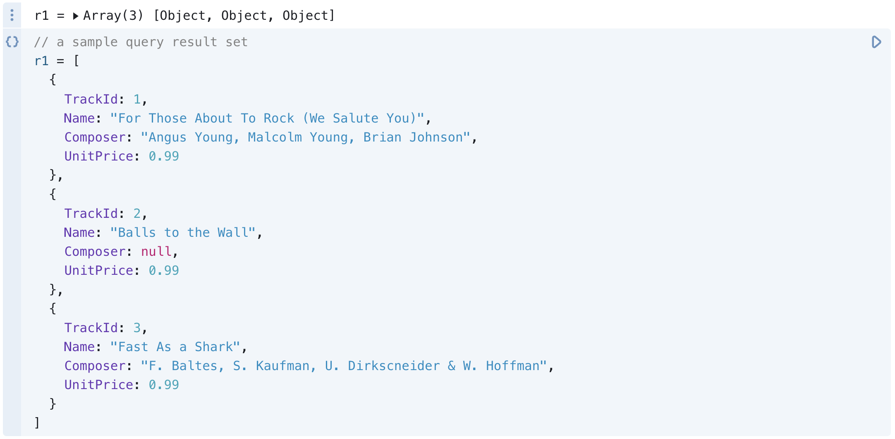
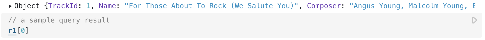
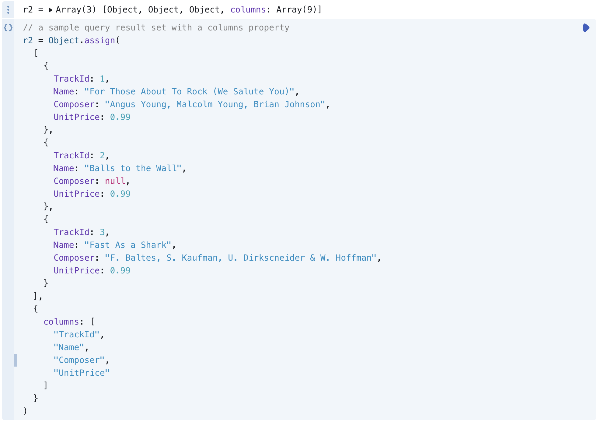
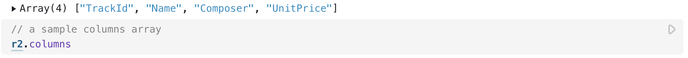
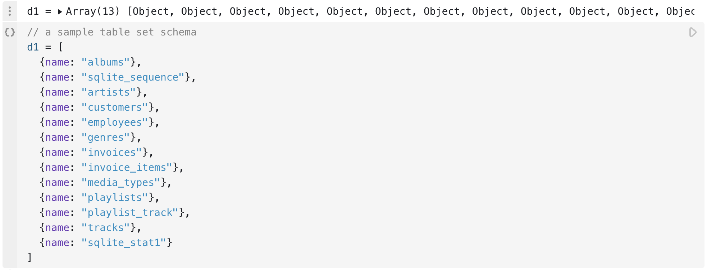
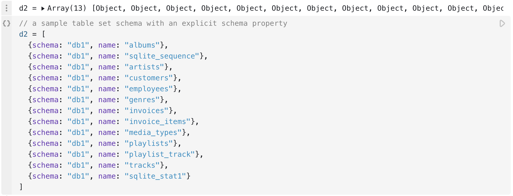
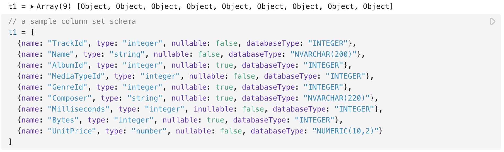

# DatabaseClient specification

This notebook specifies the requirements of [DatabaseClient](https://observablehq.com/@observablehq/databases) implementations for compatibility with Observable [SQL](https://observablehq.com/@observablehq/sql) and [Data table](https://observablehq.com/@observablehq/data-table-cell) cells.

::: info NOTE
The words "MUST", "MUST NOT", "REQUIRED", "SHALL", "SHALL NOT", "SHOULD", "SHOULD NOT", "RECOMMENDED", "MAY", and "OPTIONAL" in this document are to be interpreted as described in [IETF RFC 2119](http://www.ietf.org/rfc/rfc2119.txt).
:::

## Query results

- Query result sets, such as those returned by the [query method](#table-set-schemas), MUST be expressed as an array of objects. Each element in the array MUST be an object representing a query result row ("row object"), in the order determined by the issuing query. Each such row object MUST be an object with properties corresponding to the selected columns. The properties on each row object SHOULD be enumerable and in the order expressed by the query; if the result set array does not have a **schema** or **columns** property (see below), the properties on each row object MUST be enumerable and in the order expressed by the query.

<figure>
  
</figure>


<figure>
  
  <figcaption>Sample query result set (top) and result accessing the first object (bottom).</figcaption>
</figure>

- Result set arrays MAY be decorated with a **schema** property. If present, the value MUST be a [column set schema](#column-set-schemas).

- Result set arrays MAY be decorated with a **columns** property. If present, this property MUST be an array of strings representing the selected column names of the issuing query, in the order expressed by the query. This is equivalent to a [column set schema](#column-set-schemas) whose column types are all `"other"`.

- Result sets MAY specify both the **columns** and *schema* property, but SHOULD prefer the *schema* property. If both the **columns** property and *schema* property are specified, the *schema* property takes precedence and the **columns** property is ignored.

<figure>
  
</figure>

<figure>
  
  <figcaption>Sample query result set with columns property (top) and a sample array of columns (bottom).</figcaption>
</figure>

- Query result sets MUST be compatible with the [structured clone algorithm](https://developer.mozilla.org/en-US/docs/Web/API/Web_Workers_API/Structured_clone_algorithm) (*i.e.*, result sets MUST uphold this specification when sent via [postMessage](https://developer.mozilla.org/en-US/docs/Web/API/Window/postMessage)).

## Schemas

Schemas describe the structure and type of data. They come in two forms:

* [Table set schemas](#table-set-schemas) represent tables in a database,
* [Column set schemas](#column-set-schemas) represent columns in a table or query.

### Table set schemas

Table set schemas represent zero or more database tables, including their name.

- A table set schema MUST be an array of zero or more table objects ("table object"), each representing a database table. Each table object MUST have a **name** string property which represents the table name.

- Each table object MAY have a **schema** string property which represents the name of the database schema of which the table is part. The **schema** property MAY be null, undefined, or omitted on the table object if it is implied (*e.g.*, if the database has a default schema, such as the "public" schema for PostgreSQL databases).

- Each table object MAY have a **database** string property which represents the name of the database of which the database schema is part. The **database** property MAY be omitted on the table object if it is implied (_e.g._, if the client is associated with only a single database). 

- The table objects in a given database schema SHOULD be listed in the natural order of tables as specified in the database schema.

<figure>
  
</figure>

<figure>
  
</figure>

- Table set schemas and table objects MAY include additional properties provided the properties do not otherwise conflict with this specification.

### Column set schemas

Column set schemas represent the columns in a database table or query, including their name and type.

- A column set schema MUST be an array of zero or more column objects ("column objects"), each representing a column. Each column object MUST have a **name** string property which represents the column name.

- A column object MUST have a **type** string property. The value of the type property MUST be one of the following strings:

    - `"string"` - a string such as `"hello world"`
    - `"number"` - a number such as `42` or `3.14159`
    - `"integer"` - a subtype of number representing an integer such as `42`
    - `"bigint"` - a BigInt instance such as `42n`
    - `"date"` - a Date instance such as `new Date("2022-01-01")`
    - `"boolean"` - either `true` or `false`
    - `"object"` - an object with unspecified properties
    - `"array"` - an array or [typed array](https://developer.mozilla.org/en-US/docs/Web/JavaScript/Typed_arrays) of unspecified values
    - `"buffer"` - an ArrayBuffer
    - `"other"` - some other unspecified type

If the *type* property is not specified, or if its value is not one of the above values, it is treated as `"other"`.

- A column object MAY include the boolean property **nullable**. A value of `true` indicates that associated column values MAY be null; a value of `false` indicates that associated column values MAY NOT be null. If the **nullable** property is not specified, it is treated as `true`.

- The **type** property MUST be consistent with the associated column values as they are represented in JavaScript. In the case of `"other"`, the effective type MAY be inferred from the values.

- A column object MAY also have a **databaseType** string property. If present, the value must be a string representing the vendor-specific type information for the column. For example, in a SQLite database, the value might be `"NVARCHAR(200)"` for a variable-length string column with a maximum length of 200. This field is used solely for informational (display) purposes.

- The column objects in a column set schema SHOULD be listed in the natural order of columns as specified in the associated database schema or query.

<figure>
  
</figure>

- A column set schema SHOULD only include columns which are accessible to the current user. For example, if the database uses column-level permissions and the current user does not have the necessary privileges to select a column, then the corresponding property SHOULD NOT be present in the table properties object.

## Query methods

For compatibility with Observable SQL and Table cells, a database client MUST implement at least one of the following sets of methods, in order of precedence:

1. the [**queryTag**](#querytagstrings-params) and [**queryStream**](#querystreamstring-params-options) methods, or
2. the [**queryTag**](#querytagstrings-params) and [**query**](#querystring-params-options) methods, or
3. the [**sql**](#sqlstrings-values) method.

The queryTag and queryStream methods SHOULD be preferred as this reduces latency by displaying initial results before the query has completed. However, since the queryStream method is more work to implement, the queryTag and query methods MAY be implemented instead; these still allow aborting of queries on cell invalidation. Alternatively, the simple sql method MAY be implemented instead (say for in-memory database clients that only support synchronous operations).

### query(*string*, *params*, *options*)

- The query method, if defined, MUST take a query *string*, an optional array of _params_ representing values to be interpolated into the query, and an optional _options_ object. It MUST return a Promise to a [query result set](#query-results).

- The *string* MUST be a string representing the query to be issued; it MAY be a SQL string or any other language that the underlying database supports. The *params* MUST be an array or undefined. If *params* are specified, the *string* MUST contain corresponding positional placeholders (such as `?` or `$1`) for each specified parameter; the syntax of these placeholders is at the discretion of the underlying database. (See [**queryTag**](#querytagstrings-params).)

```js
// a sample query with one parameter
db.query(`SELECT * FROM tracks WHERE AlbumId = ?`, [AlbumId])
```

```js
AlbumID = 1
```

- If the _params_ argument is undefined, it SHOULD be considered equivalent to the empty array.

```js
// a sample query with no parameters
db.query(`SELECT * FROM tracks WHERE AlbumId = 1`)
```

- If the _options_ argument is specified, it MUST be an object. This object MAY have a **signal** property whose value is an [AbortSignal](https://developer.mozilla.org/en-US/docs/Web/API/AbortSignal). This option allows the query to be aborted, say when the calling cell is edited.

```js
// a sample query that is aborted on invalidation
{
  const abortController = new AbortController();
  invalidation.then(() => abortController.abort());
  return db.query(`SELECT * FROM tracks WHERE AlbumId = 1`, {
    signal: abortController.signal
  });
}
```

### queryStream(*string*, *params*, *options*)

- The queryStream method, if defined, MUST take the same arguments as the [**query** method](#querystring-params-options). It MUST return a Promise to a **query stream response**.

- A query stream response MUST be an object. It SHOULD have a **schema** property whose value MUST be a [column set schema](#column-set-schemas). The query stream response MUST also have a **readRows** method. This method MUST return an async iterator (such as an async generator). This async iterator MUST produce [query result sets](#query-results) (_i.e._, arrays of results). However, each produced query result set SHOULD NOT have an associated **schema** property, as this would be redundant with the **schema** property returned on the query stream response object.

### queryTag(*strings*, ...*params*)

The purpose of the queryTag method is to adapt tagged template literal usage to the corresponding query or queryStream call. For example, SQLite uses the question mark operator (`?`) to represent placeholder values, so a suitable queryTag implementation for SQLite would be:

```js
function sqliteQueryTag(strings, ...params) {
  return [strings.join("?"), params];
}
```

Invoking the queryTag method as a tagged template literal returns arguments that can then be applied to the query method:

<figure>
  
</figure>

- The queryTag method, if defined, MUST take an array of strings as the first argument representing the query to be issued, followed by zero or more additional *params* arguments representing interpolated values. It MUST return an array representing the corresponding arguments to the [**query**](#querystring-params-options) or [**queryStream**](#querystreamstring-params-options) methods: a _string_ representing the query, and an array of _params_ representing any interpolated parameter values.

- The queryTag method allows SQL cells to invoke either the query or queryStream method. If the queryTag method is not defined, SQL cells will fall back to the [**sql** method](#sqlstrings-values), but this is NOT RECOMMENDED as the sql method does not support streaming or abort.

### sql(*strings*, ...*values*)

The sql method, if defined, MUST take an array of strings as the first argument representing the query to be issued, followed by zero or more additional *params* arguments representing interpolated values. It MUST return a Promise to a [query result set](#query-results).

```js
db.sql`SELECT * FROM tracks WHERE AlbumId = ${AlbumId}`
```

## Schema methods

- For compatibility with Observable Table cells, a database client MUST additionally implement the [**describeColumns**](#describecolumnstable-schema-database) method, and MAY implement the [**describeTables**](#describetablesschema-database) method, which return schema information about the available database tables.

- If the describeTables method is implemented, the user will be allowed to choose an available table from a list. If the describeTables method is not implemented, the user will be prompted to enter a table name (along with a schema name and database name as needed).

### describeTables({schema, database} = {})

- The describeTables method, if defined, MUST return a Promise to a [table set schema](#table-set-schemas) for tables matching the specified **schema** and **database** filter options, if any.

- If the **schema** option is specified (_i.e._, if it is not undefined), it MUST either be a string representing the name of a database schema from a database associated with this database client, or null to denote the default schema; in this case, the returned table set schema MUST only include tables from the specified database schema. If the **schema** option is not specified (_i.e._, if it is undefined), this method SHOULD return tables from all database schemas (from matching databases per the **database** option, if any) associated with this database client.

- If the **database** option is specified, it MUST be a string representing the name of a database associated with this database client; in this case, the returned table set schema MUST only include tables from the specified database. If the **database** option is not specified, this method SHOULD return tables from all databases (from matching database schemas per the **schema** option, if any) associated with this database client.

- If the **schema** and/or **database** options are specified, the table objects in the returned table set schema MUST have matching **schema** and **database** properties. If the **schema** and/or **database** options are not specified, the table objects in the returned table set schema MAY have **schema** or **database** properties as needed to identify the table (*i.e.*, if the table is from a non-default database or non-default schema).

### describeColumns({table, schema, database} = {})

- The describeColumns method, if defined, MUST return a Promise to a [column set schema](#column-set-schemas) for the database table specified by the **table**, **schema**, and **database** options.

- The **table** option is REQUIRED and MUST be a string representing the name of the table to describe.

- If the **schema** option is specified (_i.e._, if it is not undefined), it MUST either be a string representing the name of the schema of which the table is part, or null to denote the default schema. The **schema** option MAY be omitted (_i.e._, it may be undefined) if the desired table is in the database client’s default schema (e.g., the "public" schema for PostgreSQL).

- If the **database** option is specified, it MUST be a string representing the name of the database of which the schema is part. The **database** option MAY be omitted if the desired table is in the database client’s default database.

### escape(*identifier*)

The escape method, if defined, allows a database client to customize the way the database, schema, table, and column identifiers are quoted when constructing a SQL query. 

- If specified, the escape method MUST accept a string representing an (unescaped) identifier and MUST return a string representing the corresponding escaped (quoted) identifier. The escaped identifier SHOULD be suitable for interpolation into a query string that MAY be passed to the [query](#querystring-params-options), [queryStream](#querystreamstring-params-options), [queryTag](#querytagstrings-params), or [sql](#sqlstrings-values) methods.

## Dialects

Database clients may expose a dialect property. This field is solely for informational purposes, such as to tailor the syntax highlighting of the SQL cell for the specific database implementation; it does not have any effect on runtime behavior.

### dialect

If present, the database client’s **dialect** field MUST be a string. The dialect field is used as a editor hint, for example for syntax highlighting, but does not affect the behavior of the SQL and data table cell. Currently-supported values include:

* `"sql"`
* `"sqlite"`
* `"postgres"`
* `"bigquery"`
* `"snowflake"`
* `"mysql"`
* `"mssql"`
* `"oracle"`
* `"duckdb"`
* `"mongosql"`

If the dialect field is not present or is not one of the currently-supported values, its value is treated as if it were `"sql"`.
