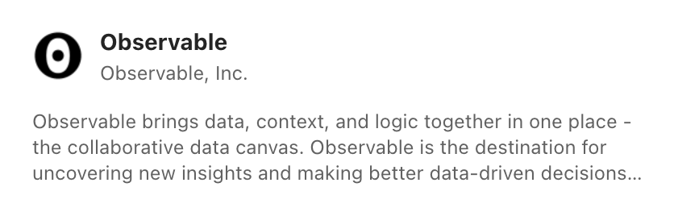
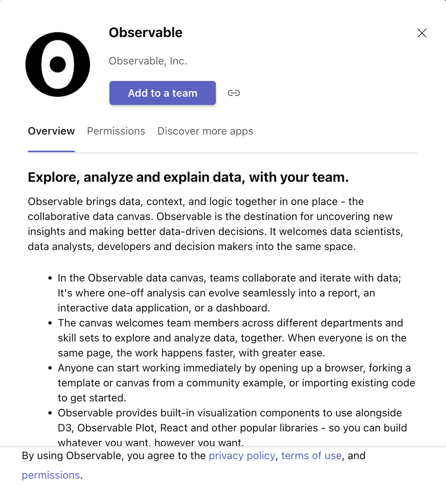
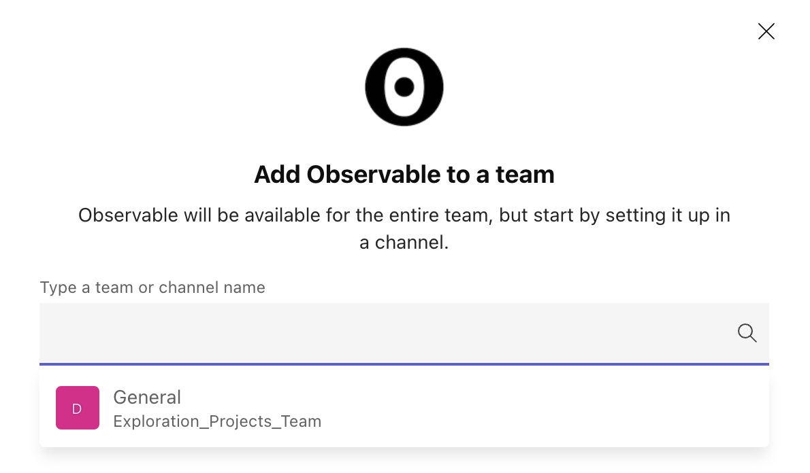
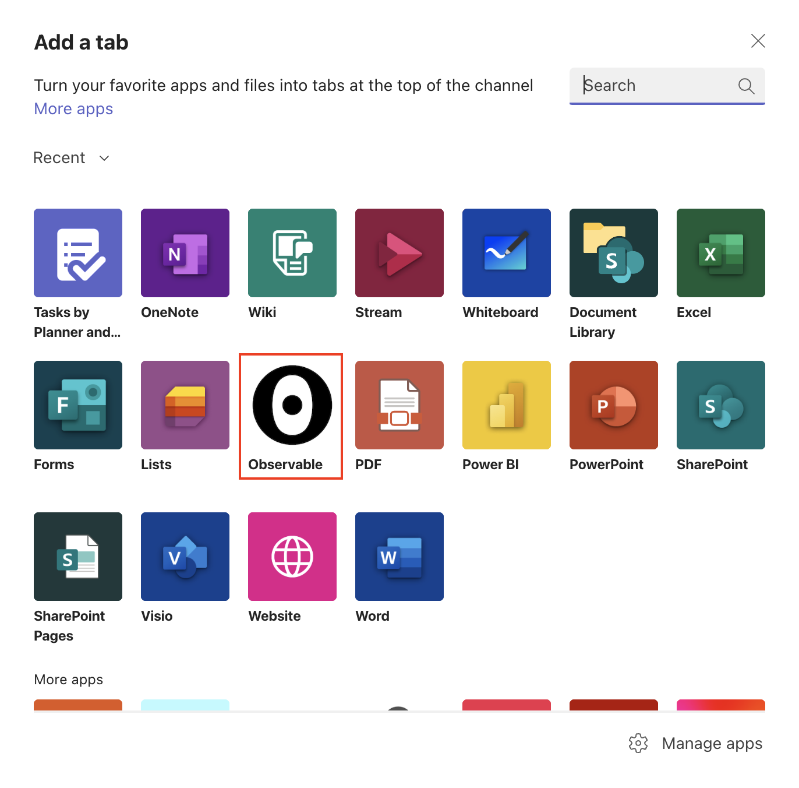
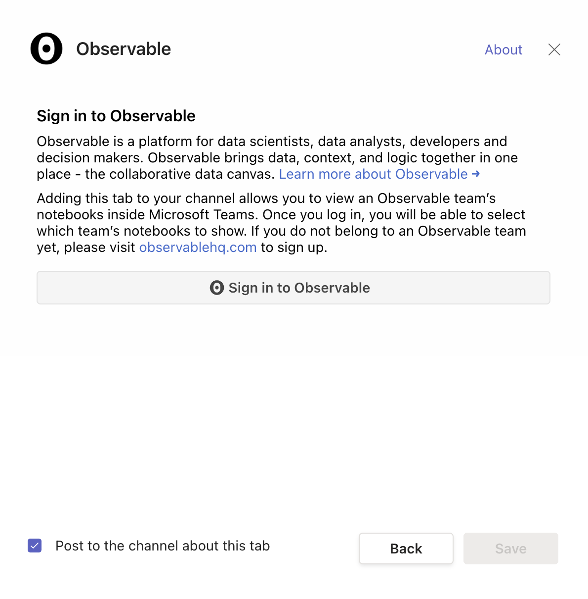
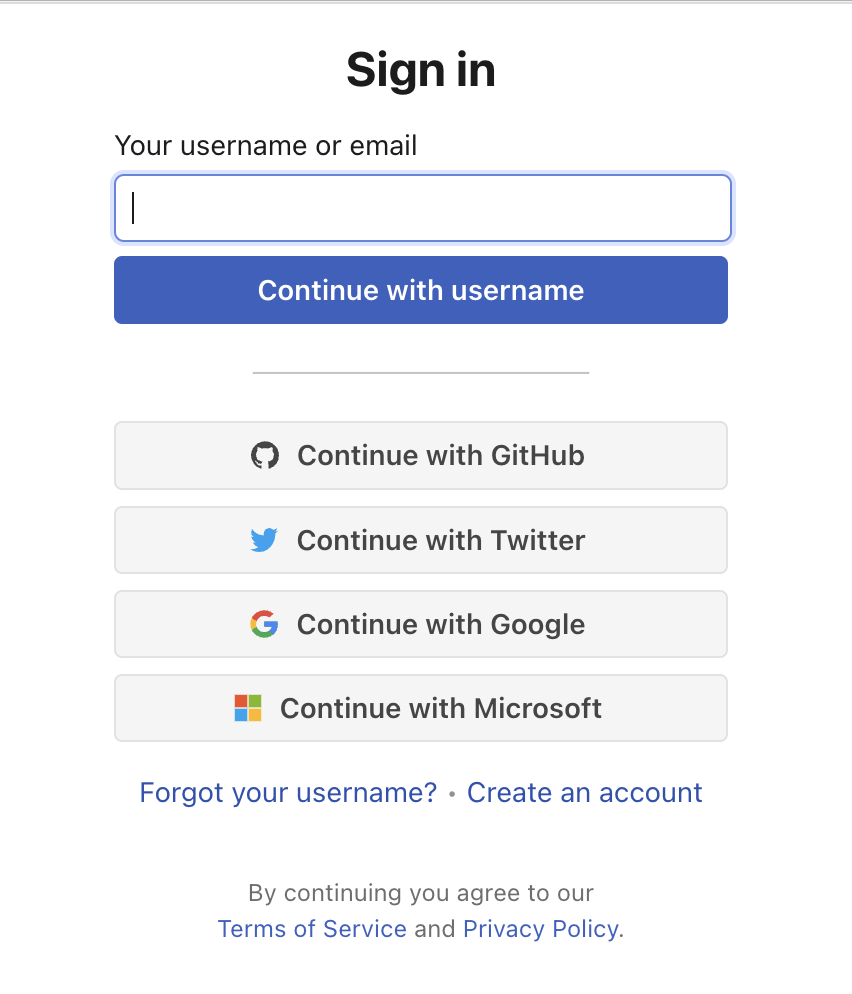
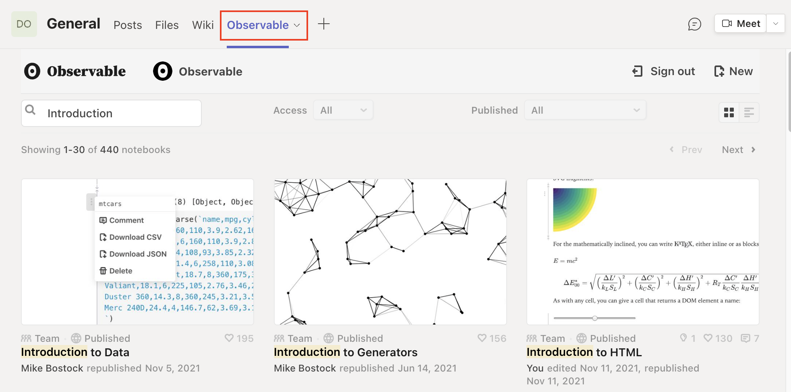
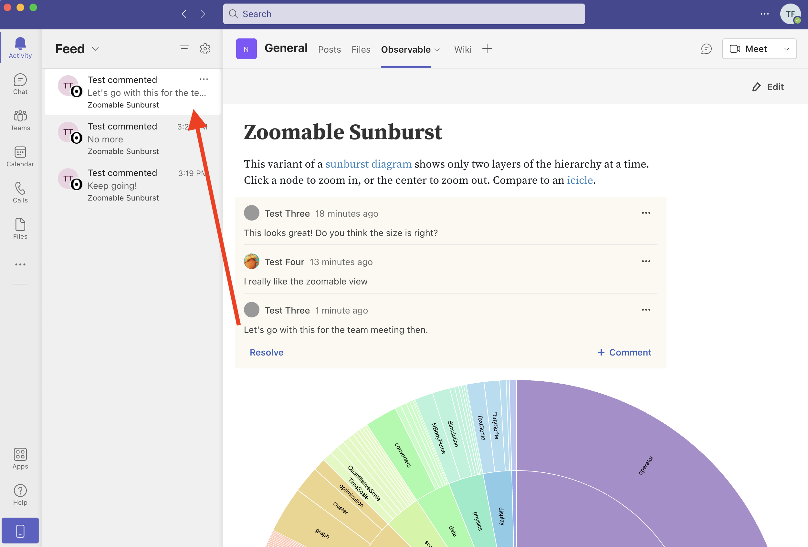
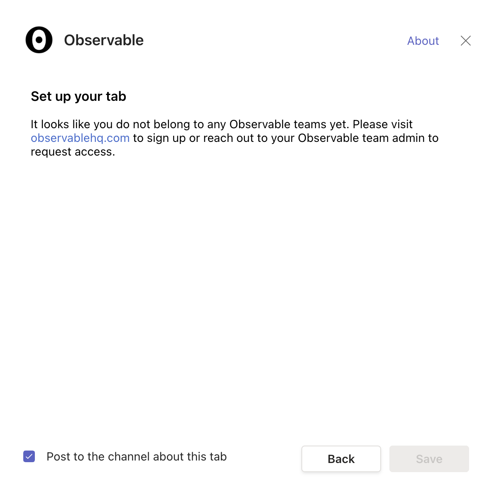

# Microsoft Teams integration

Observable offers an integration between [Observable Teams](https://observablehq.com/@observablehq/getting-started-with-teams) and Microsoft Teams. Adding Observable as a tab in Microsoft Teams allows you to view and comment on Observable notebooks from within Microsoft Teams, and easily navigate to editing the notebooks within Observable. Edits are reflected in real-time within Microsoft Teams.

## Installing the Observable app

To install the Observable app from within Microsoft Teams, go to **Apps** and then use the **Search** box to search for "Observable". The description for Observable appears:

<figure>
  
  <figcaption>The Observable app listing in Microsoft Teams.</figcaption>
</figure>

Click the description of the app, and you will see a longer description that also features an **Add to a team** button:

<figure>
  
  <figcaption>Click <b>Add to a team</b> to add the Observable app to your Microsoft Teams team.</figcaption>
</figure>

After you click **Add to a team**, you will see a new window: 

<figure>
  
  <figcaption>Set up a channel before adding Observable to a team.</figcaption>
</figure>

Select the appropriate channel, then click **Set up a tab** at the bottom of the modal. You can also click the plus sign (+) to add a tab, and then select Observable from the list of apps:

<figure>
  
  <figcaption>The Observable app is available from the <b>Add a tab</b> modal in Microsoft Teams.</figcaption>
</figure>

Upon selecting Observable for a new tab, the following modal appears:

<figure>
  
  <figcaption>Click <b>Sign in to Observable</b> to continue to the Observable <b>Sign in modal</b>.</figcaption>
</figure>

After you click **Sign in to Observable**, you are shown the Observable **Sign in modal**:

<figure>
  
  <figcaption>Sign into Observable, or create an account.</figcaption>
</figure>

If you already have an Observable account, sign in with your preferred authentication provider. (Note that there are advantages to signing in using your Microsoft authentication—see the section on Notifications below.)

If you have not yet created an account, you can [sign up](https://observablehq.com/@observablehq/signing-on) by clicking **Create an account** and creating your Observable Team. To learn more about Observable, take a look at our [Getting Started](https://observablehq.com/@observablehq/documentation#gettingStarted) notebooks.

Once you have signed in to Observable, the Observable tab appears:

<figure>
  
  <figcaption>The Observable tab installed.</figcaption>
</figure>

Once you have installed the Observable tab, you can do the following:
- Browse notebooks available to your team
- Search for notebooks

When you want to view a notebook, clicking the notebook thumbnail opens the notebook, where you can view and comment on it.

If you want to edit the notebook, you can then click **Edit**. This will open a new browser window where you can edit the notebook within Observable.

For more about creating notebooks, editing notebooks, and leaving comments in Observable:
- [Create a new notebook](https://observablehq.com/@observablehq/creating-a-new-notebook)
- [Edit an existing notebook](https://observablehq.com/@observablehq/a-taste-of-observable)
- [Comment on notebooks](https://observablehq.com/@observablehq/comments)

::: info NOTE
When navigating to Observable in your browser, if you have not previously logged into Observable from that browser, you will be prompted to sign into the browser also (use your Microsoft account to log in to Observable if you want to receive notifications). This will only be needed the first time you access Observable in the browser.
:::

## Notification of comments on Observable notebooks from within Microsoft Teams

If you sign in to Observable using Microsoft authentication, the Microsoft Teams integration will notify you when someone comments on your notebook:

<figure>
  
  <figcaption>Microsoft Teams notifications alert you to comments on your Observable notebooks.</figcaption>
</figure>

::: info NOTE
To receive comment notifications, you must have notifications enabled in your Observable notebook under <b>Settings</b>. The default is for notifications to be enabled.
:::

## Notification of shared notebooks

Other co-workers or members of the same Observable Team and Microsoft Team that you belong to can share notebooks with you, and Observable will send you a notification. This is done whenever a notebook is shared with you individually (not with the entire team).

## If you have only a personal Observable account

If you only have a personal Observable account and do not belong to an Observable team, you will see the following modal when you attempt to log in from Microsoft Teams:

<figure>
  
  <figcaption>Individual accounts will not have access to Observable teams.</figcaption>
</figure>