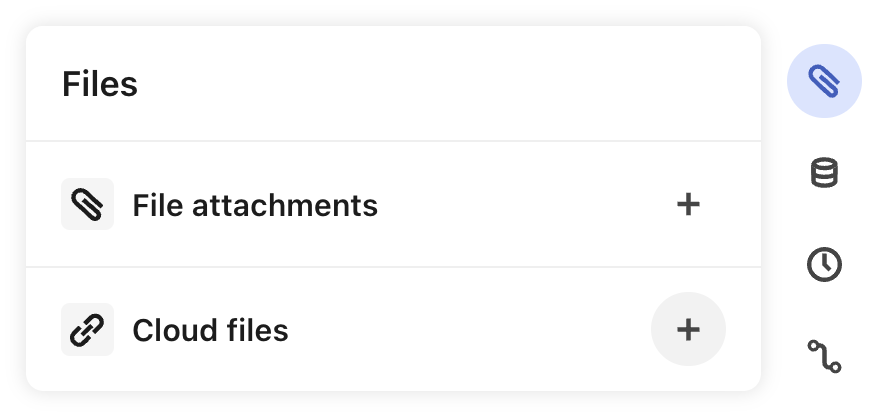
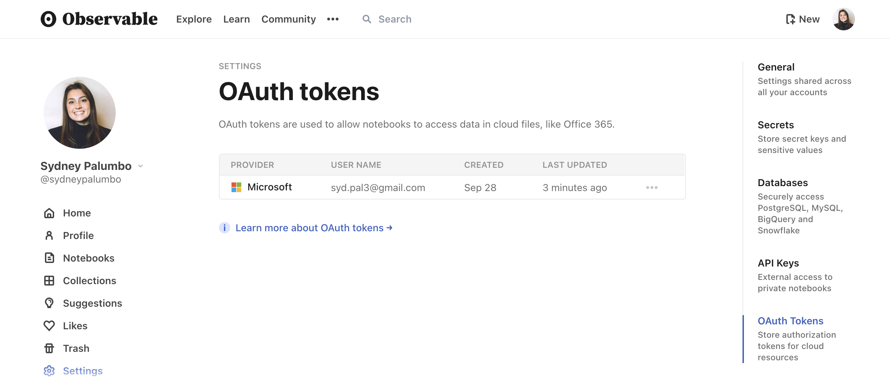
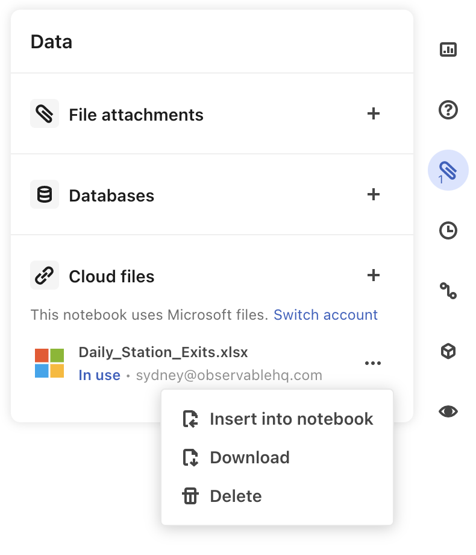

# Cloud files
<PricingBadge level="pro" />

In Observable, you can currently access cloud files in *Microsoft Office 365, Microsoft OneDrive* as well as *Google Drive*. Support for more cloud providers will be added over time, based on user requests.

Access to cloud files makes it possible for your Observable notebooks to have a live references to data stored in the cloud, while still supporting all other existing ways to access data ([File Attachments](/data/files/file-attachments), [Database Connectors](/data/databases/overview), and notebook [Secrets](/security/secrets) for securely accessing data via private APIs).

Cloud file access is convenient and secure:

- Every time your notebook is loaded, the contents of the cloud file are loaded into the notebook.
- Unlike a file attachment, the cloud file reference is not static, but can be refreshed when (for example) a spreadsheet is updated.
- To maintain clarity in the permissions model, viewers of the notebook are required to sign in to the cloud file provider to ensure they have the required permissions to view the cloud file data being accessed by the notebook.

## Adding cloud file references to notebooks

When logged into your Observable account, follow these steps to import data from **Microsoft Office 365 Excel** or **Google Drive** into your notebook. 

1. Open your existing notebook, or create a new one. 
2. Open the **Files pane** by clicking the paperclip icon on the right-hand side of the page.

<figure>
  
  <figcaption>Access cloud files through the Files pane.</figcaption>
</figure>

3. Open the **Cloud files** dialog by clicking on the `+` next to it.
4. Pick from the available cloud file providers 
5. After choosing a provider, you will be prompted to sign in to Microsoft or Google, and grant access to your OneDrive (Microsoft) or Google Drive (Google) files to Observable.
   - Be sure to sign in with the correct third-party account that has access to the desired files. (See more about OAuth permissions below)
   - For Google, check the box for "See and download all your Google Drive files". This is required to access your files, and bring the needed data into Observable.
7. Once you have connected, you will see a file picker that you can use to navigate to your file.
8. Select the desired file. Once selected, one or more cells will be added to your notebook importing your file.

## Retrieving fresh data

Once added, the contents of the cloud file will be read each time the `FileAttachment()` function is executed in the notebook. This happens automatically when the notebook is loaded and the cell is initially executed. If you want to manually refresh the data, click the Play button (the blue triangle) on a cell containing the reference (or use the Shift-Return shortcut to run a cell). This causes the cloud file to be re-read and its value in the notebook to be refreshed.

Your data is kept secure. If the notebook is accessed by or shared with someone who lacks the necessary permissions, the `FileAttachment()` function displays an error.

## OAuth permissions

The first time you use a notebook with cloud files, either as an editor or just a viewer, you will be prompted to sign in to the cloud service provider using an identity that has access to that file. When you do this, Observable will retrieve and store an OAuth token with the necessary scopes to read the file.

Provider | Scopes
-------- | ------
Microsoft 365 | openid, profile, User.Read, Files.Read.All
Google | openid, userinfo.email, userinfo.profile, drive.readonly

Each viewer of a notebook uses their own OAuth token when accessing a cloud file, meaning that the stored token is only available to the current user, not to just anyone who can view the notebook.

OAuth tokens are persistently stored so you won't be prompted each time you visit a notebook that requires them, only the first time. You can see the list of stored tokens for your account in your Settings, where you also have the option of deleting them. If you delete your token, you will be prompted to add one the next time you access a notebook that needs a token.

<figure>
  
  <figcaption>Stored tokens are listed in the <b>OAuth Tokens</b> section of your account <b>Settings</b>.</figcaption>
</figure>

## Removing a reference to a cloud file

You can remove references to cloud files in your notebook with the following steps: 
1. Delete the `FileAttachment` reference (or the whole cell) that refers to the cloud file.
2. Return to the **Cloud files** menu in the **Files pane** and remove the linked file using the three dots menu (...) next to the file.

<figure>
  
  <figcaption>Manage cloud files in the <b>Files pane</b>.</figcaption>
</figure>

## Cloud files in public notebooks are not supported

Cloud files use the OAuth credential of the user who is viewing the notebook. This user must be signed into Observable. Therefore, *using cloud files in public notebooks is not supported*. 

You can create a public notebook with the information from a cloud file if you first snapshot the cloud file  to a regular file attachment by:

1. Downloading a version of the cloud file.
2. Attach the downloaded file to your notebook using the **File attachments menu item** in the **Files pane**.