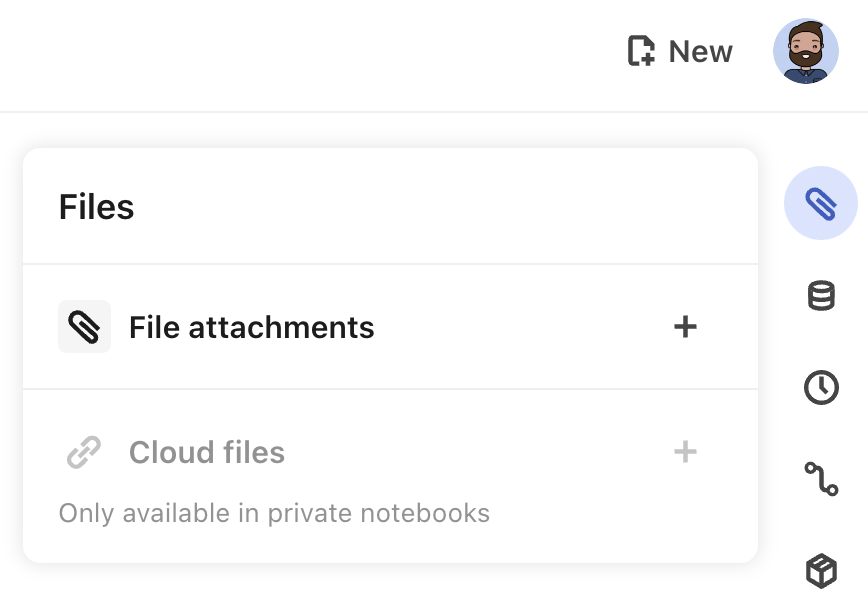
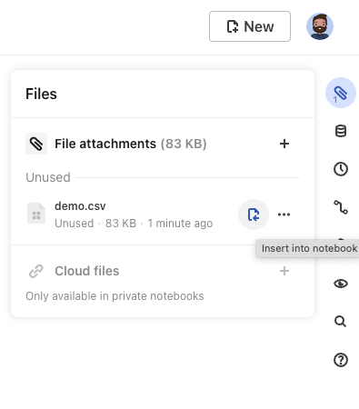
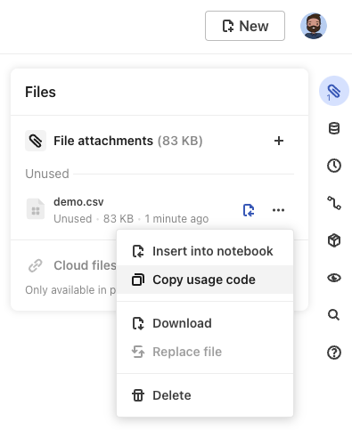
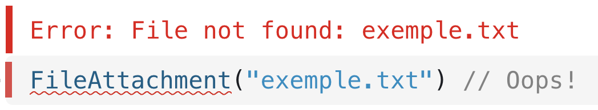
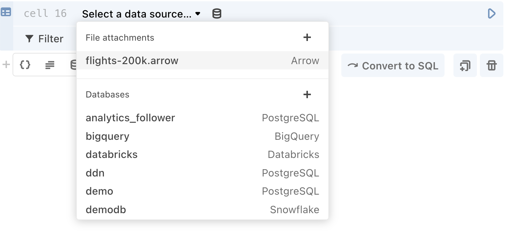
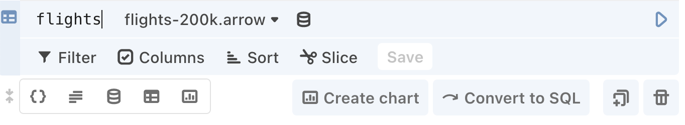
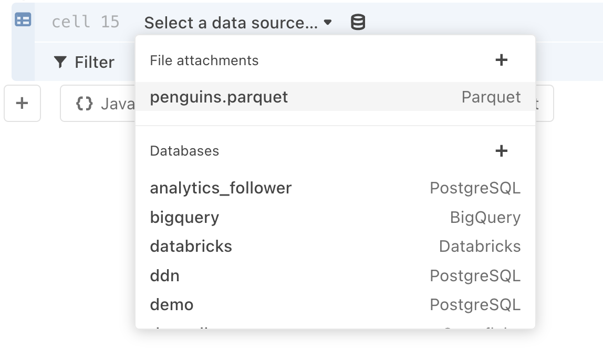
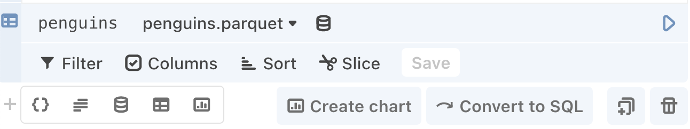

# File attachments

The quickest way to work with small-ish datasets in an Observable notebook is to attach a file. Observable supports attaching a variety of file types including CSV, JSON, and XLSX files, as well as videos and images.

## Attaching files

To attach a file:

1. Open the **Files pane** by clicking the paperclip icon in the top-right corner of the notebook. The **Files pane** will appear, revealing the **File attachments menu item** (also with a paperclip icon).
2. In the **Files pane**, click the plus sign icon to select a file, or drag and drop a file directly from your computer onto the open **Files pane**.

<figure>
  
  <figcaption>Access the <b>Files pane</b> in the top right of your notebook to attach a file.</figcaption>
</figure>

File attachments behave predictably:

- Files are copied when you [fork](https://observablehq.com/@observablehq/fork-suggest-merge?collection=@observablehq/editing-publishing-collaborating).
- Files can be reused through [imports](https://observablehq.com/@observablehq/import?collection=@observablehq/notebook-fundamentals).
- You can go back in time with [history](/notebooks/history) and see when a file was attached (as long as they were not deleted).
- In Free workspaces, all files are visible, and the history of which files were attached to which versions are also visible.
- If you are in a Pro or Enterprise workspace, files in your private notebooks remain private. That is, those files are only accessible from your notebooks.
- And because Observable is designed for tinkering, you can even play with your local files in other people’s notebooks, then fork to upload your files and save your work.

### File size limits

- An individual user can upload up to 50 megabytes (MB) of data.
- Over a 28-day period, there’s a rolling quota of 1GB per user.
- In your team workspace, the quota is pooled for all editors on the team. For example, a team with 10 editors has a 10GB quota.
- There is no cap on the total file size usage per user. (For larger files, you’ll either need to host the files yourself, or use a [local file input](https://observablehq.com/@observablehq/input-file).)

### Speed tips

Here are a few alternate methods to attach files in a notebook:

- Drag the file over the notebook, and the **Files pane** will automatically appear. Release the file over the open **Files pane**, and Observable will add it to the **Files list**.
- Open the **[Add cell menu](https://observablehq.com/@observablehq/adding-cells?collection=@observablehq/notebook-fundamentals#addCellMenu)**, and choose **File attachment** from there.
- Create a JavaScript cell, then copy a file type that `FileAttachment` knows how to interpret (the ones mentioned in this notebook) to your clipboard. Paste the file into the JavaScript cell, and Observable will automatically upload the file and create the proper `FileAttachment` call.
- Press Shift-Command-U (⇧⌘U) while editing a cell. This will display a modal for selecting files. Once you have selected and uploaded the file, Observable automatically inserts the proper `FileAttachment` call for the file.

## Private file storage
<PricingBadge level="enterprise" />

Private file storage allows Enterprise users the ability to use their own organization-managed s3 bucket for the purposes of storing file attachments. This is different from the default file attachment experience, which is to store them in an Observable-managed bucket. If you have more stringent data security practices in your Enterprise organization that require you to store data on organization controlled infrastructure, this is the right option for storing your notebooks’ file attachments.

If you are a workspace admin for your organizations’ Enterprise account and want to utilize this feature, follow our [instructions to enable Private file storage](https://observablehq.com/@observablehq/private-file-storage-setup).

For more technical details regarding how the Private file storage experience compares with the default experience and how the two will interact, see our [FAQ reference notebook](https://observablehq.com/@observablehq/private-file-storage-faq).

## Using files


To use a file, first pass the file’s name to the built-in `FileAttachment` function from the Observable standard library:

```js
attachment = FileAttachment("example.json")
```

Calling `FileAttachment` doesn’t immediately load the file—the contents are only loaded when you request them. It’s a bit like the [Fetch API](https://developer.mozilla.org/en-US/docs/Web/API/Fetch_API/Using_Fetch): there are async methods that return the file’s contents in different forms, such as JSON, CSV, or ArrayBuffer. You choose the appropriate method based on how you want to consume the file.

The file attachment pane also offers a quick way to add your file attachments to your notebook, either by inserting directly into your notebook as a new [Data table cell](/cells/data-table) or by copying the usage code for a [JavaScript cell](/cells/javascript). 

### Insert into a Data Table Cell 
To insert your file attachment into your notebook as a Data table cell, click on the insert into notebook button next to the file in the file attachment pane. 
<figure>
  
  <figcaption>Access the <b>Files pane</b> in the top right of your notebook and find the insert into notebook button to the right of each file attachment.</figcaption>
</figure>

### Copy usage code
Alternatively, you can copy the usage code for your file attachment for a JavaScript cell. 
<figure>
  
  <figcaption>Access the <b>Files pane</b> in the top right of your notebook and find the copy usage code option in the menu to right of each file attachment.</figcaption>
</figure>


If you use a file attachment in a JavaScript code block or other cell modes (i.e. Markdown, HTML), you need to *await* it. The `await` operator pauses the execution of code in the current cell while it waits for the promise to resolve. See the example immediately below.

```html
<figure>
    ${await FileAttachment("example.jpg").image()}
    <figcaption>The figure caption</figcaption>
</figure>
```

### Errors

If you pass an unknown file name to `FileAttachment`, it throws an error. This is true even if you don’t load the file’s contents because Observable tracks the set of known files using static analysis.

<figure>
  
  <figcaption>Error thrown when a file is not found.</figcaption>
</figure>


## Examples

### Apache Arrow files

Observable's [Data table cell](/cells/data-table) accepts attached [Apache Arrow files](https://arrow.apache.org/). After attaching an Arrow file in your notebook, insert a new Data table cell, then select the file as the data source.

<figure>
  
  <figcaption>Choose an attached Arrow file as the source in a Data table cell.</figcaption>
</figure>

Naming the Data table cell (for example, as *flights* below) allows you to call the loaded data elsewhere in your notebook:

<figure>
  
  <figcaption>Rename the Data table cell to the left of the selected data source to call the data elsewhere in your notebook.</figcaption>
</figure>

### Apache Parquet files

Observable's [Data table cell](/cells/data-table) accepts attached [Apache Parquet files](https://parquet.apache.org/). After attaching a Parquet file in your notebook, insert a new Data table cell, then select the file as the data source.

<figure>
  
  <figcaption>Choose an attached Parquet file as the source in a Data table cell.</figcaption>
</figure>

Naming the Data table cell (for example, as *penguins* below) allows to call the loaded data elsewhere in your notebook:

<figure>
  
  <figcaption>Rename the Data table cell to the left of the selected data source to call the data elsewhere in your notebook.</figcaption>
</figure>

### Binary files

You might want to work with binary data, such as a shapefile. In these cases, the typical method is to use an [ArrayBuffer](https://developer.mozilla.org/en-US/docs/Web/JavaScript/Reference/Global_Objects/ArrayBuffer).

```js
shapefile = require("shapefile@0.6")
```

```js
collection = shapefile.read(await FileAttachment("example.shp").arrayBuffer())
```

You can also get a [ReadableStream](https://streams.spec.whatwg.org/#rs) if you want to read a file incrementally:


```js
chunk = {
    const stream = await FileAttachment("example.shp").stream();
    const reader = stream.getReader();
    let done, value;
    while (({done, value} = await reader.read()), !done) {
        yield value;
    }
  }
```

### CSV files

```js
data = FileAttachment("example.csv").csv()
```

Observable will automatically detect the first row in a CSV file as the column headers. You can retrieve those values using `data.columns` (replacing `data` with the name of your data).

By default, the values in your CSV file will be parsed as strings. If you need the values to be parsed as integers, you can add a `typed:true` to the CSV method to automatically infer file types:

```js
typed = FileAttachment("example.csv").csv({typed: true})
```

The ability to automatically infer file types is from D3’s `autotype`; read more about that here: [d3.autoType](https://observablehq.com/@d3/d3-autotype).

If you’d rather have an array of arrays and not treat the first row as the header, use the *array* option. (This can be combined with the *typed* option, too.)

```js
array = FileAttachment("example.csv").csv({array: true})
```

If you want to perform more complicated parsing on the rows — for instance, if there are commas in the number values — you can use a chained promise to write a custom parsing function.

```js
exampleData = FileAttachment("example.csv").csv()
  .then(data => {
    const parseCommas = (d) => Number(d.replace(/,/g, ""));
    return data.map(row => ({
        Open: parseCommas(row.Open)
    }))
  })
```

### Image files

```js
image = FileAttachment("example.png").image()
```

You can also pass optional properties for images, such as a width, height, and style:

```js
image = FileAttachment("example.png").image({width: 400, height: 200, style: "border: 1px solid black"})
```

### JSON files

```js
json = FileAttachment("example.json").json()
```


### SQLite

```js
db = FileAttachment("chinook.db").sqlite()
```

Alternatively, call SQLiteDatabaseClient.open(*source*), where *source* is a URL, fetch Response, Blob, File, ArrayBuffer, or Array (Uint8Array), or a promise to the same. This is convenient when your SQLite file is hosted elsewhere, say on a private server or GitHub.

```js
altdb = SQLiteDatabaseClient.open(FileAttachment("chinook.db").url())
```

To query the database, call *db*.query(*sql*), where *sql* is a SQL string.

```js
customers = db.query(`SELECT * FROM customers`)
```

The *db*.query() function accepts a second *parameters* argument which allows the query to reference dynamic values without allowing arbitrary SQL injection. These parameters can be referenced in the *query* as `$1`, `$2`, *etc.*.

```js
db.query(`SELECT * FROM tracks WHERE Composer LIKE $1`, [`%${term}%`])
```

The _db_.queryRow() function is similar to _db_.query() except that it returns only the first row, or null if the query returns no results.

```js
db.queryRow(`SELECT sqlite_version()`)
```

You can also use the _db_.sql tagged template literal.

```js
db.sql`SELECT * FROM tracks WHERE Composer LIKE ${`%${term}%`}`
```

### TSV files

```js
data = FileAttachment("example.tsv").tsv()
```

Functions identically to [CSV files](/data/files/file-attachments#csv-files). 

### Video files

```html
<video src=${await visibility().then(() => FileAttachment("example.mov").url())} autoplay loop muted></video>
```

Videos do not have their own file attachment method, so the typical usage pattern is to employ the `url()` method within a video tag in an HTML cell.


### XLSX files

```js
workbook = FileAttachment("Laser_Report_2020@1.xlsx").xlsx()
```

If you inspect the output of this code, you can see that the workbook includes an array of the sheet names in the original file. Using that array, you can access individual sheets of the XLSX file:

```js
sheet1 = workbook.sheet("Laser Report 2020")
```

You can access all the specific sheetnames by using the `sheetNames()` method: 

```js
sheetNames = workbook.sheetNames()
```

The `sheetNames(name[, {range, headers}])` method takes optional parameters:
- `name`: a string or number representing the sheet name from which you plan to extract data.
- `range`: a string specifying a rectangular range of cells to extract from the sheet. For example, "B4:K123" specifies a range from top-left cell B4 to bottom-right cell K123, inclusive. 
- `headers`: a Boolean that, if true, will treat the first extracted row as column headers and use its cells as field names in returned objects. The default is false.

When you call the data from a specific sheet, we return an array of objects representing those cell values. There are a few situations to note:

- Values are coerced to their corresponding JavaScript types: numbers, strings, Date objects.
- Dates are interpreted in UTC.
- Formula results are included, but formula definitions ignored. Formula errors are coerced to `NaN`.
- Hyperlinks are returned as strings, with a space between URL and text if they differ.
- Empty cells are skipped: objects will not include fields or values for them, but empty rows are kept.
- Row numbers from the source sheet are included as a non-enumerable `"#"` property to assist with recognition and range specification.

### ZIP files

```js
dogZip = FileAttachment("Dog_Photos@3.zip").zip()
```

The .filenames property is an array of paths to files contained within the .zip archive.

```js
fileNames = dogZip.filenames
```

You can extract specific files from your zip file by using the `.file()` method

```js
dogZip.file("n02102177_1257.jpg").image()
```

## FileAttachment API

Here is the list of [`FileAttachment()` API](https://github.com/observablehq/stdlib#file-attachments) methods: 

| Method                     | Returns a promise to...                                                                                                                                   |
| -------------------------- | --------------------------------------------------------------------------------------------------------------------------------------------- |
| `attachment.arrayBuffer()` | ...the file’s contents as an ArrayBuffer.                                                                                   |
| `attachment.blob()`        | ...a Blob containing the raw contents of the file.                                                                          |
| `attachment.csv()`         | ...the file’s contents, parsed as comma-separated values (CSV) into an array. Options:<br> `{array = false, typed = false}` |
| `attachment.html()`        | ...an HTMLDocument containing the contents of the file.                                                                     |
| `attachment.image()`       | ...a file loaded as an Image with optional JavaScript properties. Options:<br> `{property: value, property: value}`         |
| `attachment.json()`        | ...the file’s contents, parsed as JSON into JavaScript values.                                                              |
| `attachment.sqlite()`      | ...the file loaded as a SQLite database client.                                                                         |
| `attachment.stream()`      | ...a ReadableStream of the file’s contents.                                                                                 |
| `attachment.text()`        | ...the file’s contents as a JavaScript string.                                                                              |
| `attachment.tsv()`         | ...the file’s contents, parsed as tab-separated values (TSV) into an array. Options:<br> `{array = false, typed = false}`   |
| `attachment.url()`         | ...the URL at which the file may be retrieved.                                                                              |
| `attachment.xlsx()`        | ...the file loaded as a Workbook.                                                                       |
| `attachment.xml()`         | ...an XMLDocument containing the contents of the file.                                                                      |
| `attachment.zip()`         | ...a list of files in the ZIP archive. Files can be read from the archive.                                                 |

Each method returns a [promise](https://developer.mozilla.org/en-US/docs/Web/JavaScript/Guide/Using_promises) to the file’s contents.


## Private file storage

<PricingBadge level="enterprise" />

Private file storage allows Enterprise users the ability to use their own organization-managed S3 bucket for the purposes of storing file attachments. This is different from the default file attachment experience, which is to store them in an Observable-managed bucket. If you have more stringent data security practices in your Enterprise organization that require you to store data on organization controlled infrastructure, this is the right option for storing your notebooks’ file attachments.

If you are a workspace admin for your organizations’ Enterprise account and want to utilize this feature, follow our [instructions to enable Private file storage](https://observablehq.com/@observablehq/private-file-storage-setup).

For more technical details regarding how the Private file storage experience compares with the default experience and how the two will interact, see our [FAQ reference notebook](https://observablehq.com/@observablehq/private-file-storage-faq).


## Additional information

Here are a few more details about files you might want to know.

**Files are local to the notebook.** Files can’t be referenced across notebooks—a given file can be directly accessed only by its notebook. You can, however, import cells that use files across notebooks. Likewise, when you fork a notebook, you’ll get your own copy of any attached files.

**Files are securely hosted on our servers.** Our production infrastructure is hosted by Heroku, and is contained within Heroku's secure network. In addition, we rely on GitHub Enterprise's advanced vulnerability scanning and security alerts. For more information, see our [Security FAQ document](https://observablehq.com/resources/security).

**Files are immutable.** The contents associated with a given file name never change. Instead of replacing a file’s contents, you replace a file, which automatically generates a new name and updates all code references to point to the new file. This preserves [notebook history](/notebooks/history): you can view any version of your notebook and see the original data, and compare different versions of files.

**But, files can be deleted.** While file immutability ensures that you can go back in time to see earlier versions of a notebook, we recognize that there are times when you simply want a file taken down for good. In this case, delete the file from the files pane. This will cause references to the deleted file to error (and break old versions of the notebook).

**Files in private notebooks are private. (Pro and Enterprise)** For Pro and Enterprise tier users, who can have both public and private notebooks, file visibility is limited to the *currently used* files. That is, when you make a notebook public, only the files currently used by the notebook will become public. A file you replaced or stopped using—as long as you no longer reference it—will remain private.

**References to files are parsed statically.** We use static analysis to determine which files a notebook uses so that we can automatically publish referenced files when a notebook is published (and *only* referenced files), and similarly copy only referenced files when forking a notebook. The FileAttachment function thus accepts only literal strings; code such as `FileAttachment("my" + "file.csv")` or similar dynamic invocation is invalid syntax. For details on how this is implemented, see [our parser](https://github.com/observablehq/parser).

If you want more control over parsing, load the file as text instead, and pass it to your parser of choice.