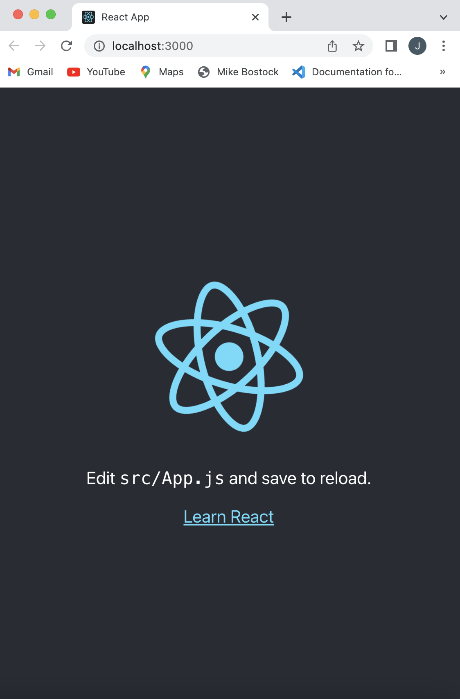
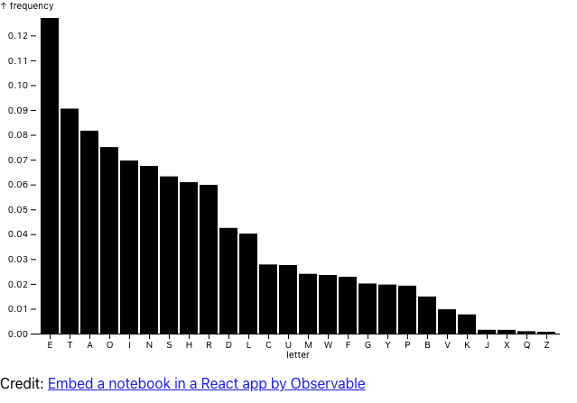

# Embed a notebook in a React app

Squinting at them from a certain distance, Observable notebooks and [React apps](https://reactjs.org/tutorial/tutorial.html) can look like close cousins: both are functional, reactive ways of writing UIs in JavaScript. Let’s see if we can get them to play nicely together, by embedding and controlling a notebook from React.

Here we have a sample bar chart from the [Plot](https://observablehq.com/@observablehq/plot?collection=@observablehq/plot) snippets in the [add cell menu](/cells/#add-cell-menu). 

<figure>
  
</figure>

```js
myBarChart = Plot.plot({
  marks: [
    Plot.barY(alphabet, {x: "letter", y: "frequency", sort: {x: "y", reverse: true}}),
    Plot.ruleY([0])
  ]
})
```

Note that I've named this cell `myBarChart` so that it can be used for embeds. (Only named cells can be embedded.)

Now, let's start a brand new React app with [create-react-app](https://github.com/facebook/create-react-app). Open a terminal and run the following commands:

```sh
> npx create-react-app pretty-animation

... (installation flies by) ...

> cd pretty-animation
> yarn start
```

Your browser should open a new tab to [http://localhost:3000/](http://localhost:3000/), and the React start page will appear:

<figure>
  
  <figcaption>The React screen appears at http://localhost:3000.
  </figcaption>
</figure>

To now embed our bar chart into a React app, we will open up the embed pane for that cell and copy the instructions. 

<video
    class="screenshot w-80"
    src="./assets/embed.mov" alt="Video showing the embed dialog being opened, the dropdown switching to React app, and then clicking the Copy button."
    autoplay loop playsinline controls = "false">
</video>

Now take the code you just copied and run it in a terminal. The example below should be similar:

```bash
> yarn add @observablehq/runtime@5
yarn add "https://api.observablehq.com/d/2ea21d94adf9f376@475.tgz?v=3"
```

::: info NOTE
Use the code you copied from the Embed pane.
:::

Next we'll need the React code to create this component. You can also find this from the embed pane for the cell. 

<video
    class="screenshot w-80"
    src="./assets/embed2.mov" alt="Video showing the embed dialog being opened, the dropdown switching to React app, and then clicking the Copy button."
    autoplay loop playsinline controls = "false">
</video>

Now we take the copied code and paste it into a new file for our React app. We'll call it *BarChart.js*. It should look like this:

```js
import React, {useRef, useEffect} from "react";
import {Runtime, Inspector} from "@observablehq/runtime";
import notebook from "2ea21d94adf9f376";

function Notebook() {
  const myBarChartRef = useRef();

  useEffect(() => {
    const runtime = new Runtime();
    runtime.module(notebook, name => {
      if (name === "myBarChart") return new Inspector(myBarChartRef.current);
    });
    return () => runtime.dispose();
  }, []);

  return (
    <>
      <div ref={myBarChartRef} />
      <p>Credit: <a href="https://observablehq.com/d/2ea21d94adf9f376@484">Embed a notebook in a React app by Observable</a></p>
    </>
  );
}

export default Notebook;
```

The last step is to add our new component to the *Index.js* file, to have it render on localhost:3000.

```js
import React from 'react';
import ReactDOM from 'react-dom/client';
import './index.css';
import Notebook from './BarChart';

const root = ReactDOM.createRoot(document.getElementById('root'));
root.render(
  <React.StrictMode>
    <Notebook />
  </React.StrictMode>
);
```

Now when you go to localhost:3000, you should see this:

<figure>
  
  <figcaption>The chart appears at http://localhost:3000.
  </figcaption>
</figure>

Now you've learned how to embed an Observable cell within a React app. For more examples of using Observable with React apps, including passing data, check out our [examples on Github](https://github.com/observablehq/examples). 
