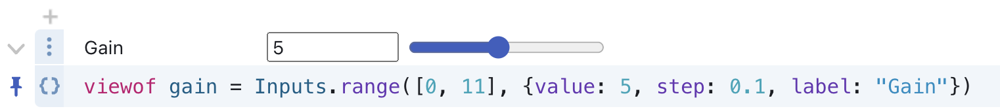

# Observable Inputs

These lightweight interface components—buttons, sliders, dropdowns, tables, and the like—help you explore data and build interactive displays. For a walkthrough of how you might use these to support data analysis, see [Hello, Inputs!](https://observablehq.com/@observablehq/hello-inputs). 

## Usage

Declare your inputs with [viewof](https://observablehq.com/@observablehq/views), like so: 

```js
viewof gain = Inputs.range([0, 11], {value: 5, step: 0.1, label: "Gain"})
```

The range input above (created with `Inputs.range()`) specifies the total range of values a user can choose from (0 to 11), along with options for: 

- `value`: the default starting value or option of an input
- `step`: the increments along the range (here, change by increments of 0.1)
- `label`: a label informing or prompting the user

<figure>
  
  <figcaption>A range slider created with Inputs.range.</figcaption>
</figure>

Now you can reference the input's value (here *gain*) in any cell, and the cell will run whenever the input changes. No event listeners required!

  <video
    class="screenshot w-80"
    src="./assets/inputs-values.mp4" alt="Video showing values in other JavaScript cells changing instantaneously as the value in a range slider changes."
    autoplay loop playsinline controls = "false">
  </video>

  To quickly create an input, open the [**add cell menu**](/cells/#add-cell-menu) by clicking the plus sign in the left margin, then search for an input by name (or search for "input" to see all built-in input options). Click on the desired input, and a new JavaScript cell is added containing placeholder code that you can update to create your input.

<video
    style="border-radius:2px;box-shadow:0 4px 12px rgba(0,0,0,0.15), 0 0 0 1px rgba(0, 0, 0, 0.1);margin-left:27px;margin-bottom:40px;max-width: 70%"
    src="./assets/input-add-cell-menu.mp4" alt="Video showing a user opening the Add cell menu, searching for 'input', and selecting 'Radio button'. A code snippet for a radio button input appears in the notebook in a JavaScript cell."
    autoplay loop playsinline controls = "false">
  </video>


  Observable Inputs are released under the [ISC license](https://github.com/observablehq/inputs/blob/main/LICENSE) and depend only on [Hypertext Literal](https://observablehq.com/@observablehq/htl), our tagged template literal for safely generating dynamic HTML. If you are interested in contributing or wish to report an issue, please see [our repository](https://github.com/observablehq/inputs). For recent changes, please see [our release notes](https://github.com/observablehq/inputs/releases).

  ## Basics

These basic inputs will get you started:

* [Button](https://observablehq.com/@observablehq/input-button): do something when a button is clicked
* [Toggle](https://observablehq.com/@observablehq/input-toggle): toggle between two values (on or off)
* [Checkbox](https://observablehq.com/@observablehq/input-checkbox): choose any from a set
* [Radio](https://observablehq.com/@observablehq/input-radio): choose one from a set
* [Range](https://observablehq.com/@observablehq/input-range) or [Number](https://observablehq.com/@observablehq/input-range): choose a number in a range (slider)
* [Select](https://observablehq.com/@observablehq/input-select): choose one or any from a set (drop-down menu)
* [Text](https://observablehq.com/@observablehq/input-text): enter freeform single-line text
* [Textarea](https://observablehq.com/@observablehq/input-textarea): enter freeform multi-line text
* [Date](https://observablehq.com/@observablehq/input-date) or [Datetime](https://observablehq.com/@observablehq/input-date): choose a date
* [Color](https://observablehq.com/@observablehq/input-color): choose a color
* [File](https://observablehq.com/@observablehq/input-file): choose a local file

Minimal examples of each are shown below. Click on the input name and links for examples to explore and interact with in Observable notebooks. 

### [Button](https://observablehq.com/@observablehq/input-button) 

Do something when a button is clicked. [API Reference ›](https://github.com/observablehq/inputs/blob/main/README.md#button)

```js
viewof clicks = Inputs.button("Click me")
```

<video
    style="border-radius:2px;box-shadow:0 4px 12px rgba(0,0,0,0.15), 0 0 0 1px rgba(0, 0, 0, 0.1);margin-left:27px;margin-bottom:40px;max-width: ${width}"
    src="./assets/input-button.mp4" alt="A user clicks on a button labeled 'Click me' while a counter increases by 1 each time. Code to create the button is shown below: viewof clicks = Inputs.button('Click me')."
    autoplay loop playsinline controls = "false">
  </video>

### [Toggle](https://observablehq.com/@observablehq/input-toggle) 

Toggle between two values (on or off). [API Reference ›](https://github.com/observablehq/inputs/blob/main/README.md#toggle)

```js
viewof mute = Inputs.toggle({label: "Mute"})
```

<video
    style="border-radius:2px;box-shadow:0 4px 12px rgba(0,0,0,0.15), 0 0 0 1px rgba(0, 0, 0, 0.1);margin-left:27px;margin-bottom:40px;max-width: ${width}"
    src="./assets/input-toggle.mp4" alt="A user clicks on and off of a single checkbox labeled 'Mute'. Code to create the checkbox is below: viewof mute = Inputs.toggle({label: 'Mute'})."
    autoplay loop playsinline controls = "false">
  </video>

### [Checkbox](https://observablehq.com/@observablehq/input-checkbox) 

Choose any from a set. [API Reference ›](https://github.com/observablehq/inputs/blob/main/README.md#checkbox)

```js
viewof flavors = Inputs.checkbox(["salty", "sweet", "bitter", "sour", "umami"], {label: "Flavors"})
```

<video
    style="border-radius:2px;box-shadow:0 4px 12px rgba(0,0,0,0.15), 0 0 0 1px rgba(0, 0, 0, 0.1);margin-left:27px;margin-bottom:40px;max-width: ${width}"
    src="./assets/input-checkbox.mp4" alt="A user clicks on and off of multiple checkboxes to select or deselect flavor options. Code to create the checkbox is shown: viewof flavors = Inputs.checkbox(['salty', 'sweet', 'bitter', 'sour', 'umami'], {label: 'Flavors'})."
    autoplay loop playsinline controls = "false">
  </video>

### [Radio](https://observablehq.com/@observablehq/input-radio)

Choose one from a set. [API Reference ›](https://github.com/observablehq/inputs/blob/main/README.md#radio)

```js
viewof flavor = Inputs.radio(["salty", "sweet", "bitter", "sour", "umami"], {label: "Flavor"})
```

<video
    style="border-radius:2px;box-shadow:0 4px 12px rgba(0,0,0,0.15), 0 0 0 1px rgba(0, 0, 0, 0.1);margin-left:27px;margin-bottom:40px;max-width: ${width}"
    src="./assets/input-radio.mp4" alt="A user clicks on and off of radio buttons to select a single option. Code to create the input is shown: viewof flavors = Inputs.radio['salty', 'sweet', 'bitter', 'sour', 'umami'], {label: 'Flavor'})."
    autoplay loop playsinline controls = "false">
  </video>

### [Range](https://observablehq.com/@observablehq/input-range)

Pick a number. [API Reference ›](https://github.com/observablehq/inputs/blob/main/README.md#range)

```js
viewof n = Inputs.range([0, 255], {step: 1, label: "Favorite number"})
```

<video
    style="border-radius:2px;box-shadow:0 4px 12px rgba(0,0,0,0.15), 0 0 0 1px rgba(0, 0, 0, 0.1);margin-left:27px;margin-bottom:40px;max-width: ${width}"
    src="./assets/input-range.mp4" alt="A user slides a cursor along a range, change the selected numeric value. Code to create the input is shown: viewof n = Inputs.range([0, 255], {step: 1, label: 'Favorite number'})."
    autoplay loop playsinline controls = "false">
  </video>

### [Select](https://observablehq.com/@observablehq/input-select)

Choose one, or any, from a menu. [API Reference ›](https://github.com/observablehq/inputs/blob/main/README.md#select)

```js
viewof homeState = Inputs.select([null].concat(stateNames), {label: "Home state"})
```

<video
    style="border-radius:2px;box-shadow:0 4px 12px rgba(0,0,0,0.15), 0 0 0 1px rgba(0, 0, 0, 0.1);margin-left:27px;margin-bottom:40px;max-width: ${width}"
    src="./assets/input-select.mp4" alt="A user chooses different US states from a dropdown list. Code to create the input is shown: viewof homeState = Inputs.select([null].concat(stateNames), {label: 'Home state'})"
    autoplay loop playsinline controls = "false">
  </video>


### [Text](https://observablehq.com/@observablehq/input-text)

Enter freeform single-line text. [API Reference ›](https://github.com/observablehq/inputs/blob/main/README.md#text)

```js
viewof name = Inputs.text({label: "Name", placeholder: "What’s your name?"})
```

<video
    style="border-radius:2px;box-shadow:0 4px 12px rgba(0,0,0,0.15), 0 0 0 1px rgba(0, 0, 0, 0.1);margin-left:27px;margin-bottom:40px;max-width: ${width}"
    src="./assets/input-text.mp4" alt="A user types text into an initially blank text box to update a stored value. Code to create the input is shown: viewof name = Inputs.text({label: 'Name', placeholder: 'What’s your name?'})"
    autoplay loop playsinline controls = "false">
  </video>

### [Textarea](https://observablehq.com/@observablehq/input-textarea)

Enter freeform multi-line text. [API Reference ›](https://github.com/observablehq/inputs/blob/main/README.md#textarea)

```js
viewof bio = Inputs.textarea({label: "Biography", placeholder: "What’s your story?"})
```

<video
    style="border-radius:2px;box-shadow:0 4px 12px rgba(0,0,0,0.15), 0 0 0 1px rgba(0, 0, 0, 0.1);margin-left:27px;margin-bottom:40px;max-width: ${width}"
    src="./assets/input-textarea.mp4" alt="A user types a sentence into an initially blank text box. Code to create the input is shown: viewof bio = Inputs.textarea({label: 'Biography', placeholder: 
    What’s your story?'})"
    autoplay loop playsinline controls = "false">
  </video>

### [Date](https://observablehq.com/@observablehq/input-date)

Choose a date, or a date and time. [API Reference ›](https://github.com/observablehq/inputs/blob/main/README.md#date)

```js
viewof birthday = Inputs.date({label: "Birthday"})
```

<video
    style="border-radius:2px;box-shadow:0 4px 12px rgba(0,0,0,0.15), 0 0 0 1px rgba(0, 0, 0, 0.1);margin-left:27px;margin-bottom:40px;max-width: ${width}"
    src="./assets/input-date.mp4" alt="A user selects a date from a calendar widget. Code shown to create the date input: viewof birthday = Inputs.date({label: 'Birthday'})"
    autoplay loop playsinline controls = "false">
  </video>

### [Color](https://observablehq.com/@observablehq/input-color)

Choose a color. [API Reference ›](https://github.com/observablehq/inputs/blob/main/README.md#color)

```js
viewof color = Inputs.color({label: "Favorite color", value: "#4682b4"})
```

<video
    style="border-radius:2px;box-shadow:0 4px 12px rgba(0,0,0,0.15), 0 0 0 1px rgba(0, 0, 0, 0.1);margin-left:27px;margin-bottom:40px;max-width: ${width}"
    src="./assets/input-color.mp4" alt="A user scrolls through different colors to choose one. Code shown to create the date input: viewof color = Inputs.color({label: 'Favorite color', value: '#4682b4'})"
    autoplay loop playsinline controls = "false">
  </video>

### [File](https://observablehq.com/@observablehq/input-file)

Choose a local file. [API Reference ›](https://github.com/observablehq/inputs/blob/main/README.md#file)

```js
viewof file = Inputs.file({label: "CSV file", accept: ".csv", required: true})
```

<video
    style="border-radius:2px;box-shadow:0 4px 12px rgba(0,0,0,0.15), 0 0 0 1px rgba(0, 0, 0, 0.1);margin-left:27px;margin-bottom:40px;max-width: ${width}"
    src="./assets/input-file.mp4" alt="A user clicks a button prompting them to upload a file, which takes them to a finder where they navigate to and select the file. It is then imported into the notebook."
    autoplay loop playsinline controls = "false">
  </video>

## Inputs for tabular data

These inputs are designed to work with tabular data such as CSV or TSV [file attachments](/data/files/file-attachments) and [database clients](/data/databases/overview).

* [Search](https://observablehq.com/@observablehq/input-search) - query a tabular dataset
* [Table](https://observablehq.com/@observablehq/input-table) - browse a tabular dataset

### [Search](https://observablehq.com/@observablehq/input-search)

Query a tabular dataset. [Examples ›](https://observablehq.com/@observablehq/input-search) [API Reference ›](https://github.com/observablehq/inputs/blob/main/README.md#search)

```js
viewof search = Inputs.search(capitals, {placeholder: "Search U.S. capitals"})
```

<video
    style="border-radius:2px;box-shadow:0 4px 12px rgba(0,0,0,0.15), 0 0 0 1px rgba(0, 0, 0, 0.1);margin-left:27px;margin-bottom:40px;max-width: ${width}"
    src="./assets/input-search.mp4" alt="A user enters text ('Sacramento') into a text box, and an array of objects is automatically filtered to only contain objects with that string."
    autoplay loop playsinline controls = "false">
  </video>

### [Table](https://observablehq.com/@observablehq/input-table)

Browse a tabular dataset. [Examples ›](https://observablehq.com/@observablehq/input-table) [API Reference ›](https://github.com/observablehq/inputs/blob/main/README.md#table)

For an array of objects named *search*:

```js
viewof rows = Inputs.table(search)
```

<video
    style="border-radius:2px;box-shadow:0 4px 12px rgba(0,0,0,0.15), 0 0 0 1px rgba(0, 0, 0, 0.1);margin-left:27px;margin-bottom:40px;max-width: ${width}"
    src="./assets/input-table.mp4" alt="Using Inputs.table, a user scrolls through the rows of a table, then selects several rows by clicking a checkbox in the left margin next to different rows. The information from selected rows is stored in an array of objects in a following cell."
    autoplay loop playsinline controls = "false">
  </video>

## Advanced & community inputs

Got the basics? Here are a few more advanced techniques:

* [Form](https://observablehq.com/@observablehq/input-form?collection=@observablehq/inputs) - combine multiple inputs for a compact display
* [Synchronized inputs](https://observablehq.com/@observablehq/synchronized-inputs?collection=@observablehq/inputs) - bind two or more inputs
* [Introduction to Views](https://observablehq.com/@observablehq/introduction-to-views) - more on Observable's `viewof`

For even more, consider these "friends & family" inputs and techniques shared by the Observable community:

| Name | Author | Description |
|------|--------|-------------|
| [2D Slider](https://observablehq.com/d/98bbb19bf9e859ee) | Fabian Iwan | a two-dimensional range]|
| [Binary Input](https://observablehq.com/@rreusser/binary-input) | Ricky Reusser | bitwise IEEE floating point |
| [DIY inputs](https://observablehq.com/@bartok32/diy-inputs) | Bartosz Prusinowski | inputs with fun, custom styles |
| [FineRange](https://observablehq.com/@rreusser/fine-range) | Ricky Reusser | high-precision numeric control | 
| [Form Input](https://observablehq.com/@mbostock/form-input) | Mike Bostock | multiple inputs in single cell |
| [Inputs](https://observablehq.com/@jashkenas/inputs) | Jeremy Ashkenas | the original |
| [Player](https://observablehq.com/@oscar6echo/player) | oscar6echo | detailed timing control for animation |
| [Scrubber](https://observablehq.com/@mbostock/scrubber) | Mike Bostock | play/pause/scrub control for animation |
| [Range Slider](https://observablehq.com/@mootari/range-slider) | Fabian Iwand | a two-ended range | 
| [Ternary Slider](https://observablehq.com/@yurivish/ternary-slider) | Yuri Vishnevsky | a proportion of three values | 
| [Data driven range sliders](https://observablehq.com/@bumbeishvili/data-driven-range-sliders) | David B. | a range input with a histogram | 
| [Snapping Histogram Slider](https://observablehq.com/@trebor/snapping-histogram-slider) | Robert Harris | a range input with a histogram |
| [Inputs in grid](https://observablehq.com/@bumbeishvili/input-groups) | David B. | combine multiple inputs into a compact grid |
| [List Input](https://observablehq.com/@harrislapiroff/list-input) | Harris L. | enter more than one of something |
| [Copier](https://observablehq.com/@mbostock/copier) | Mike Bostock | a button to copy to the clipboard |
| [Tangle](https://observablehq.com/@mbostock/tangle) | Mike Bostock | Bret Victor-inspired inline scrubbable numbers |
| [Editor](https://observablehq.com/@cmudig/editor) | CMU Data Interaction Group | code editor with syntax highlighting |
| [Color Scheme Picker](https://observablehq.com/@zechasault/color-schemes-and-interpolators-picker) | Zack Ciminera | pick a D3 color scheme |
| [Easing Curve Editor](https://observablehq.com/@nhogs/easing-graphs-editor) | Nhogs | create a custom easing curve |