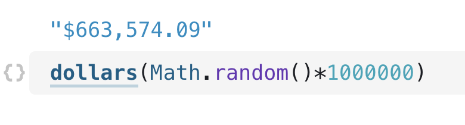

# Importing and remixing

---

<figure>
  
</figure>

Notebooks on Observable can be reused in different ways. If you need only very specific parts (like a single function or dataset), you can import them piecemeal into another notebook so you don't have to recreate or copy the code in different places. If you want to base your notebook on an existing one, or you want to try out some ideas and perhaps send back suggestions to the original author, you can fork a notebook. Here's a look at how these two ways of remixing content work, and when to use which.

## Importing 

A big strength of notebooks is that they make it easy to write components once, then reuse them in other places, for more efficient and organized data work. This is done using the `import` keyword. You could write it by hand, but it's much easier to simply copy it from a cell, using the cell menu. This also has the advantage of being less error-prone.

    <video src="./assets/import101.mov" alt="User is in a blank notebook and opens the cell menu to add a new cell. They type 'rad' to filter the results and click on the radio input. They then another JavaScript cell that takes the value from that radio input and see it update as they interact with the input." style="width: 100%; border-radius: 5px; box-shadow: 3px 3px 10px #ccc;" autoplay playsinline loop muted></video>

Suppose we were to import the `letterFrequency` chart below from [the earlier notebook about inputs](https://observablehq.com/d/ec4297da21238b6b?collection=@observablehq/intro-to-observable). It depends on a dataset and three variables that pick the letter to highlight as well as the colors of the selected and regular bars. The import brings all of those necessary values with it:

<figure>
  
  <figcaption>An example of importing a chart from another notebook.</figcaption>
</figure>

This imports the cell and creates a variable of the same name:

<figure>
  
  <figcaption>After it is imported, you can easily just use the chart anywhere by invoking it by name from a JavaScript cell.</figcaption>
</figure>

If you don't like the name of the cell in the original notebook, perhaps because it has a generic name such as `data` _or_ because you already have an object stored with the same name (which isn't allowed in Observable notebooks), you can rename it directly in the import statement:

<figure>
  
  <figcaption>You can change the name of a component upon importing.</figcaption>
</figure>

We can now call our imported function just like any other function:

<figure>
  
</figure>

To import multiple cells from the same notebook, add their names into the same import statement, separated by commas.

You might also notice a lock symbol on top of a cell that contains an import from another notebook. This allows you to lock the version of the notebook that the cell is imported from. Locking the version ensures that you get the exact cell you expected, but it also means that you will not get any updates that are made to it.

## Importing external libraries

In addition to importing from other notebooks, you can also import general JavaScript modules. Observable already includes many useful libraries (D3, Plot, lodash, and more) but you might want to use one that isn't available by default.

Unfortunately, there is no single standard for JavaScript modules, which can make importing a challenge at times. We have a [helpful import debugger](https://observablehq.com/@observablehq/module-require-debugger) to help with this.

Many external modules are easy to import, however, such as this [library of financial functions](https://www.npmjs.com/package/financial) that we're using in [our mortgage calculator](https://observablehq.com/@observablehq/modeling-in-observable?collection=@observablehq/observable-for-excel-users):

<figure>
  
  <figcaption>An easily imported external library.</figcaption>
</figure>

## Forking a notebook

A different way of reusing a notebook, and a way to collaborate, is to _fork_ a notebook. This is done by selecting the _Fork_ option from the menu in the top right of every notebook.

    <video src="./assets/fork.mov" alt="User is viewing a community notebook on horizon charts and interacts with an input for the number of bands. They then click on the Fork modal and forks a copy of this notebook to their personal account." style="width: 100%; border-radius: 5px; box-shadow: 3px 3px 10px #ccc;" autoplay playsinline loop muted></video>

The term forking comes from version control systems, and essentially means making a copy of a document, and that copy knows where it came from. A forked notebook works like a completely independent copy, but because it knows which parent notebook it was derived from, it has some additional functionality.

One of them is the ability to make suggestions. A good model for testing out ideas is to fork a notebook, test the ideas in the fork, and then use the [_suggest_](https://observablehq.com/@observablehq/fork-suggest-merge) feature to send the changes back to the original author. If you're familiar with git or other distributed version control systems, you would recognize this as a pull request.

The owner of the original notebook can then inspect the changes and decide whether to accept the suggestion and merge the changes into their version, or ignore them. 

But it's also just a great way to start your work from an existing example you like, perhaps something you found on [Observable's Explore page](https://observablehq.com/explore).

That's it for our [course](https://observablehq.com/@observablehq/learning-observable-introduction?collection=@observablehq/intro-to-observable). If you're interested in learning more, check-out our other [tutorials](https://observablehq.com/tutorials) or documentation. 

Also, if you're feeling stuck or have questions, the Observable community is here to help. Here are several places to reach out for help, clarification and support:
- [Observable Community Forum](https://talk.observablehq.com/)
- [Observable Community Slack Workspace](https://join.slack.com/t/observable-community/shared_invite/zt-1icwex7uf-ovIAS0PcuJ~ZgBToSyUs8w) (#help channel)
- Email: support@observablehq.com