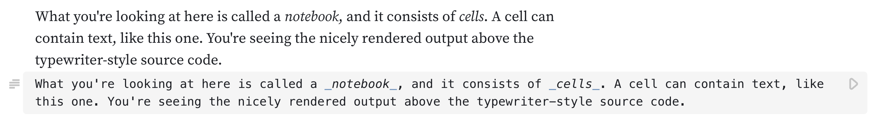

# Notebooks & cells

---

<figure>
  
  <figcaption></figcaption>
</figure>

---

Notebooks consist of cells. Here is an example of a cell in a notebook:

<figure>
  
  <figcaption>An example of how a text cell works in Observable.</figcaption>
</figure>

A cell can contain code, like in this example:

<figure>
  
  <figcaption>An example of some code in a JavaScript cell.</figcaption>
</figure>

The content of the cell is the code, in this case the simple calculation `1+2`, and on Observable the result is shown above the code.

After typing into a cell, whether it's code or text, you need to run the cell to see the result. You do that by clicking the play button in the top right corner of the cell, or by pressing <Keys set="Shift-Enter" />.

Cells can contain computations of any complexity, and they can produce much more than just numbers. Here's an example of a chart (don't worry about the details, we'll get to Plot [later](https://observablehq.com/d/79f43da4b58ef64e?collection=@observablehq/intro-to-observable)):

<figure>
  
  <figcaption>An example of a scatterplot in an Observable cell.</figcaption>
</figure>

A cell can also contain interactive elements such as sliders, radio buttons, dropdown boxes to select an item, and more:

<figure>
  
  <figcaption>An example of a slider input in a JavaScript cell.</figcaption>
</figure>

## Cell types

Text cells are written in plain text with markup for styling. You can have italics or bold text, hyperlinks, etc. The markup language we use is called Markdown. Text cells can also include code. To get the `amount` variable to show up in text, you type `${amount}` as shown here:

<figure>
  
  <figcaption>An example of a variable defined in another cell being interpolated in a text cell.</figcaption>
</figure>

and the value of the variable will be rendered.

This is not limited to text—you can use the values of named cells in calculations. Perhaps we want to multiply the amount by some other number and assign that to a new variable, named `yearly`.

<figure>
  
  <figcaption>An example of using a variable in a JavaScript cell that was defined in another cell.</figcaption>
</figure>

## Reactive code execution

While dragging the slider to change the value, you may have noticed that all other values in the notebook updated automatically without you having to re-run any code in individual cells. If you're familiar with spreadsheets, that might not seem terribly surprising, but if you're more used to traditional programming, it probably is.

Observable uses a [_reactive_ model of code execution](https://observablehq.com/@observablehq/how-observable-runs). What that means is that it knows how different cells depend on one another in a notebook. When any cell is updated, all cells that depend on it are automatically re-run. This works with any number of cells, and their order on the page doesn't matter.

The calculation below depends on the two controls that come after it. For some variety, we're showing a dropdown box and radio buttons here. The total amount of our simple compounding interest calculator changes when you change any of its parameters, whether they're defined before (like `amount`) or after the calculation:

<figure>
  
  <figcaption>An example of a calculation in one cell with variables defined in cells that come after.</figcaption>
</figure>

## Creating and deleting cells

Now that you've seen what cells are, you want to create your own! To create a new cell, hover over the left edge of the existing cells to reveal **+** buttons above and below. Clicking any of them will open the [_Add Cell_ menu](https://observablehq.com/@observablehq/adding-cells). You can select from the three main types of cells (JavaScript, Markdown, and HTML) as well as a wide range of useful templates for charts, inputs, tables, and more.

    <video src="./assets/addCell@1.mp4" alt="User adds a new cell to a blank Observable notebook by clicking on the cell, opening up the cell menu, and clicking on a JavaScript cell. They then write 1 + 1 which computes the value 2." style="width: 100%; border-radius: 5px; box-shadow: 3px 3px 10px #ccc;" autoplay playsinline loop muted></video>

To delete a cell, click the three-dot menu in its left sidebar and select _Delete_. You can also click into the cell and then select the trash can button from the toolbar on the bottom of your browser window.

    <video src="./assets/delete.mp4" alt="User deletes two cells in an Observable notebook, the first time with the cell options and the second time with the cell menu." style="width: 100%; border-radius: 5px; box-shadow: 3px 3px 10px #ccc;" autoplay playsinline loop muted></video>

## Pinning and moving cells

The little push pin icon you see next to an open cell allows you to _pin_ a cell, which means keeping it open. JavaScript cells are pinned by default, while Markdown and HTML cells are unpinned when you create them. You can change that for any cell by simply clicking the pin (for example, this Markdown cell is pinned). For JavaScript cells, we often want to show the code, which is why they are pinned by default. This isn't as important for text cells, but keeping them pinned can encourage others to edit or comment.

You can move cells by clicking and holding the mouse over the bar on the left of the cell (the pointer will turn into a hand icon). Hold down the mouse or track pad button to drag the cell to a new position in the notebook. A horizontal line indicates where the cell will end up when you drop it. As an alternative, the toolbar on the bottom of the browser lets you move a cell up or down by clicking the arrow buttons.

    <video src="./assets/drag2.mp4" alt="User moves cells in the notebook by clicking to the left of a cell and dragging it up and down the page." style="width: 100%; border-radius: 5px; box-shadow: 3px 3px 10px #ccc;" autoplay playsinline loop muted></video>

To move multiple cells, click Select in the cell menu (three dot menu). This shows checkboxes for each cell, which lets you pick which ones to include. You can bulk move all selected cells at once using arrow buttons in the tool bar at the bottom of your browser window, delete them all using the trash can icon, or duplicate them using the duplicate button.

    <video src="./assets/dragMultiple.mp4" alt="User moves multiple cells in a notebook at once by selecting each cell then using the up and down arrows to move them in the notebook." style="width: 100%; border-radius: 5px; box-shadow: 3px 3px 10px #ccc;" autoplay playsinline loop muted></video>

## Create a notebook

To create a new notebook, scroll to the top of any page on Observable and you will find a _New_ button in the top right. Clicking it presents you with a choice to create a blank notebook or to start from a number of templates, such as charts, data access to a number of services, curated datasets to explore, and more.

    <video src="./assets/new.mp4" alt="User creates a new notebook by clicking on the 'New +' button on the top right hand corner of the page and then selects one of the notebook templates." style="width: 100%; border-radius: 5px; box-shadow: 3px 3px 10px #ccc;" autoplay playsinline loop muted></video>

You can share notebooks with others to edit together, or keep them to yourself. Notebooks can connect to a variety of data sources including local files, spreadsheets, APIs and for Enterprise and Pro accounts, cloud files and databases.