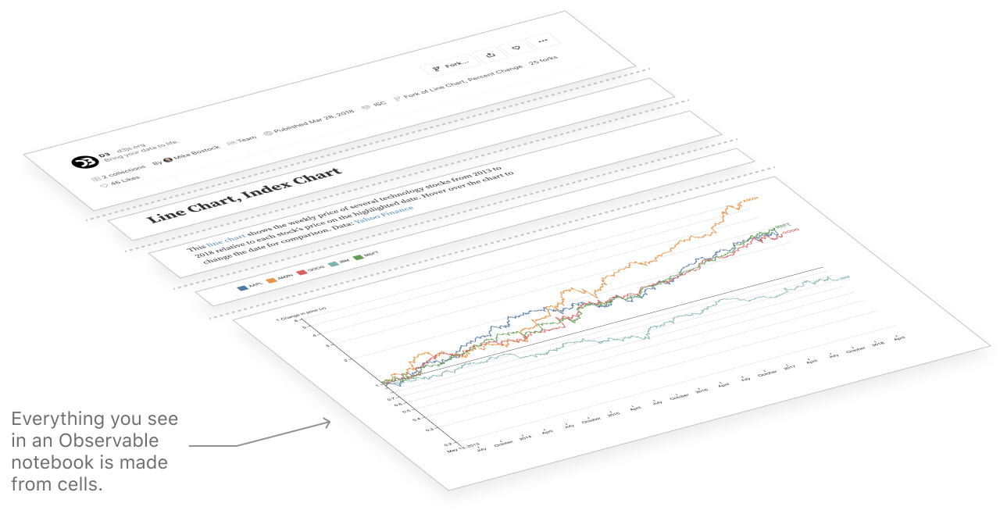

# Observable overview

Observable streamlines the path from data to insights—for both individuals and teams. In Observable notebooks, users can quickly access their data and combine text, analyses, and data visualizations in the same place. Collections of code snippets and low-code features allow anyone to quickly build or modify notebooks. Observable is built for collaboration and sharing, so that more people can explore, work with, and contribute to discussions around data.

## The Notebook

Observable notebooks are __interactive, editable documents defined by code__. 

All content in notebooks is made in cells. Within cells, you can author formatted text (in markdown) and code (JavaScript, SQL, HTML) to view right alongside customized data tables and visualizations. Then, quickly share your work with teammates and stakeholders to get everyone literally on the same page. 

<figure>
  
  <figcaption></figcaption>
</figure>

A notebook is both a final product for presentation, and a blank canvas for data analysis, exploration, and creative tinkering. With zero software installation or environment setup required, the barriers to get up and running in an Observable notebook are low for coders and non-coders alike. 

## Upload data, visualize and add interactivity

At Observable, we aim to help everyone—regardless of their previous experience with data, writing code, or building visualizations—get from data to insights with the least possible friction. In Observable notebooks, a wealth of features and code snippets for low-code data access, analysis, and visualization exist at your fingertips.

### Upload data

In Observable, you can quickly access your own data by attaching local files or spreadsheets, connecting to APIs, and—for Enterprise and Pro users—connecting to [databases](/data/databases/overview) or [cloud files](/data/files/cloud-files). Here is an example of uploading a CSV file to an Observable notebook, and viewing its contents in a data table.

    <video src="./assets/files.mp4" alt="User clicks on File Attachments pane and drags a csv file called mta.csv, which is then imported into the notebook and viewed with a data table." style="width: 100%; border-radius: 5px; box-shadow: 3px 3px 10px #ccc;" autoplay playsinline loop muted></video>

### Visualize data with Plot

The [Observable Plot](https://observablehq.com/plot/) library lets you quickly build and customize data visualizations. Code snippets are provided in the [cell menu](/cells/#add-cell-menu) as a starting point for many common chart types. They help get you up and running quickly with your own visualizations by simply substituting your data and variable names.

    <video src="./assets/cellMenuExample.mp4" alt="Video screenshot of Observable notebook, showing selection of a line chart code snippet from the Add Cell menu. A new cell with starter code appears, then the coder replaces the example Apple stock data with subway ridership data to create an updated chart of ridership over time." style="width: 100%; border-radius: 5px; box-shadow: 3px 3px 10px #ccc;" autoplay playsinline loop muted></video>

### Add interactivity

[Observable Inputs](/inputs/overview) are lightweight interface components (including buttons, sliders, dropdowns, tables, and text inputs) that help you explore data and build interactive displays. You can also find them in the cell menu.

Once you've added an Input to your notebook, link its value to one or more elements of a chart to add interactivity. Since your Observable notebook is _on_ the web and in the language _of_ the web, your interactive chart is immediately shareable with collaborators.

    <video src="./assets/inputs2.mp4" alt="Video screenshot of Observable notebook, showing selection of a line chart code snippet from the Add Cell menu. A new cell with starter code appears, then the coder replaces the example Apple stock data with subway ridership data to create an updated chart of ridership over time." style="width: 100%; border-radius: 5px; box-shadow: 3px 3px 10px #ccc;" autoplay playsinline loop muted></video>

## Made for collaboration

At Observable, we believe that collaboration is key to doing responsible, innovative work with data. That's why we support several ways to collaborate with others in notebooks, whether it's co-editing a visualization or adding comments to an analysis. Here are a few ways that Observable is built with collaboration in mind.

### Multiplayer editing

You can invite others to join and edit notebooks with you. Edits are live and visible to all users who are present at the same time. You can see other active users' avatars at the top of the screen. Click on them to automatically follow them around the notebook!

    <video src="./assets/collab.mp4" alt="Screen capture of an Observable notebook showing a user clicking the Share button, then adding another user as an editor. The new editor's avatar now appears in the notebook and is seen making edits." style="width: 100%; border-radius: 5px; box-shadow: 3px 3px 10px #ccc;" autoplay playsinline loop muted></video>

### Explore, comment and discuss—right in the notebook

Collaborators and stakeholders don't require edit access to contribute to work in an Observable notebook. Anyone with view access can interact with notebooks using inputs, and can give feedback and participate in discussions using [comments](/collaboration/comments). Comments get sent to the original editor so they can respond and resolve. 

    <video src="./assets/comments.mp4" alt="Screen capture of a user making a comment on a chart, and another user responding and making those changes." style="width: 100%; border-radius: 5px; box-shadow: 3px 3px 10px #ccc;" autoplay playsinline loop muted></video>

### Version history

Whether working solo or with collaborators in a notebook, it is useful to have a record of changes made. The [History](/notebooks/history) pane (accessed by clicking the clock icon in the right margin) shows what changes were made to your notebook. You can also revert back to earlier versions at any time. 

Automated version history in Observable means that everyone working in the notebook can safely make edits and investigate changes.

    <video src="./assets/history@1.mp4" alt="Screen capture of an Observable notebook. The user selects the clock icon to open the History pane, selects an older veresion of the notebook, then chooses to Restore the notebook back to that version." style="width: 100%; border-radius: 5px; box-shadow: 3px 3px 10px #ccc;" autoplay playsinline loop muted></video>

## JavaScript for data analysis

At Observable, we believe that JavaScript is the future of data analysis. Our co-founder, Mike Bostock, wrote  in [Towards Data Science](https://towardsdatascience.com/javascript-for-data-analysis-2e8e7dbf63a7):
> _JavaScript is the richest medium we've ever had for communication, but thanks to the open nature of the web it's also something more: a medium amenable to inspection and tinkering, for learning and collaboration._
> 

While JavaScript lacks some of the extensive data analysis and data science libraries you see in R, Python, or Julia, it makes up for that with portability and convenience. Notebooks can run in a browser, on your laptop, tablet or phone. You can see the code, edit the code, run the code from any of those devices. There is no setup required, there is no software to install. It simply _works_.

As so many of our workflows move to the web, the ones that don't become more inconvenient. What we need are better tools in JavaScript for data analysis, and that's where Observable comes in.

### Data analysis and visualization

JavaScript has been a common language for data visualization for many years. [D3](https://d3js.org/) has become the de facto framework for bespoke data visualization, used extensively by news organizations and for custom visualization applications. Many other great visualization frameworks are also built in JavaScript, such as [VegaLite](https://vega.github.io/vega-lite/), [Highcharts](https://www.highcharts.com/), [Observable Plot](https://observablehq.com/plot), and more. JavaScript is clearly the language of choice for data visualization today. 

At Observable, we believe that **data visualization _is_ data analysis**. Charts let us explore and understand patterns in data using visual encodings, rather than through mathematical models. They can reveal insights and raise questions that may otherwise be hidden within model assumptions and numerical outputs. And, visuals can be a more approachable and compelling way to communicate insights with stakeholders who may not be familiar with models or know how to interpret them.

With tools to aggregate and summarize raw data directly in visualizations (for example, see [Plot group](https://observablehq.com/@observablehq/plot-group) for grouped transformations right in Observable Plot), Observable makes it straightforward to view patterns in raw and transformed data without the need for extensive data preparation.

Combined with SQL cells and JavaScript libraries for data wrangling and analysis (which are easily loaded into notebooks using [require](/cells/require)), Observable has the tools you need for many data analysis essentials.

## The Observable community

The community of Observable creators, learners, readers, and ambassadors is vast. By joining the [Observable community](https://observablehq.com/community), you tap into a universe of published notebooks and examples that you can look to for inspiration and reuse in your own work. You also get direct support from community members when you have questions or need help.

### Community contributions for inspiration and reuse

The Observable community is home to thousands of visualization and data analysis examples. Our [explore](https://observablehq.com/explore) page is your portal to our top content, rated by community likes and curated by the Observable team. Examples you find can be reused for your own analysis, either by importing the code itself or forking the notebook to your own workspace. 

Visualization code is easy to reuse for other datasets. The [components](https://observablehq.com/collection/@observablehq/components) collection features reusable functions that you can easily import into your own notebooks to analyze your own data.

    <video src="./assets/reuseViz.mp4" alt="Screen capture of a user working in Observable, importing a chart function from the D3 collection then replacing the example data with their own to create their own chart." style="width: 100%; border-radius: 5px; box-shadow: 3px 3px 10px #ccc;" autoplay playsinline loop muted></video>

The video above shows an example of an [import](/notebooks/imports). Observable lets you quickly reuse content by importing named cells from other notebooks. Most often you'll import code and functions for reuse, but imports are versatile—you can also import charts, inputs, tables, text, or even data.  This works with community notebooks, as well as private notebooks within a team.

    <video src="./assets/import.mp4" alt="Screen capture of an Observable user writing a function, choosing Copy Import from the cell menu, then importing and using the function in another notebook." style="width: 100%; border-radius: 5px; box-shadow: 3px 3px 10px #ccc;" autoplay playsinline loop muted></video>
  

  With content from thousands of community-contributed Observable notebooks available for reuse, how can you focus your search to find what you need? Check out our guide for [searching on Observable](/collaboration/search) and visit a couple of our favorite links, such as the [Plot](https://observablehq.com/@observablehq/plot-gallery) and [D3](https://observablehq.com/@d3/gallery) galleries.
### Community support

In addition to providing inspiration and reusable code, the Observable Community provides invaluable support while you learn and work. Here are several places to reach out for help, clarification and support:

- [Observable Community Forum](https://talk.observablehq.com/)
- [Observable Community Slack Workspace](https://observablehq.com/slack/join)