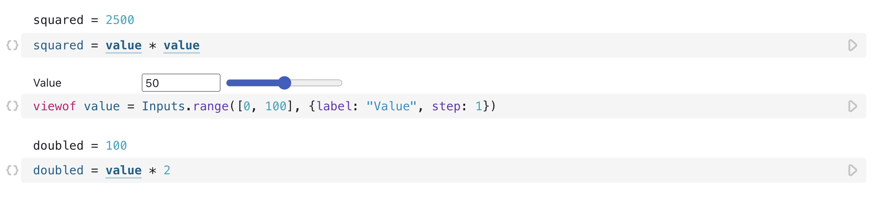

# Reactive dataflow

---

<figure>
  
</figure>

---

We previously introduced Observable's [reactive model](https://observablehq.com/d/b64494e58131b26a?collection=@observablehq/intro-to-observable#cell-51) for cell execution. Here, we'll dig a bit deeper into how it works, features to help you understand and update your notebooks' organization, and advantages of the reactive dataflow.

Observable is different from vanilla JavaScript because it organizes code and data into _cells_ that it re-runs automatically as needed. You can think of this as working like a spreadsheet, where you can write calculations and enter values. 

Observable knows which cells depend on which others, no matter where they are located in the notebook. So when one of them changes, all values that depend on it are automatically updated. This is also efficient: only those cells that are affected by a change are re-run. That means that you can organize cells in your notebook however you want, without worrying about how the order of operations may be affected. 

The `value` cell below is used in two other cells, one before and one after it in the notebook. If you were to change its value by moving the slider, both dependent cells would update.

<figure>
  
  <figcaption>The value of the middle cell determines the value of the cell before and the cell after.</figcaption>
</figure>

Learn more about [How Observable Runs](https://observablehq.com/@observablehq/how-observable-runs). 

## The Minimap

We can see how this works by looking at the [_Minimap_](https://observablehq.com/@observablehq/minimap?collection=@observablehq/visualizing-debugging-notebooks). Open it by clicking the Minimap button in the sidebar on the right and then click the cell named `value` inside it (or click within the cell in the document).

    <video src="./assets/minimap2.mov" alt="User clicks on the Minimap pane, which pulls up a dependency tree view of all the cells in the notebook. The user then clicks on each cell in the Minimap to see if it has upstream or downstream dependencies." style="width: 100%; border-radius: 5px; box-shadow: 3px 3px 10px #ccc;" autoplay loop muted></video>

The `value` cell is now highlighted, and lines link to cells that depend on it. This reads left to right: the cell we selected has a dot toward the left, and cells that depend on it have a dot toward the right.

Suppose we were to add two more cells:

<figure>
  
  <figcaption>Two cells dependent on earlier defined cells.</figcaption>
</figure>

The resulting dependency tree can be followed easily:

    <video src="./assets/minimap.mov" alt="User clicks on the Minimap pane, which pulls up a dependency tree view of all the cells in the notebook. The user then clicks on each cell in the Minimap to see if it has upstream or downstream dependencies." style="width: 100%; border-radius: 5px; box-shadow: 3px 3px 10px #ccc;" autoplay loop muted></video>

In this somewhat contrived example, `doublesquaredplus` depends on the `doublesquared` and `value` cells, with `doublequared` depending on `double` and `squared`. The Minimap shows us one level up and down from `doublesquared` when we click on it, and indicates that there are more dependencies upstream of `doubled` and `squared`. We can follow them by clicking on those cells.

The Minimap also provides another way of reordering cells in a notebook. You can click on a cell in the Minimap, then drag it up or down to move it to a new position in your notebook. This is helpful when you want to move cells over a longer distance, for example to move them into an appendix.

    <video src="./assets/minimap3.mov" alt="User has an open Minimap, clicks and drags values around the map to move them in the notebook." style="width: 100%; border-radius: 5px; box-shadow: 3px 3px 10px #ccc;" autoplay loop muted></video>

## Advantages of reactive code

Reactive code might seem unusual at first, and it is best understood by just trying it out. Once you're used to this way of working, you will likely miss it in other environments. Not having to worry about the order in which values are defined, and not having to re-run computations when things change, eliminates many sources of bugs and lets you build much more readable and better structured code.

The reactive model also gives you more control over how your code is organized and presented. In longer notebooks, it is common to move computations, data preparation, etc., into an appendix at the end of the notebook (or perhaps in an entirely separate notebook — see [importing](https://observablehq.com/d/3455fc643fe664d7?collection=@observablehq/intro-to-observable)) without having to call those data prep functions before creating the charts or running an analysis. 
