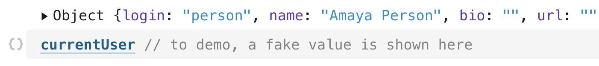
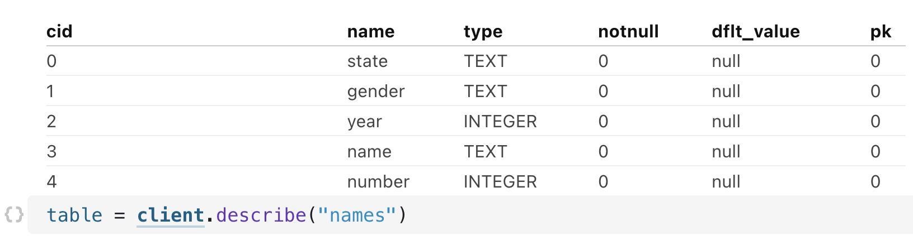
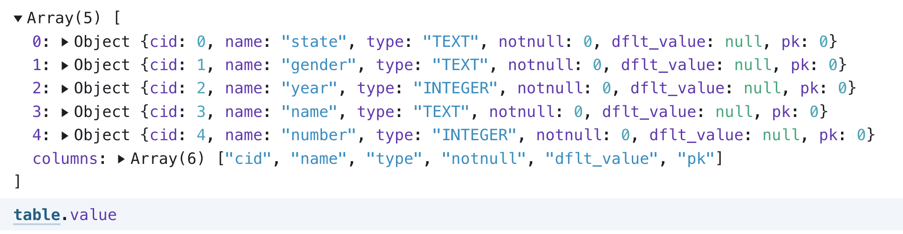
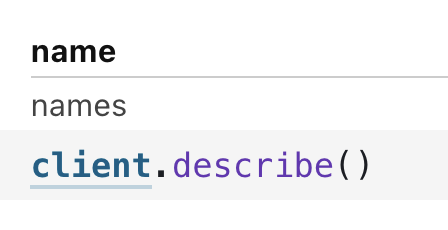
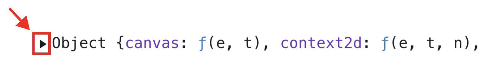
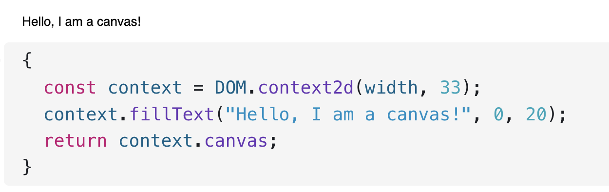
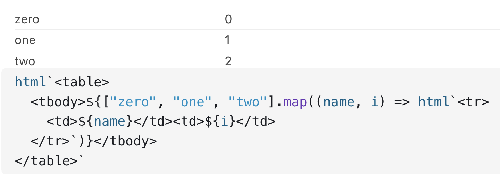
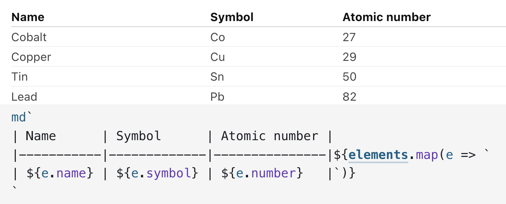
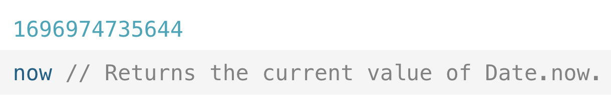
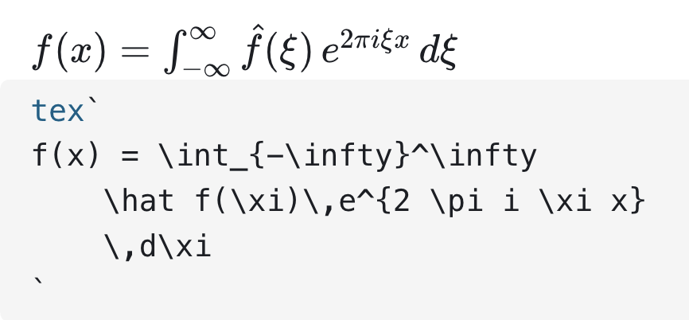

# Standard library

Many capabilities that you will find useful are provided in the [Observable standard library](https://github.com/observablehq/stdlib/blob/master/README.md). This notebook describes those capabilities in brief, and provides links when there are notebooks that go into greater detail. (Older functionality is listed in [Deprecated / No Longer Recommended](#deprecated).)

## currentUser

The `currentUser` object is a special addition to the standard library, only available within [private workspaces](https://observablehq.com/pricing). `currentUser` provides information about the team member currently viewing the page:

<figure>
  
  <figcaption>Reveal current user information with `currentUser`.</figcaption>
</figure>

## DatabaseClient

For most uses, the [Data table cell](https://observablehq.com/@observablehq/data-table-cell?collection=@observablehq/getting-data-in-and-out) or [SQL cell](https://observablehq.com/@observablehq/sql-cell?collection=@observablehq/getting-data-in-and-out) are preferable to creating a database client programmatically. Their results can be accessed as variables just like any other cell.

To programmatically create a database client for a configured database, use `DatabaseClient`:

```js
client = DatabaseClient("Baby Names")
```

This returns a promise to the client for the database with the specified name. You then can use a `query` method that returns a promise to the array of results:

```js
names = client.query(
  `SELECT name, gender, year, SUM(number) AS number
  FROM names
  WHERE year > ?
  GROUP BY name, gender, year`,
  [1920]
)
```

The database client has the following methods available:

| Name | Description |
|-|-|
| [databaseClient.query()](#clientQuery) | Run the specified SQL query, returning a promise to the array of results. |
| [databaseClient.queryRow()](#clientQueryRow) | Similar to databaseClient.query but returns a promise to a single row of results. |
| [client.sql\`\`](#clientSQL) | Similar to query(), but allows easy interpolation of variables into the query string |
| [databaseClient.explain()](#clientExplain) | Explains the query plan for the specified query, returning a promise to an HTML element. (PostgreSQL databases only.)|
| [databaseClient.describe()](#clientDescribe) | Describes the schema for the table with the specified name, returning a promise to an HTML table. |

### *client*.query(*query*[, *parameters*]) {#query}
Run the specified SQL *query*, returning a promise to the array of results. (You can either explicitly await the promise as part of a larger expression, or rely on Observable's [implicit cell-level await](https://observablehq.com/@observablehq/introduction-to-promises).)

If *parameters* is specified, it is an array of values to bind to query parameters. The parameter syntax depends on the database type: 
- BigQuery can use named (`@age`, `@name`, …) or ordered (repeating `?`) parameters 
- Databricks uses numbered parameters (`:1`, `:2`, …)
- Mongo SQL uses ordered parameters (repeating \`?\`)
- MySQL uses ordered parameters (repeating `?`)
- Oracle can use named (`:age`, `:name`, …) or ordered (repeating `?`) parameters 
- PostgreSQL uses numbered parameters (`$1`, `$2`, …)
- Snowflake  uses numbered parameters (`:1`, `:2`, …)
- SQL Server can use named (`@age`, `@name`, …) parameters  

Please refer to the respective documentation: 
- [BigQuery](https://cloud.google.com/bigquery/docs/parameterized-queries)
- [Databricks](https://docs.databricks.com/)
- [Mongo](https://www.mongodb.com/docs/)
- [MySQL](https://github.com/mysqljs/mysql/blob/master/Readme.md#escaping-query-values)
- [Oracle](https://node-oracledb.readthedocs.io/en/latest/user_guide/bind.html#in-bind-parameters)
- [PostgreSQL](https://node-postgres.com/features/queries#parameterized-query)
- [Snowflake](https://docs.snowflake.com/en/user-guide/nodejs-driver-use.html#binding-statement-parameters)
- [SQL Server](https://github.com/tediousjs/node-mssql#input-name-type-value)

### *client*.queryRow(*query*[, *parameters*])

An alternative to [*client*.query](#query) that returns a single row instead of an array of results. For example: 

```js
client.queryRow(
  `SELECT MIN(year) AS year
  FROM names
  WHERE name = ?`,
  ["Loki"]
)
```

Returns `Object {year: 2007}`

### *client*.sql\`*query*\`
Run the specified SQL *query* returning a promise to the array of results. Interpolated expressions are treated as query parameters. (Like with [*client*.query](#query), you can either explicitly await the promise as part of a larger expression, or rely on Observable’s [implicit cell-level await](https://observablehq.com/@observablehq/introduction-to-promises).)

```js
year = 1950
```

```js
client.sql`SELECT name, gender, year, SUM(number) AS number
FROM names
WHERE year > ${year}
GROUP BY name, gender, year`
```

### *client*.explain(*query*[, *parameters*])

Explains the query plan for the specified *query*, returning a promise to an HTML element. Currently this is only supported for PostgreSQL databases. 

```js
client.explain(
  `SELECT MIN(year) AS year
  FROM names
  WHERE name = ?`,
  ["Loki"]
)
```

returns `SEARCH names`.

### *client*.describe([*name*])

Describes the schema for the table with the specified *name*, returning a promise to an HTML table. The exact output depends on the database type.

<figure>
  
  <figcaption>Use client.describe for table schema.</figcaption>
</figure>

In addition to the returned HTML table, you can access the table schema programmatically as *table*.value. The returned array contains an object for each of the table's columns.

<figure>
  
</figure>

If you don't specify a table *name*, *client*.describe instead describes the available tables in the database.

<figure>
  
</figure>

## DOM

The following [Document Object Model](https://developer.mozilla.org/en-US/docs/Web/API/Document_Object_Model/Introduction) methods are supported.

### DOM.context2d(_width_, _height_[, _dpi_]))
Returns a new canvas context with the specified _width_ and _height_ and the specified device pixel ratio _dpi_. If _dpi_ is not specified, it defaults to [`window.devicePixelRatio`](https://developer.mozilla.org/en-US/docs/Web/API/Window/devicePixelRatio). To access the context's canvas, use [`context_.canvas`](https://developer.mozilla.org/en-US/docs/Web/API/CanvasRenderingContext2D/canvas). For example, to create a 960x500 canvas:

```js
{
  const context = DOM.context2d(960, 500);
  return context.canvas;
}
```

To expand the DOM, click the black triangle next to "Object":

<figure>
  
  <figcaption>Click the black triangle to expand the DOM.</figcaption>  
</figure>

Another example: the following code creates a small canvas and adds text:

<figure>
  
</figure>

`DOM.context2d` is helpful if you are using [2D Canvas](https://www.w3.org/TR/2dcontext/) (rather than [WebGL](https://webglfundamentals.org/)), because of automatic pixel density scaling.

### DOM.uid([_name_])
Returns a new unique _identifier_. If _name_ is specified, the _identifier_.`id` will be derived from the specified _name_, which may be useful for debugging. If `DOM.uid` is called repeatedly with the same _name_, every returned _identifier_ is still unique (that is, different). 

Identifiers are useful in SVG: 

- Use _identifier_.`href` for IRI references, such as the [xlink:href](https://www.w3.org/TR/SVG/animate.html#HrefAttribute) attribute.
- Use _identifier_.`toString` for functional notation, such as the [clip-path](https://www.w3.org/TR/css-masking/#the-clip-path) presentation attribute.

For example, to clip an attached image (image@1.png) to a circle of radius 320 px:

```js
{
  const clip = DOM.uid("clip");
  return svg`<svg width="128" height="128" viewBox="0 0 640 640">
  <defs>
    <clipPath id="${clip.id}">
      <circle cx="320" cy="320" r="320"></circle>
    </clipPath>
  </defs>
  <image
    clip-path="${clip}"
    width="640" height="640"
    preserveAspectRatio="xMidYMin slice"
    xlink:href="${await FileAttachment("image@1.png").url()}"
  ></image>
</svg>`;
}
```

Using `DOM.uid` is strongly recommended over hand-coding as it ensures that your identifiers are still unique if your code is imported into another notebook. Because _identifier_.`href` and _identifier_.`toString` return absolute rather than local IRIs, it also works well in conjunction with a notebook’s [base URL](https://developer.mozilla.org/docs/Web/HTML/Element/base).

## FileAttachment

To read in local files, use one of the FileAttachment methods below or a [FileReader](https://developer.mozilla.org/en-US/docs/Web/API/FileReader). See [File Attachments](https://observablehq.com/@observablehq/file-attachments) for examples and more explanation. 

### fileAttachment.arrayBuffer()
Returns a promise to the file's contents as an [ArrayBuffer](https://developer.mozilla.org/en-US/docs/Web/JavaScript/Reference/Global_Objects/ArrayBuffer).

```js
const city = shapefile.read(await FileAttachment("sf.shp").arrayBuffer());
```

### fileAttachment.blob()
Returns a promise to a [Blob](https://developer.mozilla.org/en-US/docs/Web/API/Blob) containing the raw content of the file.

```js
const blob = await FileAttachment("binary-data.dat").blob();
```

### fileAttachment.csv({_array_ = false, _typed_ = false} = {})
Returns a promise to the file’s contents, parsed as comma-separated values (CSV) into an array.

```js
const data = await FileAttachment("cars.csv").csv();
```

If _array_ is true, an array of arrays is returned; otherwise, the first row is assumed to be the header row and an array of objects is returned, and the returned array has a _data_.`columns` property that is an array of column names. (See [`d3.csvParseRows`](https://github.com/d3/d3-dsv/blob/master/README.md#dsv_parseRows).) If _typed_ is true, [automatic type inference](https://observablehq.com/@d3/d3-autotype) is applied; only use this feature if you know your data is compatible.

### fileAttachment.image()

Returns a promise to a file loaded as an [Image](https://developer.mozilla.org/en-US/docs/Web/API/HTMLImageElement/Image). The promise resolves when the image has finished loading, making this useful for reading the image pixels in Canvas, or for loading the image into a WebGL texture. Consider [`fileAttachment.url`](#fileAttachmentUrlSection) if you want to embed an image in HTML or Markdown.

```js
const image = await FileAttachment("sunset.jpg").image();
```

### fileAttachment.json()
Returns a promise to the file's contents, parsed as JSON into JavaScript values.

```js
const logs = await FileAttachment("weekend-logs.json").json();
```

### fileAttachment.stream()
Returns a promise to a [ReadableStream](https://developer.mozilla.org/en-US/docs/Web/API/Streams_API) of the file's contents.

```js
const stream = await FileAttachment("metrics.csv").stream();
const reader = stream.getReader();
let done, value;
while (({done, value} = await reader.read()), !done) {
  yield value;
}
```

### fileAttachment.text()
Returns a promise to the file's contents as a JavaScript string.

```js
const hello = await FileAttachment("hello.txt").text();
```

### fileAttachment.tsv({_array_ = false, _typed_ = false} = {})
Returns a promise to the file’s contents, parsed as tab-separated values (CSV) into an array.

```js
const data = await FileAttachment("cars.tsv").tsv();
```

If _array_ is true, an array of arrays is returned; otherwise, the first row is assumed to be the header row and an array of objects is returned, and the returned array has a _data_.`columns` property that is an array of column names. (See [`d3.csvParseRows`](https://github.com/d3/d3-dsv/blob/master/README.md#dsv_parseRows).) If _typed_ is true, [automatic type inference](https://observablehq.com/@d3/d3-autotype) is applied; only use this feature if you know your data is compatible.

### fileAttachment.url()
Returns a promise to the URL at which the file may be retrieved.

```js
const url = await FileAttachment("file.txt").url();
```

### fileAttachment.xlsx()
Returns an array of sheetnames from a given XLSX file.

```js
workbook = FileAttachment("Laser_Report_2020.xlsx").xlsx()
```

See [FileAttachment.xlsx](https://observablehq.com/@observablehq/xlsx) for examples and more explanation.

### fileAttachment.zip()
Returns an array of filenames from a given ZIP archive.

```js
dogZip = FileAttachment("Dog_Photos.zip").zip()
```

See [FileAttachment.zip](https://observablehq.com/@observablehq/zip) for examples and more explanation. 

Note that the `Files.text()`, `Files.url()`, and `Files.buffer()` methods in [Reading Local Files](https://observablehq.com/@mbostock/reading-local-files) are deprecated now.

## Generators
Use the methods in this section to create generators. (See [Introduction to Generators](https://observablehq.com/@observablehq/introduction-to-generators) for an explanation of what generators are used for.)

### Generators.input(_input_)

::: info NOTE
Consider using the [`viewof`](https://observablehq.com/@observablehq/introduction-to-views) operator.
:::

Returns a new generator that yields promises to the current value of the specified _input_ element; each promise resolves when the _input_ element emits an event. (The promise resolves when the event is emitted, even if the value of the input is unchanged.) If the initial value of the _input_ is not undefined, the returned generator’s first yielded value is a resolved promise with the initial value of the _input_.

The type of event that triggers promise resolution depends on the _input_ type as follows:
- For button, submit, and checkbox inputs, _click_ events.
- For file inputs, _change_ events.
- For all other types, _input_ events.

The resolved value is likewise dependent on the _input_.`type` as follows:

- For range and number inputs, _input_.`valueAsNumber`.
- For date inputs, _input_.`valueAsDate`.
- For checkbox inputs, _input_.`checked`.
- For single-file inputs (_input_.`multiple` is falsey), _input_.`files[0]`.
- For multi-file inputs (_input_.`multiple` is truthy), _input_.`files`.
- For all other types, _input_.`value`.
  
The specified _input_ need not be an `HTMLInputElement`, but it must support the _target_.`addEventListener` and _target_.`remoteEventListener` methods of the [`EventTarget`](https://developer.mozilla.org/docs/Web/API/EventTarget/addEventListener) interface.

`Generators.input` is used by Observable’s [`viewof` operator](https://observablehq.com/@observablehq/introduction-to-views) to define the current value of a view, and is based on [`Generators.observe`](#generatorsObserveSection). Usually you do not use `Generators.input` directly, but it can be used to define a [generator cell](https://observablehq.com/@observablehq/generator-cells-functions-and-objects) exposing the current value of an input, and you can also read the yielded values by hand. For example, to accumulate the first four values:

```js
{
  const values = [];
  for (const value of Generators.input(element)) {
    if (values.push(await value) >= 4) {
      return values;
    }
  }
}
```

`Generators.input` is lossy and may skip values: if more than one event is emitted before the next promise is pulled from the generator (more than once per animation frame), then the next promise returned by the generator will be resolved with the latest input value, potentially skipping intermediate values. See [`Generators.queue`](#generatorsQueueSection) for a non-debouncing generator.

### Generators.observe(_initialize_)

Returns a generator that yields promises to an observable value, adapting a push-based data source (such as an [`Observable`](https://github.com/tc39/proposal-observable/blob/master/README.md), an [`EventEmitter`](https://nodejs.org/api/events.html#events_class_eventemitter) or an [`EventTarget`](https://developer.mozilla.org/docs/Web/API/EventTarget)) to a pull-based one.

The specified _initialize_ function is invoked before `Generators.observe` returns, being passed a _change_ function; calling _change_ triggers the resolution of the current promise with the passed value. The _initialize_ function may also return a _dispose_ function; this function will be called when the generator is [disposed](https://developer.mozilla.org/docs/Web/JavaScript/Reference/Global_Objects/Generator/return). (See [invalidation](#invalidationSection).)

For example, to observe the current value of a text input element, you might say:

```js
Generators.observe(change => {

  // An event listener to yield the element’s new value.
  const inputted = () => change(element.value);

  // Attach the event listener.
  element.addEventListener("input", inputted);

  // Yield the element’s initial value.
  change(element.value);

  // Detach the event listener when the generator is disposed.
  return () => element.removeEventListener("input", inputted);
})
```

See also [`Generators.input`](#generatorsInputSection).

`Generators.observe` is typically used to define a [generator cell](https://observablehq.com/@mbostock/generator-cells-functions-and-objects), but you can also read the yielded values by hand. For example, to accumulate the first four values:

```js
{
  const generator = Generators.observe(…);
  const values = [];
  for (const value of generator) {
    if (values.push(await value) >= 4) {
      return values;
    }
  }
}
```

`Generators.observe` is lossy and may skip values: if _change_ is called more than once before the next promise is pulled from the generator (more than once per animation frame), then the next promise returned by the generator will be resolved with the latest value passed to _change_, potentially skipping intermediate values. See [`Generators.queue`](#generatorsQueueSection) for a non-debouncing generator.

### Generators.queue(_initialize_)
Returns a generator that yields promises to an observable value, adapting a push-based data source (such as an [`Observable`](https://github.com/tc39/proposal-observable/blob/master/README.md), an [`EventEmitter`](https://nodejs.org/api/events.html#events_class_eventemitter) or an [`EventTarget`](https://developer.mozilla.org/docs/Web/API/EventTarget)) to a pull-based one.

The specified _initialize_ function is invoked before `Generators.queue` returns, being passed a _change_ function; calling _change_ triggers the resolution of the current promise with the passed value. The _initialize_ function may also return a _dispose_ function; this function will be called when the generator is [disposed](https://developer.mozilla.org/docs/Web/JavaScript/Reference/Global_Objects/Generator/return). (See [invalidation](#invalidationSection).)

For example, to observe the current value of a text input element, you might say:

```js
Generators.queue(change => {

  // An event listener to yield the element’s new value.
  const inputted = () => change(element.value);

  // Attach the event listener.
  element.addEventListener("input", inputted);

  // Yield the element’s initial value.
  change(element.value);

  // Detach the event listener when the generator is disposed.
  return () => element.removeEventListener("input", inputted);
})
```

(See also [`Generators.input`](#generatorsInputSection).)

`Generators.queue` is typically used to define a [generator cell](https://observablehq.com/@mbostock/generator-cells-functions-and-objects), but you can also read the yielded values by hand. For example, to accumulate the first four values:

```js
{
  const generator = Generators.queue(…);
  const values = [];
  for (const value of generator) {
    if (values.push(await value) >= 4) {
      return values;
    }
  }
}
```

`Generators.queue` is non-lossy and, as a result, may yield “stale” values: if _change_ is called more than once before the next promise is pulled from the generator (more than once per animation frame), the passed values are queued in order and the generator will return resolved promises until the queue is empty again. See [`Generators.observe`](#generatorsObserveSection) for a debouncing generator.

See [Introduction to Generators](https://observablehq.com/@observablehq/introduction-to-generators) for examples and more explanation.

## Graphviz and the `dot` template

Observable supports the `dot` template for convenient use of the [Graphviz](https://observablehq.com/@observablehq/dot) language to render graphs:

<figure>
   consequence; }`', returning a flow diagram with two ovals labeled 'event' and 'consequence' connected by an arrow pointing from the former to the latter."
  />
</figure>

See [Graphviz](https://observablehq.com/@observablehq/dot) for more examples.

## html \```string``\`

::: info NOTE

The <code>html</code> function is supported, but consider using the HTML cell mode available from the <a href="https://observablehq.com/@observablehq/adding-cells?collection=@observablehq/notebook-fundamentals">Add Cell menu</a>, which allows you to type HTML code without the <code>html</code> keyword and without needing to enclose the text in backticks.
:::

Use `html` to create an HTML element. For example, to create an H3 element whose content is "Hello, world!":

```js
html`<h3>Hello, world!`
```

The `html` function returns the HTML element represented by the specified HTML [_string literal_](https://developer.mozilla.org/en-US/docs/Web/JavaScript/Guide/Grammar_and_types#string_literals). The function is intended to be used as a [tagged template literal](https://developer.mozilla.org/docs/Web/JavaScript/Reference/Template_literals#Tagged_template_literals_and_escape_sequences). Leading and trailing whitespace is automatically trimmed. 

If the resulting HTML fragment is not a single HTML element or node, it is wrapped in a DIV element. For example, consider the following expression:

```js
html`Hello, <b>world</b>!`
```

This expression is equivalent to the next expression:

```js
html`<div>Hello, <b>world</b>!</div>`
```

If an embedded expression is a DOM element, it is embedded in generated HTML. For example, to embed TeX within HTML:

```js
html`I like ${tex`\KaTeX`} for math.`
```

If an embedded expression is an array, the elements of the array are embedded in the generated HTML. For example, to create a table from an array of values:

<figure>
  
</figure>

Another example: 

<figure>
  
</figure>

## Inputs

Observable has a wide variety of inputs, such as buttons, sliders, radio buttons, checkboxes, text entry inputs and more. These are part of the [Recommended Libraries](https://observablehq.com/@observablehq/recommended-libraries?collection=@observablehq/libraries), but there is a separate [notebook](https://observablehq.com/@observablehq/inputs) devoted solely to Observable Inputs.

## invalidation
To free up resources when a cell is re-evaluated, such as cancelling timers or disposing WebGL contexts, use the \`invalidation\` promise. This promise resolves when the current cell is re-evaluated: when the cell’s code changes, when it is run using Shift-Enter, or when a referenced input changes. This promise is typically used to dispose of resources that were allocated by the cell. For example, to abort a fetch if the cell is invalidated:

```js
{
  const controller = new AbortController;
  invalidation.then(() => controller.abort());
  const response = await fetch(url, {signal: controller.signal});
  return response.json();
}
```

The invalidation promise is provided by the runtime rather than the standard library, because it resolves to a new promise each time a cell is evaluated.

See [Invalidation](https://observablehq.com/@observablehq/invalidation) for examples and more explanation.

## md \``string`\`

::: info NOTE

The <code>md</code> function is supported, but consider using the Markdown cell mode available from the <a href="https://observablehq.com/@observablehq/adding-cells?collection=@observablehq/notebook-fundamentals">Add Cell menu</a>, which allows you to type Markdown code without the <code>md</code> keyword and without needing to enclose the text in backticks.
:::

The `md` function returns the HTML element represented by the specified Markdown [_string literal_](https://developer.mozilla.org/en-US/docs/Web/JavaScript/Guide/Grammar_and_types#string_literals). For example, to create an H3 element whose content is “Hello, world!”:

```js
md`### Hello, world!`
```

The Markdown compiler used is [Marked](https://marked.js.org). Leading and trailing whitespace is automatically trimmed.

If an embedded expression is a DOM element, it is embedded in generated HTML. For example, to embed [LaTeX](#texSection) within Markdown:

```js
md`My *favorite* number is ${tex`\tau`}.`
```

If an embedded expression is an array, the elements of the array are embedded in the generated HTML. The elements may either be strings, which are interpreted as Markdown, or DOM elements. For example, given the following array of data:

```js
elements = [
  {symbol: "Co", name: "Cobalt", number: 27},
  {symbol: "Cu", name: "Copper", number: 29},
  {symbol: "Sn", name: "Tin", number: 50},
  {symbol: "Pb", name: "Lead", number: 82}
]
```

You can then create a table from the array of data `elements` in Markdown:

<figure>
  
</figure>


## now

A reactive variable that returns the current value of `Date.now`.

<figure>
  
</figure>

To display the current time in a Markdown string:

<figure>
  
</figure>

## Promises

### Promises.delay(_duration_[, _value_]) {#promises-delay}
Returns a promise that resolves with the specified _value_ after the specified _duration_ in milliseconds. For example, to define a cell that increments approximately every second:

```js
i = {
  let i = 0;
  yield i;
  while (true) {
    yield Promises.delay(1000, ++i);
  }
}
```

If you desire precise synchronization, such as a timer that ticks exactly every second, use [`Promises.tick`](#promises-tick) instead of `Promises.delay`.

### Promises.tick() {#promises-tick}

Returns a promise that resolves with the specified _value_ at the next integer multiple of _milliseconds_ since the UNIX epoch. This is much like [`Promises.delay`](#promises-delay), except it allows promises to be synchronized. For example, to define a cell that increments every second, on the second:

```js
i = {
  let i = 0;
  yield i;
  while (true) {
    yield Promises.tick(1000, ++i);
  }
}
```

Or, to define a cell that is an async generator:

```js
i = {
  let i = 0;
  while (true) {
    yield i++;
    await Promises.tick(1000);
  }
}
```

### Promises.when(_date_[, _value_])
Returns a promise that resolves with the specified value at the specified date. This method relies on [`setTimeout`](https://developer.mozilla.org/en-US/docs/Web/API/WindowOrWorkerGlobalScope/setTimeout), and thus the specified date must be no longer than 2,147,483,647 milliseconds (24.9 days) from now.

## require {#require-section}

- `require.resolve()`
- `require.alias()`

These are supported, but consider using [dynamic import](https://developer.mozilla.org/en-US/docs/Web/JavaScript/Reference/Statements/import).

### require(*names...*)

Returns a promise of the [asynchronous module definition](https://github.com/amdjs/amdjs-api/blob/master/AMD.md) (AMD) with the specified names, loaded from [`jsDelivr`](https://jsdelivr.com/). Each module name can be a package (or scoped package) name optionally followed by the at sign (@) and a semver range. For example, to load [`d3-array`](https://github.com/d3/d3-array):

```js
d3 = require("d3-array")
```

Or, to load [`d3-array`](https://github.com/d3/d3-array) and [`d3-color`](https://github.com/d3/d3-color) and merge them into a single object:

```js
d3 = require("d3-array", "d3-color")
```

Or, to load [`d3-array`](https://github.com/d3/d3-array) 1.1x:

```js
d3 = require("d3-array@1.1")
```

See [`d3-require`](https://github.com/d3/d3-require) for more information.

### require.resolve(_name_)

Returns a promise to the resolved URL to require the module with the specified _name_. For example:

```js
require.resolve("d3-array") // "https://cdn.jsdelivr.net/npm/d3-array@2.0.3/dist/d3-array.min.js"
```

### require.alias(_aliases_)

Returns a [require function](#require-section) with the specified _aliases_. For each key in the specified _aliases_ object, any require of that key is substituted with the corresponding value. For example:

```js
React = require("react@16/umd/react.production.min.js")
```

```js
ReactDOM = require("react-dom@16/umd/react-dom.production.min.js")
```

```js
Semiotic = require.alias({"react": React, "react-dom": ReactDOM})("semiotic@1")
```

Or, equivalently: 

```js
r = require.alias({
  "react": "react@16/umd/react.production.min.js",
  "react-dom": "react-dom@16/umd/react-dom.production.min.js",
  "semiotic": "semiotic@1"
})
```

Then to require the libraries:

```js
React = r("react")
```

```js
ReactDOM = r("react-dom")
```

```js
Semiotic = r("semiotic")
```

## Sample datasets
 The standard library includes multiple sample datasets so that all notebooks have data available to work with. These include financial data, statistics, weather information, and scientific data. See [Sample Datasets](https://observablehq.com/@observablehq/sample-datasets?collection=@observablehq/getting-data-in-and-out) for the full list.

 ## Secrets
Secrets are name-value pairs that you can use in your private notebooks to access private data. By specifying secrets in your Settings, you can enable your notebooks to use API keys or other sensitive data without making the API keys or sensitive data public.

See [Introduction to Secrets](https://observablehq.com/@observablehq/secrets) for examples and more explanation.

## SVG \``string`\`

Returns the SVG element represented by the specified SVG [_string literal_](https://developer.mozilla.org/en-US/docs/Web/JavaScript/Guide/Grammar_and_types#string_literals). This function is intended to be used as a [tagged template literal](https://developer.mozilla.org/docs/Web/JavaScript/Reference/Template_literals#Tagged_template_literals_and_escape_sequences). Leading and trailing whitespace is automatically trimmed. For example, to create an SVG element whose content is a circle:

```js
svg`<svg width=16 height=16>
  <circle cx=8 cy=8 r=4></circle>
</svg>`
```

If the resulting SVG fragment is not a single SVG element, it is wrapped in a `<g>`/`</g>` element. For example, consider this expression:

```js
svg`
<circle cx=8 cy=4 r=4></circle>
<circle cx=8 cy=8 r=4></circle>
`
```

The previous expression is equivalent to the next expression:

```js
svg`<g>
  <circle cx=8 cy=4 r=4></circle>
  <circle cx=8 cy=8 r=4></circle>
</g>`
```

If an embedded expression is a DOM element, it is embedded in generated SVG. If an embedded expression is an array, the elements of the array are embedded in the generated SVG.

The following expression creates an SVG image with text:

```js
svg`<svg width=${width} height=27>
  <text y=22>Hello, I am an SVG image!</text>
</svg>`
```

## tex \``string`\` {#tex-section}

::: info NOTE
The <code>tex</code> function is supported, but consider using the <b>Mathematical formula</b> available from the <a href="https://observablehq.com/@observablehq/adding-cells?collection=@observablehq/notebook-fundamentals">Add Cell menu</a>, which allows you to type TeX code without the <code>tex</code> keyword and without needing to enclose the text in backticks.
:::

tex \``string`\` returns the HTML element represented by the specified LaTeX [_string literal_](https://developer.mozilla.org/en-US/docs/Web/JavaScript/Guide/Grammar_and_types#string_literals). Implemented by [KaTeX](https://github.com/Khan/KaTeX).

Below are two examples:

<figure>
  
</figure>

<figure>
  
</figure>

### tex.block \``string`\`

Equivalent to [`tex`](#tex-section), but uses KaTeX's display mode to produce a bigger block element rather than a smaller inline element.

```js
tex.block`E = mc^2`
```

### tex.options(_options_)

Returns a function equivalent to [`tex`](#tex-section), but with the specified _options_.

```js
tex.options({displayMode: true})`E = mc^2`
```

## visibility

Visibility is a special kind of promise that resolves when a cell becomes visible. If, for example, you want animation to run only after a cell has scrolled into view, you can do that using `visibility()`.

The visibility function is provided by the runtime rather than the standard library because it resolves to a different function for each cell.
An example of using `visibility` as part of a `fadeIn` function follows, along with an example of the effect:

```js
function fadeIn(element, visibility) {
  element.style.color = "transparent";
  element.style.willChange = "color";
  element.style.transition = "color 2.5s linear";
  visibility().then(() => (element.style.color = "inherit"));
  return element;
}
```

The following text will fade in when the page is first scrolled:

```js
fadeIn(md`This text will fade in.`, visibility)
```

See [Awaiting visibility](https://observablehq.com/@observablehq/visibility) for more examples and explanation.

## width

A reactive variable that returns the current page width.

For example, to make a rounded rectangle in SVG that resizes to fit the page:

```js
html`<svg width=${width} height=200>
  <rect width=${width} height=200 rx=10 ry=10></rect>
</svg>`
```

## Recommended libraries
Observable also includes and recommends the following additional libraries (some are third-party).

| Symbol | Name | Version |
|-|-|-|
| _ | Lodash | 4.17.21 |
| aq | Arquero | 4.8.8 |
| Arrow | Apache Arrow | 4.0.1 |
| d3 | D3.js | 7.8.5 |
| dot | Graphviz | 0.2.1 |
| htl | Hypertext Literal | 0.3.1 |
| Inputs | Observable Inputs | 0.10.6 |
| L | Leaflet | 1.9.3 |
| mermaid | Mermaid | 9.1.6 |
| Plot | Observable Plot | 0.6.11 |
| SQLite | SQL.js | 1.7.0 |
| topojson | TopoJSON Client | 3.1.0 |
| vl | Vega, Vega-Lite | 5.22.1, 5.2.0 |


See [Recommended libraries](https://observablehq.com/@observablehq/recommended-libraries?collection=@observablehq/libraries) for details about each individual library.

## Deprecated / No longer recommended {#deprecated}
The following methods are deprecated and are no longer recommended. Consider using the suggested substitutions.

### DOM methods that have been deprecated
| Name | Suggested substitution |
|-|-|
| DOM.**canvas**() | Deprecated; use <a href="https://observablehq.com/@observablehq/htl">**htl.html**</a> | 
| DOM.**download**() | Deprecated; use the cell menu or <a href = "https://developer.mozilla.org/en-US/docs/Web/API/Blob">**Blob**</a> |
| DOM.**element**() | Deprecated; use <a href="https://observablehq.com/@observablehq/htl">**htl.html**</a> |
| DOM.**input**() | Deprecated; use <a href="https://observablehq.com/@observablehq/htl">**htl.html**</a> or <a href="https://observablehq.com/@observablehq/inputs?collection=@observablehq/inputs">**Inputs**</a> |
| DOM.**range**() | Deprecated; use <a href="https://observablehq.com/@observablehq/htl">**htl.html**</a> or <a href="https://observablehq.com/@observablehq/input-range?collection=@observablehq/inputs">**Inputs.range**</a> |
| DOM.**select**() | Deprecated; use <a href="https://observablehq.com/@observablehq/htl">**htl.html**</a> or <a href="https://observablehq.com/@observablehq/input-select?collection=@observablehq/inputs">**Inputs.select**</a> |
| DOM.**svg**() | Deprecated; use <a href="https://observablehq.com/@observablehq/htl">**htl.html**</a> |
| DOM.**text**() | Deprecated; use <a href="https://observablehq.com/@observablehq/htl">**htl.html**</a> |

### Files methods that have been deprecated
| Name | Suggested substitution |
|-|-|
| Files.**buffer**() | Deprecated; use **FileAttachment** or **FileReader** |
| Files.**text**() | Deprecated; use **FileAttachment** or **FileReader** |
| Files.**url**() | Deprecated; use **FileAttachment** or **FileReader** |

### Generators methods that have been deprecated
| Name | Suggested substitution |
|-|-|
| Generators.**disposable**() | Deprecated; use **invalidation** |
| Generators.**filter**() | Deprecated; use **for** and **yield** |
| Generators.**map**() | Deprecated; use **for** and **yield** |
| Generators.**range**() | Deprecated; use **for** and **yield** |
| Generators.**valueAt**() | Deprecated; use **for** |
| Generators.**worker**() | Deprecated; use **Worker** |