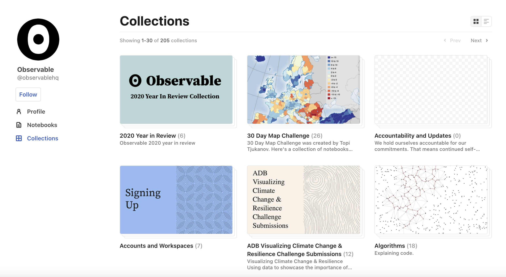
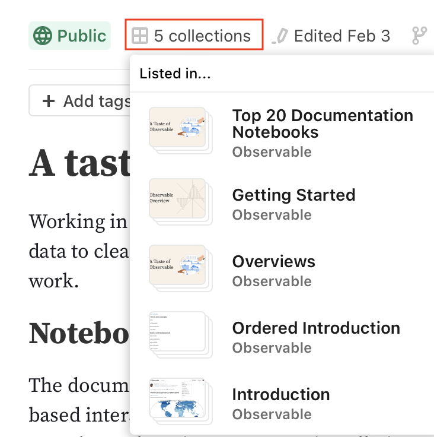
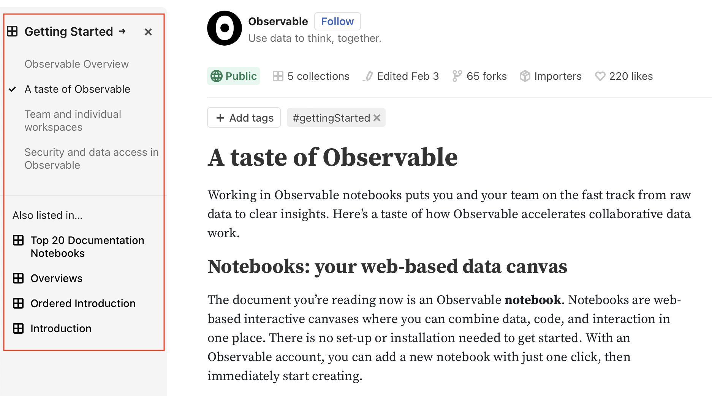
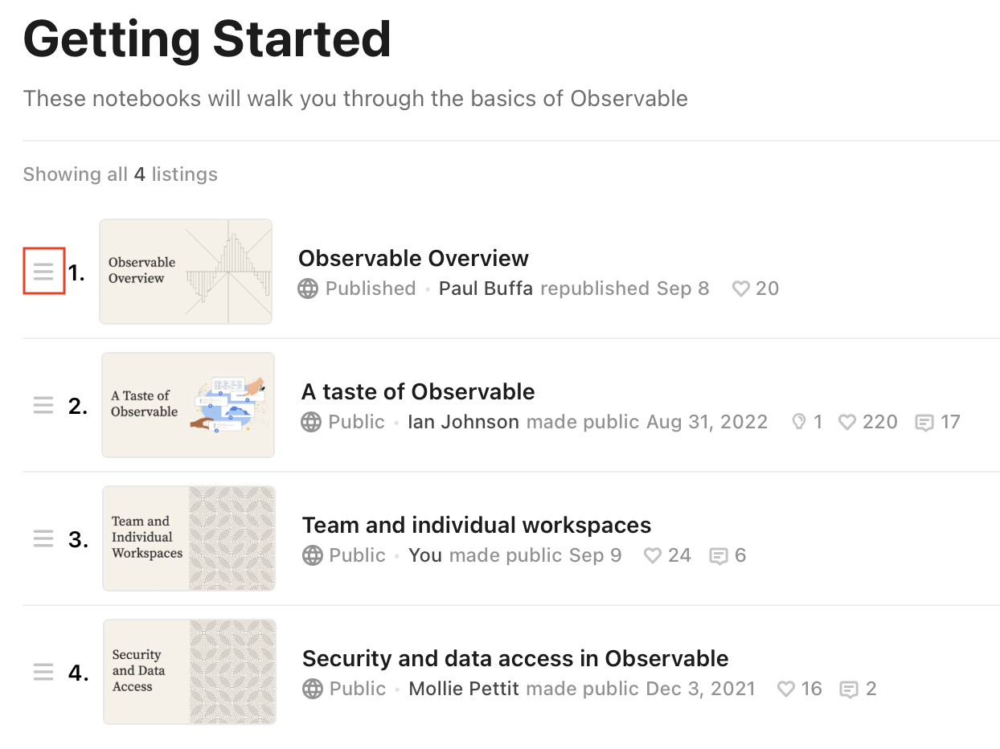
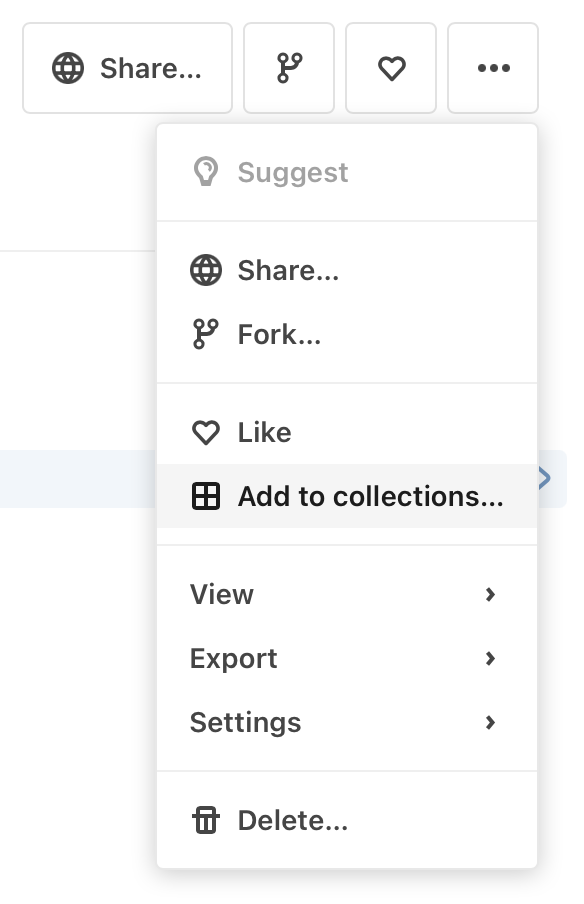
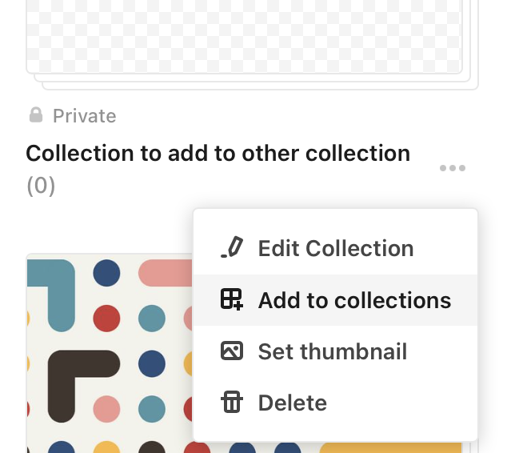

# Collections

Use **Collections** to group and organize notebooks.

<figure>
  
  <figcaption><b>Collections</b> group notebooks (or other collections) together.</figcaption>
</figure>

You can use collections to:
- Sort notebooks by topic
- Separate brainstorming notebooks from polished ones
- Organize an ordered series of notebooks
- Explore a particular idea with another team member

:::info Note
Collections display a "stacked" thumbnail image; this distinguishes their thumbnails from notebook thumbnails.
:::

## Creating a collection

From your profile page, click **Collections**, then click **New** to display the **Create collection** modal.
You’ll then be prompted to add a title and description, as well as set the visibility of the collection and decide whether it should be ordered. (More about these choices [later](#collectionOptions).)

## Browsing collections

Since notebooks can be part of multiple collections, a tag appears at the top of the notebook, indicating how many collections the notebook belongs to. Click on the tag to show the collections:

<figure>
  
  <figcaption>Click the highlighted area to display a notebook's collections.</figcaption>
</figure>

### Using the collections browser

If you then click on one of the collections, the collections browser appears, showing all of the notebooks in the collection, and the other collections in which the notebook is listed:

<figure>
  
  <figcaption>The collections browser shows all notebooks in the collection, and, if the notebook belongs to more than one collection, other related collections.</figcaption>
</figure>

### Displaying the list view of collections

Click the name of the collection to display all the notebooks in a list view. In the example just shown, you would click "Getting Started" in the collection browser.

## Configuring collections {#collectionOptions}
You can configure the visibility and ordering of a collection.

### Visibility: Public vs. private collections
- You can define public or private collections.
  - Public collections can be seen by anyone.
  - Private collections are visible only to the collection creator.
  - Team private collections are visible only to team members.
- Visibility into the contents of a collection is not the same as being able to change the contents.
- If you are a Pro or Enterprise user, private and shared notebooks aren’t visible in public collections unless the notebooks are made public. 
- The visibility of a collection does not affect the visibility of the notebooks within the collection. Instead, it simply determines which collections can be seen by others on your public Observable profile.

### Ordering: specifying a sequence of notebooks
Use ordered collections when you need to specify the order in which notebooks appear. For example, if you have a set of notebooks that represent a study course, or a sequence of actions, an ordered collection is appropriate.

To set the order of notebooks, click the name of the collection in the collection browser to display the list view of notebooks. Then drag the <svg style="display:inline;" width="16" height="16" viewBox="0 0 16 16" fill="none"><path d="M2.5 4.99999V4.29999H13.5V4.99999H2.5ZM2.5 8.49999V7.79999H13.5V8.49999H2.5ZM2.5 11.3H13.5V12H2.5L2.5 11.3Z" stroke="#999999"/></svg> icon next to the notebook to move it to its desired spot.

<figure>
  
  <figcaption>In the list view of notebooks, click and drag the highlighted icon to change a notebook's order in the list.</figcaption>
</figure>

## Adding to collections

Add your notebook to a collection using the notebook menu.

<figure>
  
  <figcaption>Add your notebook to a collection using <b>Add to collections</b>.</figcaption>
</figure>

:::info Note
If your notebook is already part of other collections, you'll see <b>In collections</b>.
:::

### Creating a new notebook in a collection

When you create a notebook, use **Add to collection** on the **New notebook** modal to add the notebook to the collection from the start.

### Adding a collection to a collection

Use the <svg style="margin: 0 .25rem;display:inline;" viewBox="0 0 16 16" fill="currentColor" stroke="none" stroke-width="1.5" stroke-linecap="round" stroke-linejoin="round" width="16" height="16"><circle r="2" cy="8" cx="2"></circle><circle r="2" cy="8" cx="8"></circle><circle r="2" cy="8" cx="14"></circle></svg> icon on the **Collections** page to add your collection to another collection.

<figure>
  
  <figcaption>You can add a collection to another collection.</figcaption>
</figure>

The same is true for adding _your collections_ to other collections, which can be done either from the collection page or from the collection's listing menu on your profile's **"Collections"** tab.

    <video src="./assets/collectionsNested.mov" style="width: 100%; border-radius: 5px; box-shadow: 3px 3px 10px #ccc;margin-bottom:20px;" autoplay loop muted
    alt="Video of the Collections page. The user clicks on the a collection to open it, then hovers over the Edit menu on the top right and selects 'Add to collections' from it. A dialog appears showing all the collections in the workspace, where the user selects another collection and then clicks 'Confirm'."
    ></video>
<figcaption>Adding a collection to a collection.</figcaption>

## Deleting from collections

To delete from a collection, go to the **Add to collection** modal and uncheck the box for the collection.

## Deleting a collection itself

You can delete a collection from the **Edit** menu that appears at the top of the collection (or from the three dots menu next to the collection's name on the **Collections** page). You'll be asked to confirm the deletion. Also, you'll see a message confirming that the collection will be deleted, but the notebooks in the collection will **not** be deleted.

## Searching for a collection
You can search for a single collection using the following string in the Observable search field, where *collectionName* is the name of the collection you are searching for:

<code>collection</code>:<i>collectionName</i>

If the collection name contains spaces, use quotes around the collection name:

<code>collection</code>:"<i>Collection Name</i>"

To return results from not just a single collection, but also any nested collections, use <code>collection**s**</code> (note the "s"): 

<code>collection<strong>s</strong></code>:<i>topCollectionName</i>

To search for a string in a collection, add the string after the collection name: 

<code>collection</code>:<i>collectionName</i> <i>string</i>

See [Introduction to search](https://observablehq.com/@observablehq/searching-on-observable) for more about searching collections.

