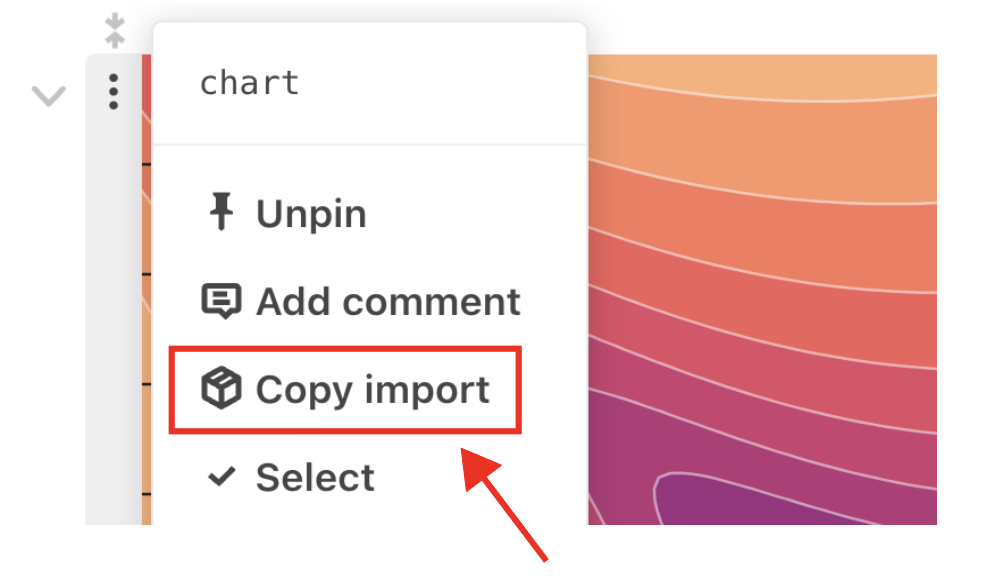
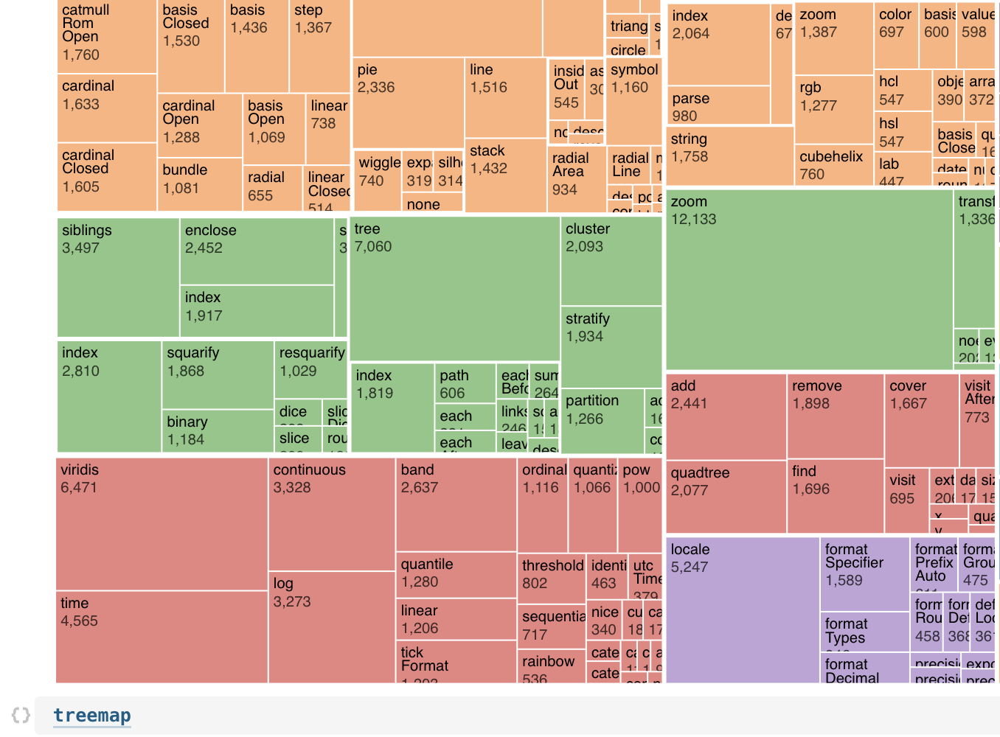
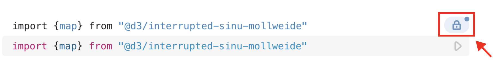
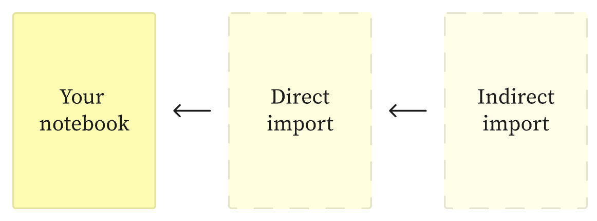
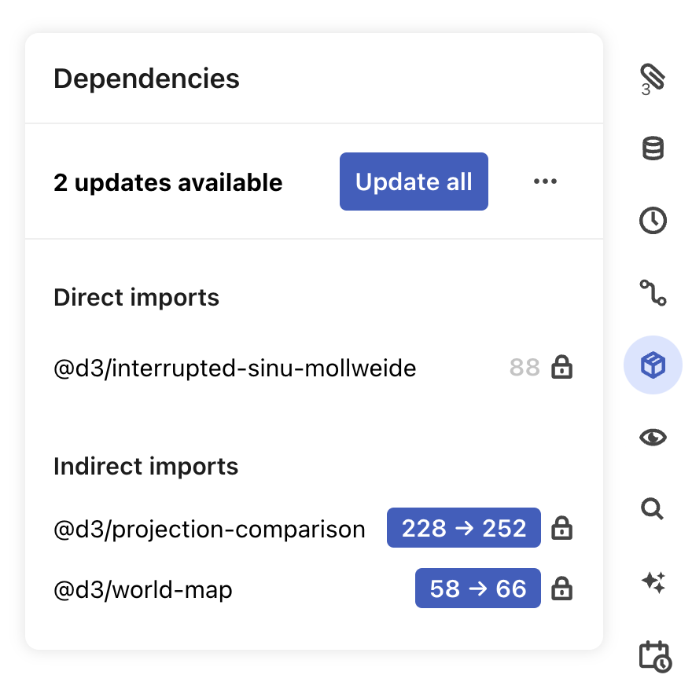

# Imports

Observable lets you quickly reuse code by importing named cells from other notebooks. That might be functions, charts, text, or any other content that you want to reuse, display or iterate on in your current notebook. 

Imports offer several advantages to copying-and-pasting code between notebooks: 

- **Dependencies**: When you import content, all downstream dependencies (indirect imports) come along with it
- **Keep content up-to-date**: You can have imported content stay up-to-date with the most recent version of a notebook it is imported from, or choose to import from a specific notebook version using [version locking](#version-locking)
- **Iterate and reuse**: [Import variations](#import-variations) like `import-as` and `import-with` let you quickly iterate on imported content, for example to substitute original data with your own

Here, we describe how to use imports for convenient code reuse. 

## Importing cells

Import a [named cell](/cells/#naming-cells) from another notebook into your *current* notebook using the following syntax in a JavaScript cell. (Find `@username/notebookName` from the notebook URL you're importing from.) 

```js
import {cellName} from "@username/notebookName"
```

You can either add the cell and notebook information manually, or choose the **Copy import** option from the Cell menu when focused on a cell you want to import:

<figure>
  
</figure>

Clicking **Copy import** will copy the import code to your clipboard, so that you can easily paste it into a JavaScript cell in another notebook. 

::: info NOTE
If the <b>Copy import</b> option is unavailable for a notebook cell, it means that the cell is not <i>named</i>. Only [named cells](/cells/#naming-cells) can be imported.
:::

For example, the notebook [observablehq.com/@d3/contours](https://observablehq.com/@d3/contours) contains a cell named `chart`, which creates and displays a contour plot made with D3. 

We can import `chart` for use in another notebook with the following code (typed manually, or pasted after choosing **Copy import** for a selected cell):

```js
import {chart} from "@d3/contours"
```

Now, `chart` is immediately available in the current notebook:

<figure>
  
</figure>

## Import variations

You may not want to use the imported cells exactly as-is. For example, you might want to reassign an imported function or cell name to better suit your analysis, or replace an original dataset used in an imported chart with your own. 

Here, we introduce two variations on `import`: `import-as` (to rename imported content) and `import-with` (e.g., to replace original data with new data).

### `import-as`

Use `import-as` to rename imported content using the following syntax: 

```js
import {namedCell as newName} from "@username/notebookName"
```

For example, we can use the following to import a global landcover map (in a cell originally named `map`) from the [observablehq.com/@d3/interrupted-sinu-mollweide](https://observablehq.com/@d3/interrupted-sinu-mollweide) notebook, renaming it as `landcoverMap`: 

```js
import {map as landcoverMap} from "@d3/interrupted-sinu-mollweide"
```

Now, we can call `landcoverMap` in the importing notebook:

<figure>
  
</figure>

### `import-with`

Use `import-with` to "rewrite" imported code as you might do when copy-pasting, without the problems of code duplication.

Consider Mike Bostock's [D3 treemap notebook](https://observablehq.com/@d3/treemap-component@164) that visualizes the Flare dataset, originally expecting the data to be stored as `data`. To reuse the treemap code with a different dataset, inject a new definition of `data` in the `with` clause on import.

For example, if we have a new dataset named `treemap_data` from an attached JSON file in our current notebook...

```js
treemap_data = FileAttachment("d3.json").json()
```

...we can import the original chart (renaming it as `treemap` below using `import-as`) but inject `treemap_data` where the original chart expected `data`. This way, when we call `treemap` in our current notebook, it will expect `treemap_data` as the data source instead of `data`.

```js
import {chart as treemap}
with {treemap_data as data}
from "@d3/treemap@164"
```

Calling `treemap` with the updated `treemap_data` displays the updated chart:

<figure>
  
  <figcaption>Use `import-with` to create an imported chart using a different dataset.</figcaption>
</figure>

As long as the new data conforms to the same shape as the old data (here, a tree of objects with *children* and *value* properties), you can reuse the existing code without copy-paste and the terrible challenge of designing a reusable chart abstraction.

## Version locking

Observable notebooks go through different versions, like different versions of a document (see [Notebook history](/notebooks/history)).

When importing content, you can use *version locking* to ensure that you are always importing from the same notebook version. If an import is locked, a padlock icon appears to the top right of the cell: 

<figure>
  
  <figcaption>A lock icon is displayed for a locked import.</figcaption>
</figure>

Click the lock icon above the imported cell, or the Dependency versions pane in the right-hand margin of your browser window to confirm that the imported notebooks are locked.

Version locking locks not just direct notebook imports but also any notebooks imported by the direct imports. These are known as *indirect imports*.

<figure>
  
  <figcaption>Indirect imports are notebooks imported by notebooks that you imported directly.</figcaption>
</figure>

By default, all imports, direct and indirect, from a workspace other than your own have their versions locked at the time of import.

To manage the import dependencies in your notebook, open the Dependencies pane (<svg width="16" height="16" viewBox="0 0 16 16" fill="currentColor" style="display: inline !important;">
    <path
      fillRule="evenodd"
      clipRule="evenodd"
      d="M8 2.15771L3.98463 4.50001L5 5.0923L9.01537 2.75001L8 2.15771ZM11 3.90771L6.98463 6.25001L8 6.8423L12.0154 4.50001L11 3.90771ZM13 6.24104L9 8.57438V13.259L13 10.9256V6.24104ZM7 13.259V8.57438L3 6.24104V10.9256L7 13.259ZM7.24419 0.283189C7.71124 0.0107464 8.28876 0.0107473 8.75581 0.283189L14.5039 3.63623C14.8111 3.81544 15 4.14434 15 4.50001V11.2128C15 11.7463 14.7166 12.2397 14.2558 12.5085L8.50387 15.8638C8.19251 16.0454 7.80749 16.0454 7.49613 15.8638L1.74419 12.5085C1.28337 12.2397 1 11.7463 1 11.2128V4.50001C1 4.14434 1.18891 3.81544 1.49613 3.63623L7.24419 0.283189Z"
    />
  </svg>) in the right notebook margin.

<figure>
  
  <figcaption>Manage notebook dependencies in the Dependency versions pane.</figcaption>
</figure>

Within the Depency versions pane, you can:

- **Update all** imports or select individual imports from a list to update to the most recent notebook version
- Choose to **Lock all** and **Unlock all** dependencies (from the <svg viewBox="0 0 16 16" width="16" height="16" fill="currentColor" style="display: inline !important;"><circle r="1.5" cy="8" cx="2.5" /><circle r="1.5" cy="8" cx="7.5" /><circle r="1.5" cy="8" cx="12.5" /></svg> menu)
- See **Direct** and **Indirect imports**. The number represents the version number of the import. The lock symbol indicates whether or not the import is locked to the listed version.

By default, every imported notebook that is owned under a different workspace (that is, the notebook has a different `@<username>` in the URL) will be locked.

## Cross-owner imports

Imports from a notebook not owned by the importing notebook (that is, a notebook whose URL has a different `@<username>`) are called cross-owner imports.

You might be tempted to think of this as "notebooks I created vs. notebooks someone else created," but that is not sufficient to distinguish same-owner from cross-owner imports. For example: 

- You may have created a notebook but then transferred it to a different workspace (e.g. from your personal account to your Team account)
- A user outside of a team may have created a notebook, but if it is transferred into a team, it will then be considered same-owner within that team

By default, the imported version is locked at the time of import _only_ for cross-owner imports. All same-owner imports will be *unlocked*. 

Let's say there is an Observable user whose username is `BigFish` who belongs to two teams, Team Saltwater and Team Freshwater, and who also has a personal account.

| Team | User | Notebook |
| --  | --- | --- | 
| Saltwater | BigFish | `observablehq.com/@saltwater/BigFishOceanNotebook`  | 
| Saltwater | BigFish | `observablehq.com/@saltwater/BigFishSeaNotebook`  | 

| Team | User | Notebook |
| --  | --- | --- | 
| Freshwater | BigFish | `observablehq.com/@freshwater/BigFishStreamNotebook`  | 

The "Freshwater" notebook is in a different workspace (the `@<username>` in the URL is different) and imports between this notebook and the previous two notebooks would be locked.

| Team | User | Notebook |
| --  | --- | --- |
| (No team) | BigFish | `observablehq.com/@BigFish/MyPersonalNotebook`  | 

This last notebook is also not in the same workspace as the three Team notebooks seen earlier, even though it was created by the same user. Imports between this notebook and any of the previous notebooks also will be locked.

## Additional info

Here are a few additional nuances of imports:

- Like [ES imports](http://exploringjs.com/es6/ch_modules.html), Observable imports are live bindings. If you import a value that changes over time ([a generator cell](https://observablehq.com/@mbostock/generator-cells-functions-and-objects)), such as a countdown to a certain date in the future, the imported value will change over time, too.

- You can only import named cells (see [Naming cells](/cells/#naming-cells), and you must name each cell you want to import explicitly. No anonymous cells allowed; if a notebook uses side effects, as is sometimes common with anonymous cells, you must name and import the cells with side effects, too.

- Imported cells are lazily evaluated: if you import a cell but you don't reference it anywhere, the code won't run. 

- While the examples in this document walk through imports for public notebooks, you can import from unlisted and private notebooks. For private notebooks, you can only import into other private notebooks in the same workspace.

- Also like ES imports, only the cells you import are available (*bound*) in the local notebook, even if those cells depend on other cells. Those dependent cells are *run*—they're just not exposed in the scope of the local notebook.

- You can use circular imports, but only if you don't use the *with* clause when importing. Import-with effectively creates a local copy of the imported module with your overrides, so a circular import-with would create an infinitely recursive module, a bit like seeing your reflection in a mirrored room.

- You can import the same notebook multiple times and references will resolve exactly. (Note, however, that the versions of the imported notebooks must also match, or they are considered different notebooks.)