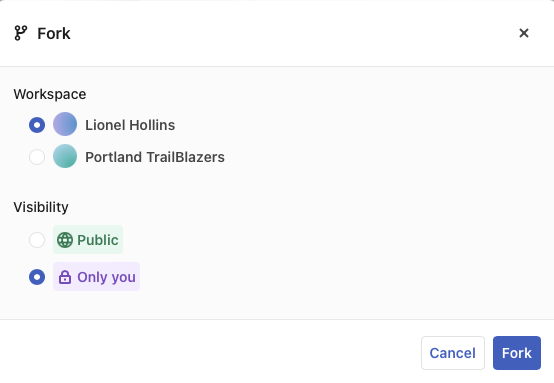

# Forking

Observable offers asynchronous collaboration using the **Fork**, **[Suggest](/collaboration/suggestions)**, and **Merge** buttons. 
- When you **Fork** a notebook, you create your own copy of a notebook, which you can then edit freely without affecting the original.
- Clicking **Suggest** causes an email to be sent back to the original notebook's author, with a link to your fork, containing your changes.
- The original notebook's author can then click the link in the email, view your changes, and **Merge** some or all of the changes into their original notebook.

Creating a *fork* of a notebook means to make your own copy, like suddenly making a fork in the road and going your own way. This is a fundamental concept in software development, but if this idea is new to you, think of it as making a copy of a recipe. Once you have a copy, you can make changes without affecting the original—the forked copy of the recipe is yours to save, modify, or discard as you choose.  
If you are uncertain about this, try it: fork an existing notebook, and compare it side-by-side with the original. You'll see that you can make changes in your fork and the original stays the same. (When you <b>want</b> to share your changes, use <b>Suggest</b>—read on in this notebook to learn more.)

You can fork public notebooks, or notebooks where edit access has been shared with you. If you have been invited to only view a notebook, you will not be able to fork the notebook. In that event, the **Fork** button will not appear and `Fork` will not be a choice in the notebook menu.

Assuming you have permission to fork a notebook, go to the notebook menu (<Icon name="threeHorizDots" />) and click **Fork**. 
- If there is only a single possible destination for the forked notebook, the fork happens immediately, as soon as you click **Fork**.
- If, however, you have a choice of multiple workspaces (for example, if you belong to a Team of any kind), or if you have edit permission to a notebook, then there are multiple possible combinations, and you will be shown a dialog box that enables you to specify the workspace that should receive the fork.

Here are some examples:
- If you have only a Free Individual workspace, and fork a Public notebook, the fork is created immediately.
- If you have only a Free Individual workspace, but are a viewer on a Team of any kind, you will not be able to fork any Team notebooks, even though you can view them.
- If you have a Pro Individual workspace and are also a Team member, you have a choice of individual or team workspaces, and public or private (Only you) notebook visibility.

In the following example, the user Lionel Hollins, who also belongs to the Portland TrailBlazers Pro Team, can fork into either his own workspace, or the team workspace. Because the original notebook is public, the fork can also be public, or can be forked into a private version.

<figure>
  
  <figcaption>Example of a Pro Individual and Pro Team member forking a public notebook. The notebook can go into either of the user's available workspaces, and can be public or private.</figcaption>
</figure>

However, if the original notebook were Private but shared with Lionel Hollins, even with edit permission, forking is not available.

 so a dialog box appears asking you to configure the forked notebook:
  - On a Public notebook, still has a choice of Public or Private, so dialog box appears.
  - On a Private notebook, there is no option to fork (private notebooks remain private)
- Free Team
  - Only Public notebooks visible
  - User can fork to his own workspace, or to the Team workspace
  - Visibility limited to Public
  - Role of team member does not appear to make a difference
- Pro Team
  - Public and private notebooks visible
  - Public notebooks can be forked to any workspace available to the user
  - Private notebooks can only be forked to their existing workspace

General rules about forking:
- You cannot fork a notebook into having more visibility than the original.
- You cannot fork a private notebook into your own public notebook, even if you have permission to edit the original.
- You can only fork into workspaces that you belong to.
- Private notebooks, if they can be forked at all, can only be forked into the workspace they are in.
- Your role matters:
  - A viewer can fork public notebooks (fork happens immediately).
  - A viewer cannot fork shared private notebooks (can see but not fork).
  - A viewer cannot fork team notebooks (can see but not fork).

Click **Fork** on the dialog box to create the fork. After confirming, you have your own forked notebook to modify or experiment with.

Now, after making changes in the fork, you might want to **[Suggest](/collaboration/suggestions)** those changes back to the original author. Here is an example of how that works. 
