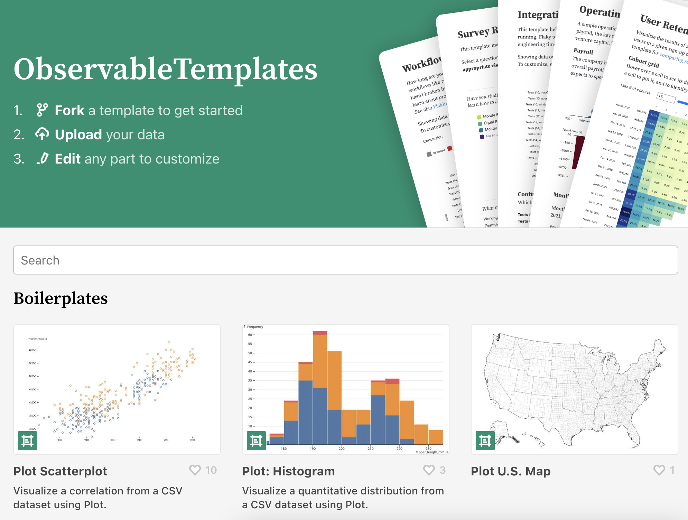
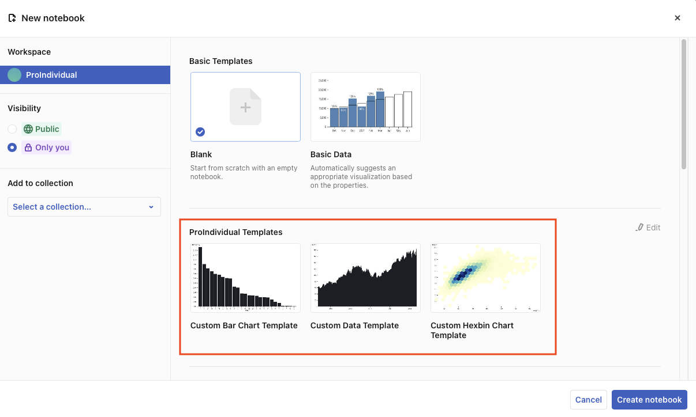

# Templates

Templates provide pre-packaged artifacts for common data-related workflows. Whether you are doing business planning, user research, devops, or running remote meetings and ice-breakers, templates can help you more quickly create expressive, interactive documents with your own data.

This page describes how you can use existing templates to avoid starting your work from scratch, and how to make your own custom templates for reuse by you and your team.

## Use existing templates {#existing-templates}

Observable provides a number of [pre-made templates](http://observablehq.com/templates) for common data-related tasks like boilerplates for basic charts and maps, starters to access APIs or connect to Google sheets, and templates for common analyses for business planning and product insights.

To use an existing template:

1. Open a template from our [pre-made templates](http://observablehq.com/templates) page:

<figure>
  
  <figcaption>Choose from template options to get started.</figcaption>
</figure>

2. In the top right of the template, click 'Fork to get started' to make your own copy of the template:

<figure>
  
  <figcaption>Fork the template to make your own copy.</figcaption>
</figure>

3. In your fork, attach or connect to your own data (e.g. see [File attachments](/data/files/file-attachments)).

4. Replace the template contents with your own data, and make any edits to customize your notebook. Underneath the pre-packaged Templates there is limitless flexibility. The code and data are right there, so you can customize, extend, and re-write any or all of it, as you see fit.

## Create custom templates {#custom-templates}
<PricingBadge level="pro" />

If you have a [Pro Team](https://observablehq.com/@observablehq/team-and-individual-workspaces?collection=@observablehq/workspaces#teamPrivate) or [Pro Individual](https://observablehq.com/@observablehq/team-and-individual-workspaces?collection=@observablehq/workspaces#cell-1094) account, Observable offers the ability to create your own custom templates. These can be tailored to exactly suit your working methods. You will be able to create new notebooks even faster because the template is customized to save you from repetitive steps.

Once created, custom templates appear as a choice whenever anyone chooses to create a new notebook.

<figure>
  
  <figcaption>Your custom templates appear in the New notebook dialog box.</figcaption>
</figure>

A few notes on custom templates: 

- Any editor can create a custom template.
- Custom templates are in addition to the standard set of [pre-defined Observable templates](http://observablehq.com/templates). 
- You can [group](#grouping) custom templates to match your work projects or work groups.

### How to create a custom template

1. In your account, create a new collection named **Templates**. (See [How to create a new collection](https://observablehq.com/@observablehq/collections?collection=@observablehq/editing-publishing-collaborating)).
2. Create the new custom template in a notebook, either from scratch, or by [forking](https://observablehq.com/@observablehq/fork-share-merge) one of the pre-defined [Observable Templates](https://observablehq.com/templates).
3. Add the new custom template to the **Templates** collection by clicking **Add to collection** from the notebook menu (<svg width="16" height="16" viewBox="0 0 16 16" fill="none" style="display: inline !important;"><path fillRule="evenodd" clipRule="evenodd" d="M4.5 8C4.5 8.82843 3.82843 9.5 3 9.5C2.17157 9.5 1.5 8.82843 1.5 8C1.5 7.17157 2.17157 6.5 3 6.5C3.82843 6.5 4.5 7.17157 4.5 8ZM9.5 8C9.5 8.82843 8.82843 9.5 8 9.5C7.17157 9.5 6.5 8.82843 6.5 8C6.5 7.17157 7.17157 6.5 8 6.5C8.82843 6.5 9.5 7.17157 9.5 8ZM14.5 8C14.5 8.82843 13.8284 9.5 13 9.5C12.1716 9.5 11.5 8.82843 11.5 8C11.5 7.17157 12.1716 6.5 13 6.5C13.8284 6.5 14.5 7.17157 14.5 8Z" fill="currentColor"/></svg>). 

::: info NOTE
If a notebook is already in a collection, you will see <b>In collections</b> rather than <b>Add to collection</b>. Either choice brings up the <b>Add to collection</b> modal.
:::

That's it! Your custom templates will now appear as options to choose from when you create a new notebook. You can put as many custom templates in the collection as you wish.

### Grouping templates in sub-collections {#grouping}

If you want to add more organization to your custom templates, you can create sub-collections within your templates collection: 

1. Create another collection for each group.
2. Add that collection to your **Templates** collection. 
3. Add notebooks to the collection for each group. (Notebooks can be in more than one collection.) 

::: info NOTE
You can place one or more collections inside your <b>Templates</b> collection, but sub-collections cannot have sub-collections themselves. Sub-collections for templates are limited to one level of nesting.
:::

### Hints for using custom templates

- Give your sub-collections useful titles and descriptions to make it easier to find the best templates for a given task.
- When a new notebook is created from a template, it is simply created as a [fork](https://observablehq.com/@observablehq/fork-suggest-merge) of a notebook in the templates collection. If you look at the template notebook, you can see the forks, assuming it has been shared with you.
- Notebooks in the templates collection need to be visible to the user who is creating a new notebook to show up.
- If you want to prevent other users from accidentally modifying the templates, you can share them as *View only*.

### More about Pro Team and Pro Individual workspaces
- [Team and individual workspaces](https://observablehq.com/@observablehq/team-and-individual-workspaces?collection=@observablehq/workspaces)
- [Permissions for Teams Notebooks](https://observablehq.com/@observablehq/permissions-for-teams-notebooks)