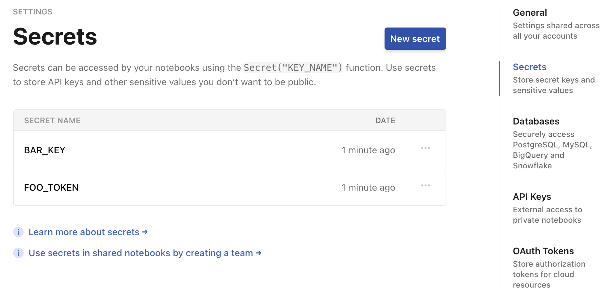

# Using secrets with Observable
<PricingBadge level="pro" />

Observable is a collaborative programming environment—for reading, sharing, forking, importing—but it’s also for private work. The **Secrets** feature makes it easier to securely access private data and APIs on Observable. This feature lets you analyze or visualize private data while keeping your secrets, well, *secret*.

Secrets are name-value pairs, similar to environment variables, that you can specify [in your settings](https://observablehq.com/settings). 

You can also choose whether to share each secret with members of guest roles in your organization via the __Allow guest access__ option when creating or updating a secret. Secrets are always unshared with guests by default.

::: info Note
Guest users have access to any secret enabled with <b>Allow guest access.</b> Access is not governed by the notebooks shared with them.
:::

<figure>
  
  <figcaption>The <b>Secrets</b> page under Settings.</figcaption>
</figure>

For example, say you want to talk to the Cloudflare API. Add a secret named `CLOUDFLARE_API_KEY` whose value is your API key (here `0123456789abcdef`, which for obvious reasons is not a real key). To access your key from a notebook, say:

```js
Secret("CLOUDFLARE_API_KEY") // returns 0123456789abcdef
```

The `Secret` function takes a single argument, the *name* of the secret, and returns the *value* of the corresponding secret if it exists. If the secret doesn’t exist, then the `Secret` function instead throws an error.

```js
Secret("DOES_NOT_EXIST") // throws an error
```

Only your private notebooks (which are only readable by you) can access your secrets—that’s why they’re secret! If you share or publish a notebook, it won’t be able to access secrets: any cell that references the `Secret` function will error.

You must explicitly grant permission for a notebook to access your secrets. The first time you ask for a secret from your private notebook, you’ll see a confirmation dialog asking for permission to access your secrets. This extra step protects you when you fork or import someone else’s notebook into your private notebook. If you don’t trust the code, don’t give it your secrets!
